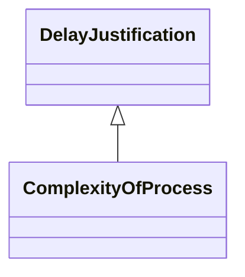

---
search:
  boost: 10.0
---

# Class: ComplexityOfProcess 


_Justification that the process is delayed due to complexity in_

_fulfilling it_


<div data-search-exclude markdown="1">


URI: [justifications:ComplexityOfProcess](https://w3id.org/lmodel/dpv/justifications/ComplexityOfProcess)





## Inheritance
* [DelayJustification](DelayJustification.md)
    * **ComplexityOfProcess**


## Class Properties

| Property | Value |
| --- | --- |
| Class URI | [justifications:ComplexityOfProcess](https://w3id.org/lmodel/dpv/justifications/ComplexityOfProcess) |


## Slots

| Name | Cardinality and Range | Description | Inheritance |
| ---  | --- | --- | --- |


## In Subsets


* [JustificationsSubset](JustificationsSubset.md)


## Aliases


* Complexity Of Process


## Identifier and Mapping Information


### Annotations

| property | value |
| --- | --- |
| upstream_iri | https://w3id.org/dpv/justifications/owl#ComplexityOfProcess |
| dpv_extension_slug | justifications |


### Schema Source


* from schema: https://w3id.org/lmodel/dpv/justifications


## Mappings

| Mapping Type | Mapped Value |
| ---  | ---  |
| self | justifications:ComplexityOfProcess |
| native | justifications:ComplexityOfProcess |
| exact | dpv_justifications:ComplexityOfProcess, dpv_justifications_owl:ComplexityOfProcess |


## LinkML Source

<!-- TODO: investigate https://stackoverflow.com/questions/37606292/how-to-create-tabbed-code-blocks-in-mkdocs-or-sphinx -->

### Direct

<details>
```yaml
name: ComplexityOfProcess
annotations:
  upstream_iri:
    tag: upstream_iri
    value: https://w3id.org/dpv/justifications/owl#ComplexityOfProcess
  dpv_extension_slug:
    tag: dpv_extension_slug
    value: justifications
description: 'Justification that the process is delayed due to complexity in

  fulfilling it'
in_subset:
- justifications_subset
from_schema: https://w3id.org/lmodel/dpv/justifications
aliases:
- Complexity Of Process
exact_mappings:
- dpv_justifications:ComplexityOfProcess
- dpv_justifications_owl:ComplexityOfProcess
is_a: DelayJustification
class_uri: justifications:ComplexityOfProcess

```
</details>

### Induced

<details>
```yaml
name: ComplexityOfProcess
annotations:
  upstream_iri:
    tag: upstream_iri
    value: https://w3id.org/dpv/justifications/owl#ComplexityOfProcess
  dpv_extension_slug:
    tag: dpv_extension_slug
    value: justifications
description: 'Justification that the process is delayed due to complexity in

  fulfilling it'
in_subset:
- justifications_subset
from_schema: https://w3id.org/lmodel/dpv/justifications
aliases:
- Complexity Of Process
exact_mappings:
- dpv_justifications:ComplexityOfProcess
- dpv_justifications_owl:ComplexityOfProcess
is_a: DelayJustification
class_uri: justifications:ComplexityOfProcess

```
</details></div>