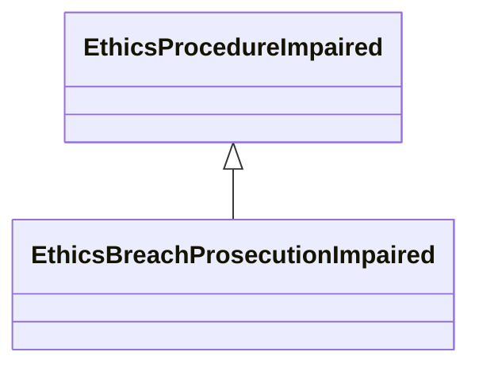

---
search:
  boost: 10.0
---

# Class: EthicsBreachProsecutionImpaired 


_Justification that the process could not be fulfilled or was not_

_successful because it would interfere with the prosecution of breaches_

_of ethics for regulated professions_


<div data-search-exclude markdown="1">


URI: [justifications:EthicsBreachProsecutionImpaired](https://w3id.org/lmodel/dpv/justifications/EthicsBreachProsecutionImpaired)





## Inheritance
* [NonFulfilmentJustification](NonFulfilmentJustification.md)
    * [EthicsProcedureImpaired](EthicsProcedureImpaired.md)
        * **EthicsBreachProsecutionImpaired**


## Class Properties

| Property | Value |
| --- | --- |
| Class URI | [justifications:EthicsBreachProsecutionImpaired](https://w3id.org/lmodel/dpv/justifications/EthicsBreachProsecutionImpaired) |


## Slots

| Name | Cardinality and Range | Description | Inheritance |
| ---  | --- | --- | --- |


## In Subsets


* [JustificationsSubset](JustificationsSubset.md)


## Aliases


* Ethics Breach Prosecution Impaired


## Identifier and Mapping Information


### Annotations

| property | value |
| --- | --- |
| upstream_iri | https://w3id.org/dpv/justifications/owl#EthicsBreachProsecutionImpaired |
| dpv_extension_slug | justifications |


### Schema Source


* from schema: https://w3id.org/lmodel/dpv/justifications


## Mappings

| Mapping Type | Mapped Value |
| ---  | ---  |
| self | justifications:EthicsBreachProsecutionImpaired |
| native | justifications:EthicsBreachProsecutionImpaired |
| exact | dpv_justifications:EthicsBreachProsecutionImpaired, dpv_justifications_owl:EthicsBreachProsecutionImpaired |


## LinkML Source

<!-- TODO: investigate https://stackoverflow.com/questions/37606292/how-to-create-tabbed-code-blocks-in-mkdocs-or-sphinx -->

### Direct

<details>
```yaml
name: EthicsBreachProsecutionImpaired
annotations:
  upstream_iri:
    tag: upstream_iri
    value: https://w3id.org/dpv/justifications/owl#EthicsBreachProsecutionImpaired
  dpv_extension_slug:
    tag: dpv_extension_slug
    value: justifications
description: 'Justification that the process could not be fulfilled or was not

  successful because it would interfere with the prosecution of breaches

  of ethics for regulated professions'
in_subset:
- justifications_subset
from_schema: https://w3id.org/lmodel/dpv/justifications
aliases:
- Ethics Breach Prosecution Impaired
exact_mappings:
- dpv_justifications:EthicsBreachProsecutionImpaired
- dpv_justifications_owl:EthicsBreachProsecutionImpaired
is_a: EthicsProcedureImpaired
class_uri: justifications:EthicsBreachProsecutionImpaired

```
</details>

### Induced

<details>
```yaml
name: EthicsBreachProsecutionImpaired
annotations:
  upstream_iri:
    tag: upstream_iri
    value: https://w3id.org/dpv/justifications/owl#EthicsBreachProsecutionImpaired
  dpv_extension_slug:
    tag: dpv_extension_slug
    value: justifications
description: 'Justification that the process could not be fulfilled or was not

  successful because it would interfere with the prosecution of breaches

  of ethics for regulated professions'
in_subset:
- justifications_subset
from_schema: https://w3id.org/lmodel/dpv/justifications
aliases:
- Ethics Breach Prosecution Impaired
exact_mappings:
- dpv_justifications:EthicsBreachProsecutionImpaired
- dpv_justifications_owl:EthicsBreachProsecutionImpaired
is_a: EthicsProcedureImpaired
class_uri: justifications:EthicsBreachProsecutionImpaired

```
</details></div>