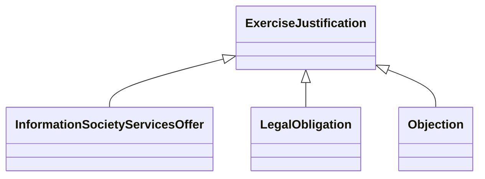

---
search:
  boost: 10.0
---

# Class: ExerciseJustification 


_Justification for why the process should be carried out_


<div data-search-exclude markdown="1">


URI: [justifications:ExerciseJustification](https://w3id.org/lmodel/dpv/justifications/ExerciseJustification)





## Inheritance
* **ExerciseJustification**
    * [InformationSocietyServicesOffer](InformationSocietyServicesOffer.md)
    * [LegalObligation](LegalObligation.md)
    * [Objection](Objection.md)


## Class Properties

| Property | Value |
| --- | --- |
| Class URI | [justifications:ExerciseJustification](https://w3id.org/lmodel/dpv/justifications/ExerciseJustification) |


## Slots

| Name | Cardinality and Range | Description | Inheritance |
| ---  | --- | --- | --- |


## In Subsets


* [JustificationsSubset](JustificationsSubset.md)


## Aliases


* Exercise Justification


## Identifier and Mapping Information


### Annotations

| property | value |
| --- | --- |
| upstream_iri | https://w3id.org/dpv/justifications/owl#ExerciseJustification |
| dpv_extension_slug | justifications |


### Schema Source


* from schema: https://w3id.org/lmodel/dpv/justifications


## Mappings

| Mapping Type | Mapped Value |
| ---  | ---  |
| self | justifications:ExerciseJustification |
| native | justifications:ExerciseJustification |
| exact | dpv_justifications:ExerciseJustification, dpv_justifications_owl:ExerciseJustification |
| related | oscal:ResponsibilityStatement |


## LinkML Source

<!-- TODO: investigate https://stackoverflow.com/questions/37606292/how-to-create-tabbed-code-blocks-in-mkdocs-or-sphinx -->

### Direct

<details>
```yaml
name: ExerciseJustification
annotations:
  upstream_iri:
    tag: upstream_iri
    value: https://w3id.org/dpv/justifications/owl#ExerciseJustification
  dpv_extension_slug:
    tag: dpv_extension_slug
    value: justifications
description: Justification for why the process should be carried out
in_subset:
- justifications_subset
from_schema: https://w3id.org/lmodel/dpv/justifications
aliases:
- Exercise Justification
exact_mappings:
- dpv_justifications:ExerciseJustification
- dpv_justifications_owl:ExerciseJustification
related_mappings:
- oscal:ResponsibilityStatement
class_uri: justifications:ExerciseJustification

```
</details>

### Induced

<details>
```yaml
name: ExerciseJustification
annotations:
  upstream_iri:
    tag: upstream_iri
    value: https://w3id.org/dpv/justifications/owl#ExerciseJustification
  dpv_extension_slug:
    tag: dpv_extension_slug
    value: justifications
description: Justification for why the process should be carried out
in_subset:
- justifications_subset
from_schema: https://w3id.org/lmodel/dpv/justifications
aliases:
- Exercise Justification
exact_mappings:
- dpv_justifications:ExerciseJustification
- dpv_justifications_owl:ExerciseJustification
related_mappings:
- oscal:ResponsibilityStatement
class_uri: justifications:ExerciseJustification

```
</details></div>