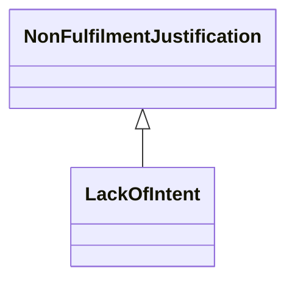

---
search:
  boost: 10.0
---

# Class: LackOfIntent 


_Justification that the process could not be fulfilled as the requestor_

_or initiator did not have a sufficient intent to complete it_


<div data-search-exclude markdown="1">


URI: [justifications:LackOfIntent](https://w3id.org/lmodel/dpv/justifications/LackOfIntent)





## Inheritance
* [NonFulfilmentJustification](NonFulfilmentJustification.md)
    * **LackOfIntent**


## Class Properties

| Property | Value |
| --- | --- |
| Class URI | [justifications:LackOfIntent](https://w3id.org/lmodel/dpv/justifications/LackOfIntent) |


## Slots

| Name | Cardinality and Range | Description | Inheritance |
| ---  | --- | --- | --- |


## In Subsets


* [JustificationsSubset](JustificationsSubset.md)


## Aliases


* Lack of Intent


## Comments

* An example of such intent is where the individual makes a request but
then offers to withdraw it in return for some form of benefit from the
organisation - see
https://ico.org.uk/for-organisations/uk-gdpr-guidance-and-resources/individual-rights/right-of-access/when-can-we-refuse-to-comply-with-a-request/#refuse2


## Identifier and Mapping Information


### Annotations

| property | value |
| --- | --- |
| upstream_iri | https://w3id.org/dpv/justifications/owl#LackOfIntent |
| dpv_extension_slug | justifications |


### Schema Source


* from schema: https://w3id.org/lmodel/dpv/justifications


## Mappings

| Mapping Type | Mapped Value |
| ---  | ---  |
| self | justifications:LackOfIntent |
| native | justifications:LackOfIntent |
| exact | dpv_justifications:LackOfIntent, dpv_justifications_owl:LackOfIntent |


## LinkML Source

<!-- TODO: investigate https://stackoverflow.com/questions/37606292/how-to-create-tabbed-code-blocks-in-mkdocs-or-sphinx -->

### Direct

<details>
```yaml
name: LackOfIntent
annotations:
  upstream_iri:
    tag: upstream_iri
    value: https://w3id.org/dpv/justifications/owl#LackOfIntent
  dpv_extension_slug:
    tag: dpv_extension_slug
    value: justifications
description: 'Justification that the process could not be fulfilled as the requestor

  or initiator did not have a sufficient intent to complete it'
comments:
- 'An example of such intent is where the individual makes a request but

  then offers to withdraw it in return for some form of benefit from the

  organisation - see

  https://ico.org.uk/for-organisations/uk-gdpr-guidance-and-resources/individual-rights/right-of-access/when-can-we-refuse-to-comply-with-a-request/#refuse2'
in_subset:
- justifications_subset
from_schema: https://w3id.org/lmodel/dpv/justifications
aliases:
- Lack of Intent
exact_mappings:
- dpv_justifications:LackOfIntent
- dpv_justifications_owl:LackOfIntent
is_a: NonFulfilmentJustification
class_uri: justifications:LackOfIntent

```
</details>

### Induced

<details>
```yaml
name: LackOfIntent
annotations:
  upstream_iri:
    tag: upstream_iri
    value: https://w3id.org/dpv/justifications/owl#LackOfIntent
  dpv_extension_slug:
    tag: dpv_extension_slug
    value: justifications
description: 'Justification that the process could not be fulfilled as the requestor

  or initiator did not have a sufficient intent to complete it'
comments:
- 'An example of such intent is where the individual makes a request but

  then offers to withdraw it in return for some form of benefit from the

  organisation - see

  https://ico.org.uk/for-organisations/uk-gdpr-guidance-and-resources/individual-rights/right-of-access/when-can-we-refuse-to-comply-with-a-request/#refuse2'
in_subset:
- justifications_subset
from_schema: https://w3id.org/lmodel/dpv/justifications
aliases:
- Lack of Intent
exact_mappings:
- dpv_justifications:LackOfIntent
- dpv_justifications_owl:LackOfIntent
is_a: NonFulfilmentJustification
class_uri: justifications:LackOfIntent

```
</details></div>