---
search:
  boost: 10.0
---

# Class: LegalProcessImpaired 


_Justification that the process could not be fulfilled as it impairs or_

_interferes with a legal or official process or procedure_


<div data-search-exclude markdown="1">


URI: [justifications:LegalProcessImpaired](https://w3id.org/lmodel/dpv/justifications/LegalProcessImpaired)

```mermaid
 classDiagram
    class LegalProcessImpaired
    click LegalProcessImpaired href "../LegalProcessImpaired/"
      NonFulfilmentJustification <|-- LegalProcessImpaired
        click NonFulfilmentJustification href "../NonFulfilmentJustification/"
      

      LegalProcessImpaired <|-- CivilLawEnforcementImpaired
        click CivilLawEnforcementImpaired href "../CivilLawEnforcementImpaired/"
      LegalProcessImpaired <|-- ConfidentialityObligationCompromised
        click ConfidentialityObligationCompromised href "../ConfidentialityObligationCompromised/"
      LegalProcessImpaired <|-- ContractEstablishmentNecessity
        click ContractEstablishmentNecessity href "../ContractEstablishmentNecessity/"
      LegalProcessImpaired <|-- ContractPerformanceNecessity
        click ContractPerformanceNecessity href "../ContractPerformanceNecessity/"
      LegalProcessImpaired <|-- CrimeDetectionImpaired
        click CrimeDetectionImpaired href "../CrimeDetectionImpaired/"
      LegalProcessImpaired <|-- CrimeInvestigationImpaired
        click CrimeInvestigationImpaired href "../CrimeInvestigationImpaired/"
      LegalProcessImpaired <|-- CrimePenaltyExecutionImpaired
        click CrimePenaltyExecutionImpaired href "../CrimePenaltyExecutionImpaired/"
      LegalProcessImpaired <|-- CrimePreventionImpaired
        click CrimePreventionImpaired href "../CrimePreventionImpaired/"
      LegalProcessImpaired <|-- CrimeProsecutionImpaired
        click CrimeProsecutionImpaired href "../CrimeProsecutionImpaired/"
      LegalProcessImpaired <|-- DataSubjectProtectionImpaired
        click DataSubjectProtectionImpaired href "../DataSubjectProtectionImpaired/"
      LegalProcessImpaired <|-- DefenceImpaired
        click DefenceImpaired href "../DefenceImpaired/"
      LegalProcessImpaired <|-- FreedomOfExpressionImpaired
        click FreedomOfExpressionImpaired href "../FreedomOfExpressionImpaired/"
      LegalProcessImpaired <|-- IdentityVerificationFailure
        click IdentityVerificationFailure href "../IdentityVerificationFailure/"
      LegalProcessImpaired <|-- JudicialProceedingsImpaired
        click JudicialProceedingsImpaired href "../JudicialProceedingsImpaired/"
      LegalProcessImpaired <|-- LegalClaimImpaired
        click LegalClaimImpaired href "../LegalClaimImpaired/"
      LegalProcessImpaired <|-- LegalObligationImpaired
        click LegalObligationImpaired href "../LegalObligationImpaired/"
      LegalProcessImpaired <|-- LegallyExempted
        click LegallyExempted href "../LegallyExempted/"
      LegalProcessImpaired <|-- NationalSecurityImpaired
        click NationalSecurityImpaired href "../NationalSecurityImpaired/"
      LegalProcessImpaired <|-- OfficialAuthorityExerciseImpaired
        click OfficialAuthorityExerciseImpaired href "../OfficialAuthorityExerciseImpaired/"
      LegalProcessImpaired <|-- OfficialStatisticsImpaired
        click OfficialStatisticsImpaired href "../OfficialStatisticsImpaired/"
      LegalProcessImpaired <|-- PublicHealthCompromised
        click PublicHealthCompromised href "../PublicHealthCompromised/"
      LegalProcessImpaired <|-- PublicInterestArchivingImpaired
        click PublicInterestArchivingImpaired href "../PublicInterestArchivingImpaired/"
      LegalProcessImpaired <|-- PublicInterestCompromised
        click PublicInterestCompromised href "../PublicInterestCompromised/"
      LegalProcessImpaired <|-- PublicSecurityImpaired
        click PublicSecurityImpaired href "../PublicSecurityImpaired/"
      LegalProcessImpaired <|-- ThirdPartyRightsImpaired
        click ThirdPartyRightsImpaired href "../ThirdPartyRightsImpaired/"
      

      
```





## Inheritance
* [NonFulfilmentJustification](NonFulfilmentJustification.md)
    * **LegalProcessImpaired**
        * [CivilLawEnforcementImpaired](CivilLawEnforcementImpaired.md)
        * [ConfidentialityObligationCompromised](ConfidentialityObligationCompromised.md)
        * [ContractEstablishmentNecessity](ContractEstablishmentNecessity.md)
        * [ContractPerformanceNecessity](ContractPerformanceNecessity.md)
        * [CrimeDetectionImpaired](CrimeDetectionImpaired.md) [ [SecurityImpaired](SecurityImpaired.md)]
        * [CrimeInvestigationImpaired](CrimeInvestigationImpaired.md) [ [SecurityImpaired](SecurityImpaired.md)]
        * [CrimePenaltyExecutionImpaired](CrimePenaltyExecutionImpaired.md) [ [SecurityImpaired](SecurityImpaired.md)]
        * [CrimePreventionImpaired](CrimePreventionImpaired.md) [ [SecurityImpaired](SecurityImpaired.md)]
        * [CrimeProsecutionImpaired](CrimeProsecutionImpaired.md) [ [SecurityImpaired](SecurityImpaired.md)]
        * [DataSubjectProtectionImpaired](DataSubjectProtectionImpaired.md) [ [SecurityImpaired](SecurityImpaired.md)]
        * [DefenceImpaired](DefenceImpaired.md) [ [SecurityImpaired](SecurityImpaired.md)]
        * [FreedomOfExpressionImpaired](FreedomOfExpressionImpaired.md)
        * [IdentityVerificationFailure](IdentityVerificationFailure.md) [ [SecurityImpaired](SecurityImpaired.md)]
        * [JudicialProceedingsImpaired](JudicialProceedingsImpaired.md)
        * [LegalClaimImpaired](LegalClaimImpaired.md)
        * [LegalObligationImpaired](LegalObligationImpaired.md)
        * [LegallyExempted](LegallyExempted.md)
        * [NationalSecurityImpaired](NationalSecurityImpaired.md) [ [SecurityImpaired](SecurityImpaired.md)]
        * [OfficialAuthorityExerciseImpaired](OfficialAuthorityExerciseImpaired.md)
        * [OfficialStatisticsImpaired](OfficialStatisticsImpaired.md)
        * [PublicHealthCompromised](PublicHealthCompromised.md)
        * [PublicInterestArchivingImpaired](PublicInterestArchivingImpaired.md)
        * [PublicInterestCompromised](PublicInterestCompromised.md)
        * [PublicSecurityImpaired](PublicSecurityImpaired.md) [ [SecurityImpaired](SecurityImpaired.md)]
        * [ThirdPartyRightsImpaired](ThirdPartyRightsImpaired.md)


## Class Properties

| Property | Value |
| --- | --- |
| Class URI | [justifications:LegalProcessImpaired](https://w3id.org/lmodel/dpv/justifications/LegalProcessImpaired) |


## Slots

| Name | Cardinality and Range | Description | Inheritance |
| ---  | --- | --- | --- |


## In Subsets


* [JustificationsSubset](JustificationsSubset.md)


## Aliases


* Legal Process Impaired


## Identifier and Mapping Information


### Annotations

| property | value |
| --- | --- |
| upstream_iri | https://w3id.org/dpv/justifications/owl#LegalProcessImpaired |
| dpv_extension_slug | justifications |


### Schema Source


* from schema: https://w3id.org/lmodel/dpv/justifications


## Mappings

| Mapping Type | Mapped Value |
| ---  | ---  |
| self | justifications:LegalProcessImpaired |
| native | justifications:LegalProcessImpaired |
| exact | dpv_justifications:LegalProcessImpaired, dpv_justifications_owl:LegalProcessImpaired |


## LinkML Source

<!-- TODO: investigate https://stackoverflow.com/questions/37606292/how-to-create-tabbed-code-blocks-in-mkdocs-or-sphinx -->

### Direct

<details>
```yaml
name: LegalProcessImpaired
annotations:
  upstream_iri:
    tag: upstream_iri
    value: https://w3id.org/dpv/justifications/owl#LegalProcessImpaired
  dpv_extension_slug:
    tag: dpv_extension_slug
    value: justifications
description: 'Justification that the process could not be fulfilled as it impairs
  or

  interferes with a legal or official process or procedure'
in_subset:
- justifications_subset
from_schema: https://w3id.org/lmodel/dpv/justifications
aliases:
- Legal Process Impaired
exact_mappings:
- dpv_justifications:LegalProcessImpaired
- dpv_justifications_owl:LegalProcessImpaired
is_a: NonFulfilmentJustification
class_uri: justifications:LegalProcessImpaired

```
</details>

### Induced

<details>
```yaml
name: LegalProcessImpaired
annotations:
  upstream_iri:
    tag: upstream_iri
    value: https://w3id.org/dpv/justifications/owl#LegalProcessImpaired
  dpv_extension_slug:
    tag: dpv_extension_slug
    value: justifications
description: 'Justification that the process could not be fulfilled as it impairs
  or

  interferes with a legal or official process or procedure'
in_subset:
- justifications_subset
from_schema: https://w3id.org/lmodel/dpv/justifications
aliases:
- Legal Process Impaired
exact_mappings:
- dpv_justifications:LegalProcessImpaired
- dpv_justifications_owl:LegalProcessImpaired
is_a: NonFulfilmentJustification
class_uri: justifications:LegalProcessImpaired

```
</details></div>