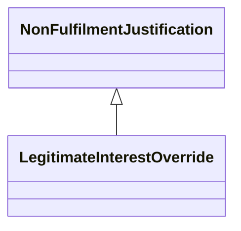

---
search:
  boost: 10.0
---

# Class: LegitimateInterestOverride 


_Justification that the process could not be fulfilled or was not_

_successful because the legitimate interest of the controller overrides_

_the interests or rights of the data subject_


<div data-search-exclude markdown="1">


URI: [justifications:LegitimateInterestOverride](https://w3id.org/lmodel/dpv/justifications/LegitimateInterestOverride)





## Inheritance
* [NonFulfilmentJustification](NonFulfilmentJustification.md)
    * **LegitimateInterestOverride**


## Class Properties

| Property | Value |
| --- | --- |
| Class URI | [justifications:LegitimateInterestOverride](https://w3id.org/lmodel/dpv/justifications/LegitimateInterestOverride) |


## Slots

| Name | Cardinality and Range | Description | Inheritance |
| ---  | --- | --- | --- |


## In Subsets


* [JustificationsSubset](JustificationsSubset.md)


## Aliases


* Legitimate Interest Override


## Identifier and Mapping Information


### Annotations

| property | value |
| --- | --- |
| upstream_iri | https://w3id.org/dpv/justifications/owl#LegitimateInterestOverride |
| dpv_extension_slug | justifications |


### Schema Source


* from schema: https://w3id.org/lmodel/dpv/justifications


## Mappings

| Mapping Type | Mapped Value |
| ---  | ---  |
| self | justifications:LegitimateInterestOverride |
| native | justifications:LegitimateInterestOverride |
| exact | dpv_justifications:LegitimateInterestOverride, dpv_justifications_owl:LegitimateInterestOverride |


## LinkML Source

<!-- TODO: investigate https://stackoverflow.com/questions/37606292/how-to-create-tabbed-code-blocks-in-mkdocs-or-sphinx -->

### Direct

<details>
```yaml
name: LegitimateInterestOverride
annotations:
  upstream_iri:
    tag: upstream_iri
    value: https://w3id.org/dpv/justifications/owl#LegitimateInterestOverride
  dpv_extension_slug:
    tag: dpv_extension_slug
    value: justifications
description: 'Justification that the process could not be fulfilled or was not

  successful because the legitimate interest of the controller overrides

  the interests or rights of the data subject'
in_subset:
- justifications_subset
from_schema: https://w3id.org/lmodel/dpv/justifications
aliases:
- Legitimate Interest Override
exact_mappings:
- dpv_justifications:LegitimateInterestOverride
- dpv_justifications_owl:LegitimateInterestOverride
is_a: NonFulfilmentJustification
class_uri: justifications:LegitimateInterestOverride

```
</details>

### Induced

<details>
```yaml
name: LegitimateInterestOverride
annotations:
  upstream_iri:
    tag: upstream_iri
    value: https://w3id.org/dpv/justifications/owl#LegitimateInterestOverride
  dpv_extension_slug:
    tag: dpv_extension_slug
    value: justifications
description: 'Justification that the process could not be fulfilled or was not

  successful because the legitimate interest of the controller overrides

  the interests or rights of the data subject'
in_subset:
- justifications_subset
from_schema: https://w3id.org/lmodel/dpv/justifications
aliases:
- Legitimate Interest Override
exact_mappings:
- dpv_justifications:LegitimateInterestOverride
- dpv_justifications_owl:LegitimateInterestOverride
is_a: NonFulfilmentJustification
class_uri: justifications:LegitimateInterestOverride

```
</details></div>