---
search:
  boost: 10.0
---

# Class: NonFulfilmentJustification 


_Justification for not fulfilling a process or requirement or obligation_


<div data-search-exclude markdown="1">


URI: [justifications:NonFulfilmentJustification](https://w3id.org/lmodel/dpv/justifications/NonFulfilmentJustification)

```mermaid
 classDiagram
    class NonFulfilmentJustification
    click NonFulfilmentJustification href "../NonFulfilmentJustification/"
      NonFulfilmentJustification <|-- ConsentProvided
        click ConsentProvided href "../ConsentProvided/"
      NonFulfilmentJustification <|-- DisproportionateEffortRequired
        click DisproportionateEffortRequired href "../DisproportionateEffortRequired/"
      NonFulfilmentJustification <|-- EthicsProcedureImpaired
        click EthicsProcedureImpaired href "../EthicsProcedureImpaired/"
      NonFulfilmentJustification <|-- FulfilmentImpossible
        click FulfilmentImpossible href "../FulfilmentImpossible/"
      NonFulfilmentJustification <|-- LackOfIntent
        click LackOfIntent href "../LackOfIntent/"
      NonFulfilmentJustification <|-- LegalProcessImpaired
        click LegalProcessImpaired href "../LegalProcessImpaired/"
      NonFulfilmentJustification <|-- LegitimateInterestOverride
        click LegitimateInterestOverride href "../LegitimateInterestOverride/"
      NonFulfilmentJustification <|-- ObjectivesImpaired
        click ObjectivesImpaired href "../ObjectivesImpaired/"
      NonFulfilmentJustification <|-- ProcessRejected
        click ProcessRejected href "../ProcessRejected/"
      NonFulfilmentJustification <|-- ScientificHistoricalResearchImpaired
        click ScientificHistoricalResearchImpaired href "../ScientificHistoricalResearchImpaired/"
      NonFulfilmentJustification <|-- SecurityImpaired
        click SecurityImpaired href "../SecurityImpaired/"
      
      
```





## Inheritance
* **NonFulfilmentJustification**
    * [ConsentProvided](ConsentProvided.md)
    * [DisproportionateEffortRequired](DisproportionateEffortRequired.md)
    * [EthicsProcedureImpaired](EthicsProcedureImpaired.md)
    * [FulfilmentImpossible](FulfilmentImpossible.md)
    * [LackOfIntent](LackOfIntent.md)
    * [LegalProcessImpaired](LegalProcessImpaired.md)
    * [LegitimateInterestOverride](LegitimateInterestOverride.md)
    * [ObjectivesImpaired](ObjectivesImpaired.md)
    * [ProcessRejected](ProcessRejected.md)
    * [ScientificHistoricalResearchImpaired](ScientificHistoricalResearchImpaired.md)
    * [SecurityImpaired](SecurityImpaired.md)


## Class Properties

| Property | Value |
| --- | --- |
| Class URI | [justifications:NonFulfilmentJustification](https://w3id.org/lmodel/dpv/justifications/NonFulfilmentJustification) |


## Slots

| Name | Cardinality and Range | Description | Inheritance |
| ---  | --- | --- | --- |


## In Subsets


* [JustificationsSubset](JustificationsSubset.md)


## Aliases


* Non-Fulfilment Justification


## Identifier and Mapping Information


### Annotations

| property | value |
| --- | --- |
| upstream_iri | https://w3id.org/dpv/justifications/owl#NonFulfilmentJustification |
| dpv_extension_slug | justifications |


### Schema Source


* from schema: https://w3id.org/lmodel/dpv/justifications


## Mappings

| Mapping Type | Mapped Value |
| ---  | ---  |
| self | justifications:NonFulfilmentJustification |
| native | justifications:NonFulfilmentJustification |
| exact | dpv_justifications:NonFulfilmentJustification, dpv_justifications_owl:NonFulfilmentJustification |
| related | oscal:RiskAcceptance |


## LinkML Source

<!-- TODO: investigate https://stackoverflow.com/questions/37606292/how-to-create-tabbed-code-blocks-in-mkdocs-or-sphinx -->

### Direct

<details>
```yaml
name: NonFulfilmentJustification
annotations:
  upstream_iri:
    tag: upstream_iri
    value: https://w3id.org/dpv/justifications/owl#NonFulfilmentJustification
  dpv_extension_slug:
    tag: dpv_extension_slug
    value: justifications
description: Justification for not fulfilling a process or requirement or obligation
in_subset:
- justifications_subset
from_schema: https://w3id.org/lmodel/dpv/justifications
aliases:
- Non-Fulfilment Justification
exact_mappings:
- dpv_justifications:NonFulfilmentJustification
- dpv_justifications_owl:NonFulfilmentJustification
related_mappings:
- oscal:RiskAcceptance
class_uri: justifications:NonFulfilmentJustification

```
</details>

### Induced

<details>
```yaml
name: NonFulfilmentJustification
annotations:
  upstream_iri:
    tag: upstream_iri
    value: https://w3id.org/dpv/justifications/owl#NonFulfilmentJustification
  dpv_extension_slug:
    tag: dpv_extension_slug
    value: justifications
description: Justification for not fulfilling a process or requirement or obligation
in_subset:
- justifications_subset
from_schema: https://w3id.org/lmodel/dpv/justifications
aliases:
- Non-Fulfilment Justification
exact_mappings:
- dpv_justifications:NonFulfilmentJustification
- dpv_justifications_owl:NonFulfilmentJustification
related_mappings:
- oscal:RiskAcceptance
class_uri: justifications:NonFulfilmentJustification

```
</details></div>