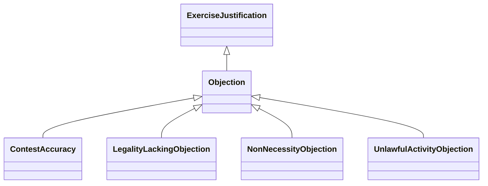

---
search:
  boost: 10.0
---

# Class: Objection 


_Justification that the process should be carried out due to specified_

_objection(s)_


<div data-search-exclude markdown="1">


URI: [justifications:Objection](https://w3id.org/lmodel/dpv/justifications/Objection)





## Inheritance
* [ExerciseJustification](ExerciseJustification.md)
    * **Objection**
        * [ContestAccuracy](ContestAccuracy.md)
        * [LegalityLackingObjection](LegalityLackingObjection.md)
        * [NonNecessityObjection](NonNecessityObjection.md)
        * [UnlawfulActivityObjection](UnlawfulActivityObjection.md)


## Class Properties

| Property | Value |
| --- | --- |
| Class URI | [justifications:Objection](https://w3id.org/lmodel/dpv/justifications/Objection) |


## Slots

| Name | Cardinality and Range | Description | Inheritance |
| ---  | --- | --- | --- |


## In Subsets


* [JustificationsSubset](JustificationsSubset.md)


## Aliases


* Objection


## Identifier and Mapping Information


### Annotations

| property | value |
| --- | --- |
| upstream_iri | https://w3id.org/dpv/justifications/owl#Objection |
| dpv_extension_slug | justifications |


### Schema Source


* from schema: https://w3id.org/lmodel/dpv/justifications


## Mappings

| Mapping Type | Mapped Value |
| ---  | ---  |
| self | justifications:Objection |
| native | justifications:Objection |
| exact | dpv_justifications:Objection, dpv_justifications_owl:Objection |


## LinkML Source

<!-- TODO: investigate https://stackoverflow.com/questions/37606292/how-to-create-tabbed-code-blocks-in-mkdocs-or-sphinx -->

### Direct

<details>
```yaml
name: Objection
annotations:
  upstream_iri:
    tag: upstream_iri
    value: https://w3id.org/dpv/justifications/owl#Objection
  dpv_extension_slug:
    tag: dpv_extension_slug
    value: justifications
description: 'Justification that the process should be carried out due to specified

  objection(s)'
in_subset:
- justifications_subset
from_schema: https://w3id.org/lmodel/dpv/justifications
aliases:
- Objection
exact_mappings:
- dpv_justifications:Objection
- dpv_justifications_owl:Objection
is_a: ExerciseJustification
class_uri: justifications:Objection

```
</details>

### Induced

<details>
```yaml
name: Objection
annotations:
  upstream_iri:
    tag: upstream_iri
    value: https://w3id.org/dpv/justifications/owl#Objection
  dpv_extension_slug:
    tag: dpv_extension_slug
    value: justifications
description: 'Justification that the process should be carried out due to specified

  objection(s)'
in_subset:
- justifications_subset
from_schema: https://w3id.org/lmodel/dpv/justifications
aliases:
- Objection
exact_mappings:
- dpv_justifications:Objection
- dpv_justifications_owl:Objection
is_a: ExerciseJustification
class_uri: justifications:Objection

```
</details></div>