---
search:
  boost: 10.0
---

# Class: SecurityImpaired 


_Justification that the process could not be fulfilled or was not_

_successful because it would interfere with tasks required for_

_maintaining security_


<div data-search-exclude markdown="1">


URI: [justifications:SecurityImpaired](https://w3id.org/lmodel/dpv/justifications/SecurityImpaired)

```mermaid
 classDiagram
    class SecurityImpaired
    click SecurityImpaired href "../SecurityImpaired/"
      NonFulfilmentJustification <|-- SecurityImpaired
        click NonFulfilmentJustification href "../NonFulfilmentJustification/"
      

      SecurityImpaired <|-- CrimeDetectionImpaired
        click CrimeDetectionImpaired href "../CrimeDetectionImpaired/"
      SecurityImpaired <|-- CrimeInvestigationImpaired
        click CrimeInvestigationImpaired href "../CrimeInvestigationImpaired/"
      SecurityImpaired <|-- CrimePenaltyExecutionImpaired
        click CrimePenaltyExecutionImpaired href "../CrimePenaltyExecutionImpaired/"
      SecurityImpaired <|-- CrimePreventionImpaired
        click CrimePreventionImpaired href "../CrimePreventionImpaired/"
      SecurityImpaired <|-- CrimeProsecutionImpaired
        click CrimeProsecutionImpaired href "../CrimeProsecutionImpaired/"
      SecurityImpaired <|-- DataSubjectProtectionImpaired
        click DataSubjectProtectionImpaired href "../DataSubjectProtectionImpaired/"
      SecurityImpaired <|-- DefenceImpaired
        click DefenceImpaired href "../DefenceImpaired/"
      SecurityImpaired <|-- IdentityVerificationFailure
        click IdentityVerificationFailure href "../IdentityVerificationFailure/"
      SecurityImpaired <|-- NationalSecurityImpaired
        click NationalSecurityImpaired href "../NationalSecurityImpaired/"
      SecurityImpaired <|-- PublicSecurityImpaired
        click PublicSecurityImpaired href "../PublicSecurityImpaired/"
      

      
```





## Inheritance
* [NonFulfilmentJustification](NonFulfilmentJustification.md)
    * **SecurityImpaired**


## Class Properties

| Property | Value |
| --- | --- |
| Class URI | [justifications:SecurityImpaired](https://w3id.org/lmodel/dpv/justifications/SecurityImpaired) |


## Slots

| Name | Cardinality and Range | Description | Inheritance |
| ---  | --- | --- | --- |


## In Subsets


* [JustificationsSubset](JustificationsSubset.md)


## Aliases


* Security Impaired


## Identifier and Mapping Information


### Annotations

| property | value |
| --- | --- |
| upstream_iri | https://w3id.org/dpv/justifications/owl#SecurityImpaired |
| dpv_extension_slug | justifications |


### Schema Source


* from schema: https://w3id.org/lmodel/dpv/justifications


## Mappings

| Mapping Type | Mapped Value |
| ---  | ---  |
| self | justifications:SecurityImpaired |
| native | justifications:SecurityImpaired |
| exact | dpv_justifications:SecurityImpaired, dpv_justifications_owl:SecurityImpaired |


## LinkML Source

<!-- TODO: investigate https://stackoverflow.com/questions/37606292/how-to-create-tabbed-code-blocks-in-mkdocs-or-sphinx -->

### Direct

<details>
```yaml
name: SecurityImpaired
annotations:
  upstream_iri:
    tag: upstream_iri
    value: https://w3id.org/dpv/justifications/owl#SecurityImpaired
  dpv_extension_slug:
    tag: dpv_extension_slug
    value: justifications
description: 'Justification that the process could not be fulfilled or was not

  successful because it would interfere with tasks required for

  maintaining security'
in_subset:
- justifications_subset
from_schema: https://w3id.org/lmodel/dpv/justifications
aliases:
- Security Impaired
exact_mappings:
- dpv_justifications:SecurityImpaired
- dpv_justifications_owl:SecurityImpaired
is_a: NonFulfilmentJustification
class_uri: justifications:SecurityImpaired

```
</details>

### Induced

<details>
```yaml
name: SecurityImpaired
annotations:
  upstream_iri:
    tag: upstream_iri
    value: https://w3id.org/dpv/justifications/owl#SecurityImpaired
  dpv_extension_slug:
    tag: dpv_extension_slug
    value: justifications
description: 'Justification that the process could not be fulfilled or was not

  successful because it would interfere with tasks required for

  maintaining security'
in_subset:
- justifications_subset
from_schema: https://w3id.org/lmodel/dpv/justifications
aliases:
- Security Impaired
exact_mappings:
- dpv_justifications:SecurityImpaired
- dpv_justifications_owl:SecurityImpaired
is_a: NonFulfilmentJustification
class_uri: justifications:SecurityImpaired

```
</details></div>