---
search:
  boost: 10.0
---

# Class: AF 


_Concept representing Country of Afghanistan_


<div data-search-exclude markdown="1">


URI: [loc:AF](https://w3id.org/lmodel/dpv/loc/AF)

```mermaid
 classDiagram
    class AF
    click AF href "../AF/"
      AF <|-- AFBAL
        click AFBAL href "../AFBAL/"
      AF <|-- AFBAM
        click AFBAM href "../AFBAM/"
      AF <|-- AFBDG
        click AFBDG href "../AFBDG/"
      AF <|-- AFBDS
        click AFBDS href "../AFBDS/"
      AF <|-- AFBGL
        click AFBGL href "../AFBGL/"
      AF <|-- AFDAY
        click AFDAY href "../AFDAY/"
      AF <|-- AFFRA
        click AFFRA href "../AFFRA/"
      AF <|-- AFFYB
        click AFFYB href "../AFFYB/"
      AF <|-- AFGHA
        click AFGHA href "../AFGHA/"
      AF <|-- AFGHO
        click AFGHO href "../AFGHO/"
      AF <|-- AFHEL
        click AFHEL href "../AFHEL/"
      AF <|-- AFHER
        click AFHER href "../AFHER/"
      AF <|-- AFJOW
        click AFJOW href "../AFJOW/"
      AF <|-- AFKAB
        click AFKAB href "../AFKAB/"
      AF <|-- AFKAN
        click AFKAN href "../AFKAN/"
      AF <|-- AFKAP
        click AFKAP href "../AFKAP/"
      AF <|-- AFKDZ
        click AFKDZ href "../AFKDZ/"
      AF <|-- AFKHO
        click AFKHO href "../AFKHO/"
      AF <|-- AFKNR
        click AFKNR href "../AFKNR/"
      AF <|-- AFLAG
        click AFLAG href "../AFLAG/"
      AF <|-- AFLOG
        click AFLOG href "../AFLOG/"
      AF <|-- AFNAN
        click AFNAN href "../AFNAN/"
      AF <|-- AFNIM
        click AFNIM href "../AFNIM/"
      AF <|-- AFNUR
        click AFNUR href "../AFNUR/"
      AF <|-- AFPAN
        click AFPAN href "../AFPAN/"
      AF <|-- AFPAR
        click AFPAR href "../AFPAR/"
      AF <|-- AFPIA
        click AFPIA href "../AFPIA/"
      AF <|-- AFPKA
        click AFPKA href "../AFPKA/"
      AF <|-- AFSAM
        click AFSAM href "../AFSAM/"
      AF <|-- AFSAR
        click AFSAR href "../AFSAR/"
      AF <|-- AFTAK
        click AFTAK href "../AFTAK/"
      AF <|-- AFURU
        click AFURU href "../AFURU/"
      AF <|-- AFWAR
        click AFWAR href "../AFWAR/"
      AF <|-- AFZAB
        click AFZAB href "../AFZAB/"
      
      
```





## Inheritance
* **AF**
    * [AFBAL](AFBAL.md)
    * [AFBAM](AFBAM.md)
    * [AFBDG](AFBDG.md)
    * [AFBDS](AFBDS.md)
    * [AFBGL](AFBGL.md)
    * [AFDAY](AFDAY.md)
    * [AFFRA](AFFRA.md)
    * [AFFYB](AFFYB.md)
    * [AFGHA](AFGHA.md)
    * [AFGHO](AFGHO.md)
    * [AFHEL](AFHEL.md)
    * [AFHER](AFHER.md)
    * [AFJOW](AFJOW.md)
    * [AFKAB](AFKAB.md)
    * [AFKAN](AFKAN.md)
    * [AFKAP](AFKAP.md)
    * [AFKDZ](AFKDZ.md)
    * [AFKHO](AFKHO.md)
    * [AFKNR](AFKNR.md)
    * [AFLAG](AFLAG.md)
    * [AFLOG](AFLOG.md)
    * [AFNAN](AFNAN.md)
    * [AFNIM](AFNIM.md)
    * [AFNUR](AFNUR.md)
    * [AFPAN](AFPAN.md)
    * [AFPAR](AFPAR.md)
    * [AFPIA](AFPIA.md)
    * [AFPKA](AFPKA.md)
    * [AFSAM](AFSAM.md)
    * [AFSAR](AFSAR.md)
    * [AFTAK](AFTAK.md)
    * [AFURU](AFURU.md)
    * [AFWAR](AFWAR.md)
    * [AFZAB](AFZAB.md)


## Class Properties

| Property | Value |
| --- | --- |
| Class URI | [loc:AF](https://w3id.org/lmodel/dpv/loc/AF) |


## Slots

| Name | Cardinality and Range | Description | Inheritance |
| ---  | --- | --- | --- |


## In Subsets


* [LocSubset](LocSubset.md)


## Aliases


* Afghanistan


## Identifier and Mapping Information


### Annotations

| property | value |
| --- | --- |
| upstream_iri | https://w3id.org/dpv/loc/owl#AF |
| dpv_extension_slug | loc |


### Schema Source


* from schema: https://w3id.org/lmodel/dpv/loc


## Mappings

| Mapping Type | Mapped Value |
| ---  | ---  |
| self | loc:AF |
| native | loc:AF |
| exact | dpv_loc:AF, dpv_loc_owl:AF |


## LinkML Source

<!-- TODO: investigate https://stackoverflow.com/questions/37606292/how-to-create-tabbed-code-blocks-in-mkdocs-or-sphinx -->

### Direct

<details>
```yaml
name: AF
annotations:
  upstream_iri:
    tag: upstream_iri
    value: https://w3id.org/dpv/loc/owl#AF
  dpv_extension_slug:
    tag: dpv_extension_slug
    value: loc
description: Concept representing Country of Afghanistan
in_subset:
- loc_subset
from_schema: https://w3id.org/lmodel/dpv/loc
aliases:
- Afghanistan
exact_mappings:
- dpv_loc:AF
- dpv_loc_owl:AF
class_uri: loc:AF

```
</details>

### Induced

<details>
```yaml
name: AF
annotations:
  upstream_iri:
    tag: upstream_iri
    value: https://w3id.org/dpv/loc/owl#AF
  dpv_extension_slug:
    tag: dpv_extension_slug
    value: loc
description: Concept representing Country of Afghanistan
in_subset:
- loc_subset
from_schema: https://w3id.org/lmodel/dpv/loc
aliases:
- Afghanistan
exact_mappings:
- dpv_loc:AF
- dpv_loc_owl:AF
class_uri: loc:AF

```
</details></div>