---
search:
  boost: 10.0
---

# Class: AL 


_Concept representing Country of Albania_


<div data-search-exclude markdown="1">


URI: [loc:AL](https://w3id.org/lmodel/dpv/loc/AL)

```mermaid
 classDiagram
    class AL
    click AL href "../AL/"
      AL <|-- AL01
        click AL01 href "../AL01/"
      AL <|-- AL02
        click AL02 href "../AL02/"
      AL <|-- AL03
        click AL03 href "../AL03/"
      AL <|-- AL04
        click AL04 href "../AL04/"
      AL <|-- AL05
        click AL05 href "../AL05/"
      AL <|-- AL06
        click AL06 href "../AL06/"
      AL <|-- AL07
        click AL07 href "../AL07/"
      AL <|-- AL08
        click AL08 href "../AL08/"
      AL <|-- AL09
        click AL09 href "../AL09/"
      AL <|-- AL10
        click AL10 href "../AL10/"
      AL <|-- AL11
        click AL11 href "../AL11/"
      AL <|-- AL12
        click AL12 href "../AL12/"
      AL <|-- ALEL
        click ALEL href "../ALEL/"
      AL <|-- ALFR
        click ALFR href "../ALFR/"
      AL <|-- ALGJ
        click ALGJ href "../ALGJ/"
      AL <|-- ALHA
        click ALHA href "../ALHA/"
      AL <|-- ALKA
        click ALKA href "../ALKA/"
      AL <|-- ALKC
        click ALKC href "../ALKC/"
      AL <|-- ALKR
        click ALKR href "../ALKR/"
      AL <|-- ALKU
        click ALKU href "../ALKU/"
      AL <|-- ALLB
        click ALLB href "../ALLB/"
      AL <|-- ALLU
        click ALLU href "../ALLU/"
      AL <|-- ALMR
        click ALMR href "../ALMR/"
      AL <|-- ALMT
        click ALMT href "../ALMT/"
      AL <|-- ALPG
        click ALPG href "../ALPG/"
      AL <|-- ALPR
        click ALPR href "../ALPR/"
      AL <|-- ALSH
        click ALSH href "../ALSH/"
      AL <|-- ALSK
        click ALSK href "../ALSK/"
      AL <|-- ALSR
        click ALSR href "../ALSR/"
      AL <|-- ALTE
        click ALTE href "../ALTE/"
      AL <|-- ALTP
        click ALTP href "../ALTP/"
      
      
```





## Inheritance
* **AL**
    * [AL01](AL01.md)
    * [AL02](AL02.md)
    * [AL03](AL03.md)
    * [AL04](AL04.md)
    * [AL05](AL05.md)
    * [AL06](AL06.md)
    * [AL07](AL07.md)
    * [AL08](AL08.md)
    * [AL09](AL09.md)
    * [AL10](AL10.md)
    * [AL11](AL11.md)
    * [AL12](AL12.md)
    * [ALEL](ALEL.md)
    * [ALFR](ALFR.md)
    * [ALGJ](ALGJ.md)
    * [ALHA](ALHA.md)
    * [ALKA](ALKA.md)
    * [ALKC](ALKC.md)
    * [ALKR](ALKR.md)
    * [ALKU](ALKU.md)
    * [ALLB](ALLB.md)
    * [ALLU](ALLU.md)
    * [ALMR](ALMR.md)
    * [ALMT](ALMT.md)
    * [ALPG](ALPG.md)
    * [ALPR](ALPR.md)
    * [ALSH](ALSH.md)
    * [ALSK](ALSK.md)
    * [ALSR](ALSR.md)
    * [ALTE](ALTE.md)
    * [ALTP](ALTP.md)


## Class Properties

| Property | Value |
| --- | --- |
| Class URI | [loc:AL](https://w3id.org/lmodel/dpv/loc/AL) |


## Slots

| Name | Cardinality and Range | Description | Inheritance |
| ---  | --- | --- | --- |


## In Subsets


* [LocSubset](LocSubset.md)


## Aliases


* Albania


## Identifier and Mapping Information


### Annotations

| property | value |
| --- | --- |
| upstream_iri | https://w3id.org/dpv/loc/owl#AL |
| dpv_extension_slug | loc |


### Schema Source


* from schema: https://w3id.org/lmodel/dpv/loc


## Mappings

| Mapping Type | Mapped Value |
| ---  | ---  |
| self | loc:AL |
| native | loc:AL |
| exact | dpv_loc:AL, dpv_loc_owl:AL |


## LinkML Source

<!-- TODO: investigate https://stackoverflow.com/questions/37606292/how-to-create-tabbed-code-blocks-in-mkdocs-or-sphinx -->

### Direct

<details>
```yaml
name: AL
annotations:
  upstream_iri:
    tag: upstream_iri
    value: https://w3id.org/dpv/loc/owl#AL
  dpv_extension_slug:
    tag: dpv_extension_slug
    value: loc
description: Concept representing Country of Albania
in_subset:
- loc_subset
from_schema: https://w3id.org/lmodel/dpv/loc
aliases:
- Albania
exact_mappings:
- dpv_loc:AL
- dpv_loc_owl:AL
class_uri: loc:AL

```
</details>

### Induced

<details>
```yaml
name: AL
annotations:
  upstream_iri:
    tag: upstream_iri
    value: https://w3id.org/dpv/loc/owl#AL
  dpv_extension_slug:
    tag: dpv_extension_slug
    value: loc
description: Concept representing Country of Albania
in_subset:
- loc_subset
from_schema: https://w3id.org/lmodel/dpv/loc
aliases:
- Albania
exact_mappings:
- dpv_loc:AL
- dpv_loc_owl:AL
class_uri: loc:AL

```
</details></div>