---
search:
  boost: 10.0
---

# Class: AO 


_Concept representing Country of Angola_


<div data-search-exclude markdown="1">


URI: [loc:AO](https://w3id.org/lmodel/dpv/loc/AO)

```mermaid
 classDiagram
    class AO
    click AO href "../AO/"
      AO <|-- AOBGO
        click AOBGO href "../AOBGO/"
      AO <|-- AOBGU
        click AOBGU href "../AOBGU/"
      AO <|-- AOBIE
        click AOBIE href "../AOBIE/"
      AO <|-- AOCAB
        click AOCAB href "../AOCAB/"
      AO <|-- AOCCU
        click AOCCU href "../AOCCU/"
      AO <|-- AOCNN
        click AOCNN href "../AOCNN/"
      AO <|-- AOCNO
        click AOCNO href "../AOCNO/"
      AO <|-- AOCUS
        click AOCUS href "../AOCUS/"
      AO <|-- AOHUA
        click AOHUA href "../AOHUA/"
      AO <|-- AOHUI
        click AOHUI href "../AOHUI/"
      AO <|-- AOLNO
        click AOLNO href "../AOLNO/"
      AO <|-- AOLSU
        click AOLSU href "../AOLSU/"
      AO <|-- AOLUA
        click AOLUA href "../AOLUA/"
      AO <|-- AOMAL
        click AOMAL href "../AOMAL/"
      AO <|-- AOMOX
        click AOMOX href "../AOMOX/"
      AO <|-- AONAM
        click AONAM href "../AONAM/"
      AO <|-- AOUIG
        click AOUIG href "../AOUIG/"
      AO <|-- AOZAI
        click AOZAI href "../AOZAI/"
      
      
```





## Inheritance
* **AO**
    * [AOBGO](AOBGO.md)
    * [AOBGU](AOBGU.md)
    * [AOBIE](AOBIE.md)
    * [AOCAB](AOCAB.md)
    * [AOCCU](AOCCU.md)
    * [AOCNN](AOCNN.md)
    * [AOCNO](AOCNO.md)
    * [AOCUS](AOCUS.md)
    * [AOHUA](AOHUA.md)
    * [AOHUI](AOHUI.md)
    * [AOLNO](AOLNO.md)
    * [AOLSU](AOLSU.md)
    * [AOLUA](AOLUA.md)
    * [AOMAL](AOMAL.md)
    * [AOMOX](AOMOX.md)
    * [AONAM](AONAM.md)
    * [AOUIG](AOUIG.md)
    * [AOZAI](AOZAI.md)


## Class Properties

| Property | Value |
| --- | --- |
| Class URI | [loc:AO](https://w3id.org/lmodel/dpv/loc/AO) |


## Slots

| Name | Cardinality and Range | Description | Inheritance |
| ---  | --- | --- | --- |


## In Subsets


* [LocSubset](LocSubset.md)


## Aliases


* Angola


## Identifier and Mapping Information


### Annotations

| property | value |
| --- | --- |
| upstream_iri | https://w3id.org/dpv/loc/owl#AO |
| dpv_extension_slug | loc |


### Schema Source


* from schema: https://w3id.org/lmodel/dpv/loc


## Mappings

| Mapping Type | Mapped Value |
| ---  | ---  |
| self | loc:AO |
| native | loc:AO |
| exact | dpv_loc:AO, dpv_loc_owl:AO |


## LinkML Source

<!-- TODO: investigate https://stackoverflow.com/questions/37606292/how-to-create-tabbed-code-blocks-in-mkdocs-or-sphinx -->

### Direct

<details>
```yaml
name: AO
annotations:
  upstream_iri:
    tag: upstream_iri
    value: https://w3id.org/dpv/loc/owl#AO
  dpv_extension_slug:
    tag: dpv_extension_slug
    value: loc
description: Concept representing Country of Angola
in_subset:
- loc_subset
from_schema: https://w3id.org/lmodel/dpv/loc
aliases:
- Angola
exact_mappings:
- dpv_loc:AO
- dpv_loc_owl:AO
class_uri: loc:AO

```
</details>

### Induced

<details>
```yaml
name: AO
annotations:
  upstream_iri:
    tag: upstream_iri
    value: https://w3id.org/dpv/loc/owl#AO
  dpv_extension_slug:
    tag: dpv_extension_slug
    value: loc
description: Concept representing Country of Angola
in_subset:
- loc_subset
from_schema: https://w3id.org/lmodel/dpv/loc
aliases:
- Angola
exact_mappings:
- dpv_loc:AO
- dpv_loc_owl:AO
class_uri: loc:AO

```
</details></div>