---
search:
  boost: 10.0
---

# Class: AR 


_Concept representing Country of Argentina_


<div data-search-exclude markdown="1">


URI: [loc:AR](https://w3id.org/lmodel/dpv/loc/AR)

```mermaid
 classDiagram
    class AR
    click AR href "../AR/"
      AR <|-- ARA
        click ARA href "../ARA/"
      AR <|-- ARB
        click ARB href "../ARB/"
      AR <|-- ARC
        click ARC href "../ARC/"
      AR <|-- ARD
        click ARD href "../ARD/"
      AR <|-- ARE
        click ARE href "../ARE/"
      AR <|-- ARF
        click ARF href "../ARF/"
      AR <|-- ARG
        click ARG href "../ARG/"
      AR <|-- ARH
        click ARH href "../ARH/"
      AR <|-- ARJ
        click ARJ href "../ARJ/"
      AR <|-- ARK
        click ARK href "../ARK/"
      AR <|-- ARL
        click ARL href "../ARL/"
      AR <|-- ARM
        click ARM href "../ARM/"
      AR <|-- ARN
        click ARN href "../ARN/"
      AR <|-- ARP
        click ARP href "../ARP/"
      AR <|-- ARQ
        click ARQ href "../ARQ/"
      AR <|-- ARR
        click ARR href "../ARR/"
      AR <|-- ARS
        click ARS href "../ARS/"
      AR <|-- ART
        click ART href "../ART/"
      AR <|-- ARU
        click ARU href "../ARU/"
      AR <|-- ARV
        click ARV href "../ARV/"
      AR <|-- ARW
        click ARW href "../ARW/"
      AR <|-- ARX
        click ARX href "../ARX/"
      AR <|-- ARY
        click ARY href "../ARY/"
      AR <|-- ARZ
        click ARZ href "../ARZ/"
      
      
```





## Inheritance
* **AR**
    * [ARA](ARA.md)
    * [ARB](ARB.md)
    * [ARC](ARC.md)
    * [ARD](ARD.md)
    * [ARE](ARE.md)
    * [ARF](ARF.md)
    * [ARG](ARG.md)
    * [ARH](ARH.md)
    * [ARJ](ARJ.md)
    * [ARK](ARK.md)
    * [ARL](ARL.md)
    * [ARM](ARM.md)
    * [ARN](ARN.md)
    * [ARP](ARP.md)
    * [ARQ](ARQ.md)
    * [ARR](ARR.md)
    * [ARS](ARS.md)
    * [ART](ART.md)
    * [ARU](ARU.md)
    * [ARV](ARV.md)
    * [ARW](ARW.md)
    * [ARX](ARX.md)
    * [ARY](ARY.md)
    * [ARZ](ARZ.md)


## Class Properties

| Property | Value |
| --- | --- |
| Class URI | [loc:AR](https://w3id.org/lmodel/dpv/loc/AR) |


## Slots

| Name | Cardinality and Range | Description | Inheritance |
| ---  | --- | --- | --- |


## In Subsets


* [LocSubset](LocSubset.md)


## Aliases


* Argentina


## Identifier and Mapping Information


### Annotations

| property | value |
| --- | --- |
| upstream_iri | https://w3id.org/dpv/loc/owl#AR |
| dpv_extension_slug | loc |


### Schema Source


* from schema: https://w3id.org/lmodel/dpv/loc


## Mappings

| Mapping Type | Mapped Value |
| ---  | ---  |
| self | loc:AR |
| native | loc:AR |
| exact | dpv_loc:AR, dpv_loc_owl:AR |


## LinkML Source

<!-- TODO: investigate https://stackoverflow.com/questions/37606292/how-to-create-tabbed-code-blocks-in-mkdocs-or-sphinx -->

### Direct

<details>
```yaml
name: AR
annotations:
  upstream_iri:
    tag: upstream_iri
    value: https://w3id.org/dpv/loc/owl#AR
  dpv_extension_slug:
    tag: dpv_extension_slug
    value: loc
description: Concept representing Country of Argentina
in_subset:
- loc_subset
from_schema: https://w3id.org/lmodel/dpv/loc
aliases:
- Argentina
exact_mappings:
- dpv_loc:AR
- dpv_loc_owl:AR
class_uri: loc:AR

```
</details>

### Induced

<details>
```yaml
name: AR
annotations:
  upstream_iri:
    tag: upstream_iri
    value: https://w3id.org/dpv/loc/owl#AR
  dpv_extension_slug:
    tag: dpv_extension_slug
    value: loc
description: Concept representing Country of Argentina
in_subset:
- loc_subset
from_schema: https://w3id.org/lmodel/dpv/loc
aliases:
- Argentina
exact_mappings:
- dpv_loc:AR
- dpv_loc_owl:AR
class_uri: loc:AR

```
</details></div>