---
search:
  boost: 10.0
---

# Class: AZ 


_Concept representing Country of Azerbaijan_


<div data-search-exclude markdown="1">


URI: [loc:AZ](https://w3id.org/lmodel/dpv/loc/AZ)

```mermaid
 classDiagram
    class AZ
    click AZ href "../AZ/"
      AZ <|-- AZABS
        click AZABS href "../AZABS/"
      AZ <|-- AZAGA
        click AZAGA href "../AZAGA/"
      AZ <|-- AZAGC
        click AZAGC href "../AZAGC/"
      AZ <|-- AZAGM
        click AZAGM href "../AZAGM/"
      AZ <|-- AZAGS
        click AZAGS href "../AZAGS/"
      AZ <|-- AZAGU
        click AZAGU href "../AZAGU/"
      AZ <|-- AZAST
        click AZAST href "../AZAST/"
      AZ <|-- AZBA
        click AZBA href "../AZBA/"
      AZ <|-- AZBAB
        click AZBAB href "../AZBAB/"
      AZ <|-- AZBAL
        click AZBAL href "../AZBAL/"
      AZ <|-- AZBAR
        click AZBAR href "../AZBAR/"
      AZ <|-- AZBEY
        click AZBEY href "../AZBEY/"
      AZ <|-- AZBIL
        click AZBIL href "../AZBIL/"
      AZ <|-- AZCAB
        click AZCAB href "../AZCAB/"
      AZ <|-- AZCAL
        click AZCAL href "../AZCAL/"
      AZ <|-- AZCUL
        click AZCUL href "../AZCUL/"
      AZ <|-- AZDAS
        click AZDAS href "../AZDAS/"
      AZ <|-- AZFUZ
        click AZFUZ href "../AZFUZ/"
      AZ <|-- AZGA
        click AZGA href "../AZGA/"
      AZ <|-- AZGAD
        click AZGAD href "../AZGAD/"
      AZ <|-- AZGOR
        click AZGOR href "../AZGOR/"
      AZ <|-- AZGOY
        click AZGOY href "../AZGOY/"
      AZ <|-- AZGYG
        click AZGYG href "../AZGYG/"
      AZ <|-- AZHAC
        click AZHAC href "../AZHAC/"
      AZ <|-- AZIMI
        click AZIMI href "../AZIMI/"
      AZ <|-- AZISM
        click AZISM href "../AZISM/"
      AZ <|-- AZKAL
        click AZKAL href "../AZKAL/"
      AZ <|-- AZKAN
        click AZKAN href "../AZKAN/"
      AZ <|-- AZKUR
        click AZKUR href "../AZKUR/"
      AZ <|-- AZLA
        click AZLA href "../AZLA/"
      AZ <|-- AZLAC
        click AZLAC href "../AZLAC/"
      AZ <|-- AZLAN
        click AZLAN href "../AZLAN/"
      AZ <|-- AZLER
        click AZLER href "../AZLER/"
      AZ <|-- AZMAS
        click AZMAS href "../AZMAS/"
      AZ <|-- AZMI
        click AZMI href "../AZMI/"
      AZ <|-- AZNEF
        click AZNEF href "../AZNEF/"
      AZ <|-- AZNV
        click AZNV href "../AZNV/"
      AZ <|-- AZNX
        click AZNX href "../AZNX/"
      AZ <|-- AZOGU
        click AZOGU href "../AZOGU/"
      AZ <|-- AZORD
        click AZORD href "../AZORD/"
      AZ <|-- AZQAB
        click AZQAB href "../AZQAB/"
      AZ <|-- AZQAX
        click AZQAX href "../AZQAX/"
      AZ <|-- AZQAZ
        click AZQAZ href "../AZQAZ/"
      AZ <|-- AZQBA
        click AZQBA href "../AZQBA/"
      AZ <|-- AZQBI
        click AZQBI href "../AZQBI/"
      AZ <|-- AZQOB
        click AZQOB href "../AZQOB/"
      AZ <|-- AZQUS
        click AZQUS href "../AZQUS/"
      AZ <|-- AZSA
        click AZSA href "../AZSA/"
      AZ <|-- AZSAB
        click AZSAB href "../AZSAB/"
      AZ <|-- AZSAD
        click AZSAD href "../AZSAD/"
      AZ <|-- AZSAH
        click AZSAH href "../AZSAH/"
      AZ <|-- AZSAK
        click AZSAK href "../AZSAK/"
      AZ <|-- AZSAL
        click AZSAL href "../AZSAL/"
      AZ <|-- AZSAR
        click AZSAR href "../AZSAR/"
      AZ <|-- AZSAT
        click AZSAT href "../AZSAT/"
      AZ <|-- AZSBN
        click AZSBN href "../AZSBN/"
      AZ <|-- AZSIY
        click AZSIY href "../AZSIY/"
      AZ <|-- AZSKR
        click AZSKR href "../AZSKR/"
      AZ <|-- AZSM
        click AZSM href "../AZSM/"
      AZ <|-- AZSMI
        click AZSMI href "../AZSMI/"
      AZ <|-- AZSMX
        click AZSMX href "../AZSMX/"
      AZ <|-- AZSR
        click AZSR href "../AZSR/"
      AZ <|-- AZSUS
        click AZSUS href "../AZSUS/"
      AZ <|-- AZTAR
        click AZTAR href "../AZTAR/"
      AZ <|-- AZTOV
        click AZTOV href "../AZTOV/"
      AZ <|-- AZUCA
        click AZUCA href "../AZUCA/"
      AZ <|-- AZXA
        click AZXA href "../AZXA/"
      AZ <|-- AZXAC
        click AZXAC href "../AZXAC/"
      AZ <|-- AZXCI
        click AZXCI href "../AZXCI/"
      AZ <|-- AZXIZ
        click AZXIZ href "../AZXIZ/"
      AZ <|-- AZXVD
        click AZXVD href "../AZXVD/"
      AZ <|-- AZYAR
        click AZYAR href "../AZYAR/"
      AZ <|-- AZYE
        click AZYE href "../AZYE/"
      AZ <|-- AZYEV
        click AZYEV href "../AZYEV/"
      AZ <|-- AZZAN
        click AZZAN href "../AZZAN/"
      AZ <|-- AZZAQ
        click AZZAQ href "../AZZAQ/"
      AZ <|-- AZZAR
        click AZZAR href "../AZZAR/"
      
      
```





## Inheritance
* **AZ**
    * [AZABS](AZABS.md)
    * [AZAGA](AZAGA.md)
    * [AZAGC](AZAGC.md)
    * [AZAGM](AZAGM.md)
    * [AZAGS](AZAGS.md)
    * [AZAGU](AZAGU.md)
    * [AZAST](AZAST.md)
    * [AZBA](AZBA.md)
    * [AZBAB](AZBAB.md)
    * [AZBAL](AZBAL.md)
    * [AZBAR](AZBAR.md)
    * [AZBEY](AZBEY.md)
    * [AZBIL](AZBIL.md)
    * [AZCAB](AZCAB.md)
    * [AZCAL](AZCAL.md)
    * [AZCUL](AZCUL.md)
    * [AZDAS](AZDAS.md)
    * [AZFUZ](AZFUZ.md)
    * [AZGA](AZGA.md)
    * [AZGAD](AZGAD.md)
    * [AZGOR](AZGOR.md)
    * [AZGOY](AZGOY.md)
    * [AZGYG](AZGYG.md)
    * [AZHAC](AZHAC.md)
    * [AZIMI](AZIMI.md)
    * [AZISM](AZISM.md)
    * [AZKAL](AZKAL.md)
    * [AZKAN](AZKAN.md)
    * [AZKUR](AZKUR.md)
    * [AZLA](AZLA.md)
    * [AZLAC](AZLAC.md)
    * [AZLAN](AZLAN.md)
    * [AZLER](AZLER.md)
    * [AZMAS](AZMAS.md)
    * [AZMI](AZMI.md)
    * [AZNEF](AZNEF.md)
    * [AZNV](AZNV.md)
    * [AZNX](AZNX.md)
    * [AZOGU](AZOGU.md)
    * [AZORD](AZORD.md)
    * [AZQAB](AZQAB.md)
    * [AZQAX](AZQAX.md)
    * [AZQAZ](AZQAZ.md)
    * [AZQBA](AZQBA.md)
    * [AZQBI](AZQBI.md)
    * [AZQOB](AZQOB.md)
    * [AZQUS](AZQUS.md)
    * [AZSA](AZSA.md)
    * [AZSAB](AZSAB.md)
    * [AZSAD](AZSAD.md)
    * [AZSAH](AZSAH.md)
    * [AZSAK](AZSAK.md)
    * [AZSAL](AZSAL.md)
    * [AZSAR](AZSAR.md)
    * [AZSAT](AZSAT.md)
    * [AZSBN](AZSBN.md)
    * [AZSIY](AZSIY.md)
    * [AZSKR](AZSKR.md)
    * [AZSM](AZSM.md)
    * [AZSMI](AZSMI.md)
    * [AZSMX](AZSMX.md)
    * [AZSR](AZSR.md)
    * [AZSUS](AZSUS.md)
    * [AZTAR](AZTAR.md)
    * [AZTOV](AZTOV.md)
    * [AZUCA](AZUCA.md)
    * [AZXA](AZXA.md)
    * [AZXAC](AZXAC.md)
    * [AZXCI](AZXCI.md)
    * [AZXIZ](AZXIZ.md)
    * [AZXVD](AZXVD.md)
    * [AZYAR](AZYAR.md)
    * [AZYE](AZYE.md)
    * [AZYEV](AZYEV.md)
    * [AZZAN](AZZAN.md)
    * [AZZAQ](AZZAQ.md)
    * [AZZAR](AZZAR.md)


## Class Properties

| Property | Value |
| --- | --- |
| Class URI | [loc:AZ](https://w3id.org/lmodel/dpv/loc/AZ) |


## Slots

| Name | Cardinality and Range | Description | Inheritance |
| ---  | --- | --- | --- |


## In Subsets


* [LocSubset](LocSubset.md)


## Aliases


* Azerbaijan


## Identifier and Mapping Information


### Annotations

| property | value |
| --- | --- |
| upstream_iri | https://w3id.org/dpv/loc/owl#AZ |
| dpv_extension_slug | loc |


### Schema Source


* from schema: https://w3id.org/lmodel/dpv/loc


## Mappings

| Mapping Type | Mapped Value |
| ---  | ---  |
| self | loc:AZ |
| native | loc:AZ |
| exact | dpv_loc:AZ, dpv_loc_owl:AZ |


## LinkML Source

<!-- TODO: investigate https://stackoverflow.com/questions/37606292/how-to-create-tabbed-code-blocks-in-mkdocs-or-sphinx -->

### Direct

<details>
```yaml
name: AZ
annotations:
  upstream_iri:
    tag: upstream_iri
    value: https://w3id.org/dpv/loc/owl#AZ
  dpv_extension_slug:
    tag: dpv_extension_slug
    value: loc
description: Concept representing Country of Azerbaijan
in_subset:
- loc_subset
from_schema: https://w3id.org/lmodel/dpv/loc
aliases:
- Azerbaijan
exact_mappings:
- dpv_loc:AZ
- dpv_loc_owl:AZ
class_uri: loc:AZ

```
</details>

### Induced

<details>
```yaml
name: AZ
annotations:
  upstream_iri:
    tag: upstream_iri
    value: https://w3id.org/dpv/loc/owl#AZ
  dpv_extension_slug:
    tag: dpv_extension_slug
    value: loc
description: Concept representing Country of Azerbaijan
in_subset:
- loc_subset
from_schema: https://w3id.org/lmodel/dpv/loc
aliases:
- Azerbaijan
exact_mappings:
- dpv_loc:AZ
- dpv_loc_owl:AZ
class_uri: loc:AZ

```
</details></div>