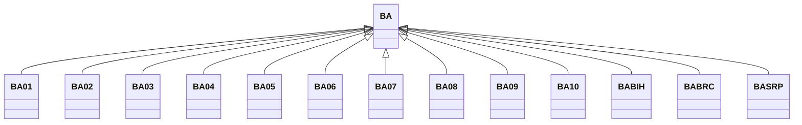

---
search:
  boost: 10.0
---

# Class: BA 


_Concept representing Country of Bosnia and Herzegovina_


<div data-search-exclude markdown="1">


URI: [loc:BA](https://w3id.org/lmodel/dpv/loc/BA)





## Inheritance
* **BA**
    * [BA01](BA01.md)
    * [BA02](BA02.md)
    * [BA03](BA03.md)
    * [BA04](BA04.md)
    * [BA05](BA05.md)
    * [BA06](BA06.md)
    * [BA07](BA07.md)
    * [BA08](BA08.md)
    * [BA09](BA09.md)
    * [BA10](BA10.md)
    * [BABIH](BABIH.md)
    * [BABRC](BABRC.md)
    * [BASRP](BASRP.md)


## Class Properties

| Property | Value |
| --- | --- |
| Class URI | [loc:BA](https://w3id.org/lmodel/dpv/loc/BA) |


## Slots

| Name | Cardinality and Range | Description | Inheritance |
| ---  | --- | --- | --- |


## In Subsets


* [LocSubset](LocSubset.md)


## Aliases


* Bosnia and Herzegovina


## Identifier and Mapping Information


### Annotations

| property | value |
| --- | --- |
| upstream_iri | https://w3id.org/dpv/loc/owl#BA |
| dpv_extension_slug | loc |


### Schema Source


* from schema: https://w3id.org/lmodel/dpv/loc


## Mappings

| Mapping Type | Mapped Value |
| ---  | ---  |
| self | loc:BA |
| native | loc:BA |
| exact | dpv_loc:BA, dpv_loc_owl:BA |


## LinkML Source

<!-- TODO: investigate https://stackoverflow.com/questions/37606292/how-to-create-tabbed-code-blocks-in-mkdocs-or-sphinx -->

### Direct

<details>
```yaml
name: BA
annotations:
  upstream_iri:
    tag: upstream_iri
    value: https://w3id.org/dpv/loc/owl#BA
  dpv_extension_slug:
    tag: dpv_extension_slug
    value: loc
description: Concept representing Country of Bosnia and Herzegovina
in_subset:
- loc_subset
from_schema: https://w3id.org/lmodel/dpv/loc
aliases:
- Bosnia and Herzegovina
exact_mappings:
- dpv_loc:BA
- dpv_loc_owl:BA
class_uri: loc:BA

```
</details>

### Induced

<details>
```yaml
name: BA
annotations:
  upstream_iri:
    tag: upstream_iri
    value: https://w3id.org/dpv/loc/owl#BA
  dpv_extension_slug:
    tag: dpv_extension_slug
    value: loc
description: Concept representing Country of Bosnia and Herzegovina
in_subset:
- loc_subset
from_schema: https://w3id.org/lmodel/dpv/loc
aliases:
- Bosnia and Herzegovina
exact_mappings:
- dpv_loc:BA
- dpv_loc_owl:BA
class_uri: loc:BA

```
</details></div>