---
search:
  boost: 10.0
---

# Class: BD 


_Concept representing Country of Bangladesh_


<div data-search-exclude markdown="1">


URI: [loc:BD](https://w3id.org/lmodel/dpv/loc/BD)

```mermaid
 classDiagram
    class BD
    click BD href "../BD/"
      BD <|-- BD01
        click BD01 href "../BD01/"
      BD <|-- BD02
        click BD02 href "../BD02/"
      BD <|-- BD03
        click BD03 href "../BD03/"
      BD <|-- BD04
        click BD04 href "../BD04/"
      BD <|-- BD05
        click BD05 href "../BD05/"
      BD <|-- BD06
        click BD06 href "../BD06/"
      BD <|-- BD07
        click BD07 href "../BD07/"
      BD <|-- BD08
        click BD08 href "../BD08/"
      BD <|-- BD09
        click BD09 href "../BD09/"
      BD <|-- BD10
        click BD10 href "../BD10/"
      BD <|-- BD11
        click BD11 href "../BD11/"
      BD <|-- BD12
        click BD12 href "../BD12/"
      BD <|-- BD13
        click BD13 href "../BD13/"
      BD <|-- BD14
        click BD14 href "../BD14/"
      BD <|-- BD15
        click BD15 href "../BD15/"
      BD <|-- BD16
        click BD16 href "../BD16/"
      BD <|-- BD17
        click BD17 href "../BD17/"
      BD <|-- BD18
        click BD18 href "../BD18/"
      BD <|-- BD19
        click BD19 href "../BD19/"
      BD <|-- BD20
        click BD20 href "../BD20/"
      BD <|-- BD21
        click BD21 href "../BD21/"
      BD <|-- BD23
        click BD23 href "../BD23/"
      BD <|-- BD24
        click BD24 href "../BD24/"
      BD <|-- BD25
        click BD25 href "../BD25/"
      BD <|-- BD26
        click BD26 href "../BD26/"
      BD <|-- BD27
        click BD27 href "../BD27/"
      BD <|-- BD28
        click BD28 href "../BD28/"
      BD <|-- BD29
        click BD29 href "../BD29/"
      BD <|-- BD30
        click BD30 href "../BD30/"
      BD <|-- BD31
        click BD31 href "../BD31/"
      BD <|-- BD32
        click BD32 href "../BD32/"
      BD <|-- BD33
        click BD33 href "../BD33/"
      BD <|-- BD34
        click BD34 href "../BD34/"
      BD <|-- BD35
        click BD35 href "../BD35/"
      BD <|-- BD36
        click BD36 href "../BD36/"
      BD <|-- BD37
        click BD37 href "../BD37/"
      BD <|-- BD38
        click BD38 href "../BD38/"
      BD <|-- BD39
        click BD39 href "../BD39/"
      BD <|-- BD40
        click BD40 href "../BD40/"
      BD <|-- BD41
        click BD41 href "../BD41/"
      BD <|-- BD42
        click BD42 href "../BD42/"
      BD <|-- BD43
        click BD43 href "../BD43/"
      BD <|-- BD44
        click BD44 href "../BD44/"
      BD <|-- BD45
        click BD45 href "../BD45/"
      BD <|-- BD46
        click BD46 href "../BD46/"
      BD <|-- BD47
        click BD47 href "../BD47/"
      BD <|-- BD48
        click BD48 href "../BD48/"
      BD <|-- BD49
        click BD49 href "../BD49/"
      BD <|-- BD50
        click BD50 href "../BD50/"
      BD <|-- BD51
        click BD51 href "../BD51/"
      BD <|-- BD52
        click BD52 href "../BD52/"
      BD <|-- BD53
        click BD53 href "../BD53/"
      BD <|-- BD54
        click BD54 href "../BD54/"
      BD <|-- BD55
        click BD55 href "../BD55/"
      BD <|-- BD56
        click BD56 href "../BD56/"
      BD <|-- BD57
        click BD57 href "../BD57/"
      BD <|-- BD58
        click BD58 href "../BD58/"
      BD <|-- BD59
        click BD59 href "../BD59/"
      BD <|-- BD60
        click BD60 href "../BD60/"
      BD <|-- BD61
        click BD61 href "../BD61/"
      BD <|-- BD62
        click BD62 href "../BD62/"
      BD <|-- BD63
        click BD63 href "../BD63/"
      BD <|-- BD64
        click BD64 href "../BD64/"
      BD <|-- BDA
        click BDA href "../BDA/"
      BD <|-- BDB
        click BDB href "../BDB/"
      BD <|-- BDC
        click BDC href "../BDC/"
      BD <|-- BDD
        click BDD href "../BDD/"
      BD <|-- BDE
        click BDE href "../BDE/"
      BD <|-- BDF
        click BDF href "../BDF/"
      BD <|-- BDG
        click BDG href "../BDG/"
      BD <|-- BDH
        click BDH href "../BDH/"
      
      
```





## Inheritance
* **BD**
    * [BD01](BD01.md)
    * [BD02](BD02.md)
    * [BD03](BD03.md)
    * [BD04](BD04.md)
    * [BD05](BD05.md)
    * [BD06](BD06.md)
    * [BD07](BD07.md)
    * [BD08](BD08.md)
    * [BD09](BD09.md)
    * [BD10](BD10.md)
    * [BD11](BD11.md)
    * [BD12](BD12.md)
    * [BD13](BD13.md)
    * [BD14](BD14.md)
    * [BD15](BD15.md)
    * [BD16](BD16.md)
    * [BD17](BD17.md)
    * [BD18](BD18.md)
    * [BD19](BD19.md)
    * [BD20](BD20.md)
    * [BD21](BD21.md)
    * [BD23](BD23.md)
    * [BD24](BD24.md)
    * [BD25](BD25.md)
    * [BD26](BD26.md)
    * [BD27](BD27.md)
    * [BD28](BD28.md)
    * [BD29](BD29.md)
    * [BD30](BD30.md)
    * [BD31](BD31.md)
    * [BD32](BD32.md)
    * [BD33](BD33.md)
    * [BD34](BD34.md)
    * [BD35](BD35.md)
    * [BD36](BD36.md)
    * [BD37](BD37.md)
    * [BD38](BD38.md)
    * [BD39](BD39.md)
    * [BD40](BD40.md)
    * [BD41](BD41.md)
    * [BD42](BD42.md)
    * [BD43](BD43.md)
    * [BD44](BD44.md)
    * [BD45](BD45.md)
    * [BD46](BD46.md)
    * [BD47](BD47.md)
    * [BD48](BD48.md)
    * [BD49](BD49.md)
    * [BD50](BD50.md)
    * [BD51](BD51.md)
    * [BD52](BD52.md)
    * [BD53](BD53.md)
    * [BD54](BD54.md)
    * [BD55](BD55.md)
    * [BD56](BD56.md)
    * [BD57](BD57.md)
    * [BD58](BD58.md)
    * [BD59](BD59.md)
    * [BD60](BD60.md)
    * [BD61](BD61.md)
    * [BD62](BD62.md)
    * [BD63](BD63.md)
    * [BD64](BD64.md)
    * [BDA](BDA.md)
    * [BDB](BDB.md)
    * [BDC](BDC.md)
    * [BDD](BDD.md)
    * [BDE](BDE.md)
    * [BDF](BDF.md)
    * [BDG](BDG.md)
    * [BDH](BDH.md)


## Class Properties

| Property | Value |
| --- | --- |
| Class URI | [loc:BD](https://w3id.org/lmodel/dpv/loc/BD) |


## Slots

| Name | Cardinality and Range | Description | Inheritance |
| ---  | --- | --- | --- |


## In Subsets


* [LocSubset](LocSubset.md)


## Aliases


* Bangladesh


## Identifier and Mapping Information


### Annotations

| property | value |
| --- | --- |
| upstream_iri | https://w3id.org/dpv/loc/owl#BD |
| dpv_extension_slug | loc |


### Schema Source


* from schema: https://w3id.org/lmodel/dpv/loc


## Mappings

| Mapping Type | Mapped Value |
| ---  | ---  |
| self | loc:BD |
| native | loc:BD |
| exact | dpv_loc:BD, dpv_loc_owl:BD |


## LinkML Source

<!-- TODO: investigate https://stackoverflow.com/questions/37606292/how-to-create-tabbed-code-blocks-in-mkdocs-or-sphinx -->

### Direct

<details>
```yaml
name: BD
annotations:
  upstream_iri:
    tag: upstream_iri
    value: https://w3id.org/dpv/loc/owl#BD
  dpv_extension_slug:
    tag: dpv_extension_slug
    value: loc
description: Concept representing Country of Bangladesh
in_subset:
- loc_subset
from_schema: https://w3id.org/lmodel/dpv/loc
aliases:
- Bangladesh
exact_mappings:
- dpv_loc:BD
- dpv_loc_owl:BD
class_uri: loc:BD

```
</details>

### Induced

<details>
```yaml
name: BD
annotations:
  upstream_iri:
    tag: upstream_iri
    value: https://w3id.org/dpv/loc/owl#BD
  dpv_extension_slug:
    tag: dpv_extension_slug
    value: loc
description: Concept representing Country of Bangladesh
in_subset:
- loc_subset
from_schema: https://w3id.org/lmodel/dpv/loc
aliases:
- Bangladesh
exact_mappings:
- dpv_loc:BD
- dpv_loc_owl:BD
class_uri: loc:BD

```
</details></div>