---
search:
  boost: 10.0
---

# Class: BF 


_Concept representing Country of Burkina Faso_


<div data-search-exclude markdown="1">


URI: [loc:BF](https://w3id.org/lmodel/dpv/loc/BF)

```mermaid
 classDiagram
    class BF
    click BF href "../BF/"
      BF <|-- BF01
        click BF01 href "../BF01/"
      BF <|-- BF02
        click BF02 href "../BF02/"
      BF <|-- BF03
        click BF03 href "../BF03/"
      BF <|-- BF04
        click BF04 href "../BF04/"
      BF <|-- BF05
        click BF05 href "../BF05/"
      BF <|-- BF06
        click BF06 href "../BF06/"
      BF <|-- BF07
        click BF07 href "../BF07/"
      BF <|-- BF08
        click BF08 href "../BF08/"
      BF <|-- BF09
        click BF09 href "../BF09/"
      BF <|-- BF10
        click BF10 href "../BF10/"
      BF <|-- BF11
        click BF11 href "../BF11/"
      BF <|-- BF12
        click BF12 href "../BF12/"
      BF <|-- BF13
        click BF13 href "../BF13/"
      BF <|-- BFBAL
        click BFBAL href "../BFBAL/"
      BF <|-- BFBAM
        click BFBAM href "../BFBAM/"
      BF <|-- BFBAN
        click BFBAN href "../BFBAN/"
      BF <|-- BFBAZ
        click BFBAZ href "../BFBAZ/"
      BF <|-- BFBGR
        click BFBGR href "../BFBGR/"
      BF <|-- BFBLG
        click BFBLG href "../BFBLG/"
      BF <|-- BFBLK
        click BFBLK href "../BFBLK/"
      BF <|-- BFCOM
        click BFCOM href "../BFCOM/"
      BF <|-- BFGAN
        click BFGAN href "../BFGAN/"
      BF <|-- BFGNA
        click BFGNA href "../BFGNA/"
      BF <|-- BFGOU
        click BFGOU href "../BFGOU/"
      BF <|-- BFHOU
        click BFHOU href "../BFHOU/"
      BF <|-- BFIOB
        click BFIOB href "../BFIOB/"
      BF <|-- BFKAD
        click BFKAD href "../BFKAD/"
      BF <|-- BFKEN
        click BFKEN href "../BFKEN/"
      BF <|-- BFKMD
        click BFKMD href "../BFKMD/"
      BF <|-- BFKMP
        click BFKMP href "../BFKMP/"
      BF <|-- BFKOP
        click BFKOP href "../BFKOP/"
      BF <|-- BFKOS
        click BFKOS href "../BFKOS/"
      BF <|-- BFKOT
        click BFKOT href "../BFKOT/"
      BF <|-- BFKOW
        click BFKOW href "../BFKOW/"
      BF <|-- BFLER
        click BFLER href "../BFLER/"
      BF <|-- BFLOR
        click BFLOR href "../BFLOR/"
      BF <|-- BFMOU
        click BFMOU href "../BFMOU/"
      BF <|-- BFNAM
        click BFNAM href "../BFNAM/"
      BF <|-- BFNAO
        click BFNAO href "../BFNAO/"
      BF <|-- BFNAY
        click BFNAY href "../BFNAY/"
      BF <|-- BFNOU
        click BFNOU href "../BFNOU/"
      BF <|-- BFOUB
        click BFOUB href "../BFOUB/"
      BF <|-- BFOUD
        click BFOUD href "../BFOUD/"
      BF <|-- BFPAS
        click BFPAS href "../BFPAS/"
      BF <|-- BFPON
        click BFPON href "../BFPON/"
      BF <|-- BFSEN
        click BFSEN href "../BFSEN/"
      BF <|-- BFSIS
        click BFSIS href "../BFSIS/"
      BF <|-- BFSMT
        click BFSMT href "../BFSMT/"
      BF <|-- BFSNG
        click BFSNG href "../BFSNG/"
      BF <|-- BFSOM
        click BFSOM href "../BFSOM/"
      BF <|-- BFSOR
        click BFSOR href "../BFSOR/"
      BF <|-- BFTAP
        click BFTAP href "../BFTAP/"
      BF <|-- BFTUI
        click BFTUI href "../BFTUI/"
      BF <|-- BFYAG
        click BFYAG href "../BFYAG/"
      BF <|-- BFYAT
        click BFYAT href "../BFYAT/"
      BF <|-- BFZIR
        click BFZIR href "../BFZIR/"
      BF <|-- BFZON
        click BFZON href "../BFZON/"
      BF <|-- BFZOU
        click BFZOU href "../BFZOU/"
      
      
```





## Inheritance
* **BF**
    * [BF01](BF01.md)
    * [BF02](BF02.md)
    * [BF03](BF03.md)
    * [BF04](BF04.md)
    * [BF05](BF05.md)
    * [BF06](BF06.md)
    * [BF07](BF07.md)
    * [BF08](BF08.md)
    * [BF09](BF09.md)
    * [BF10](BF10.md)
    * [BF11](BF11.md)
    * [BF12](BF12.md)
    * [BF13](BF13.md)
    * [BFBAL](BFBAL.md)
    * [BFBAM](BFBAM.md)
    * [BFBAN](BFBAN.md)
    * [BFBAZ](BFBAZ.md)
    * [BFBGR](BFBGR.md)
    * [BFBLG](BFBLG.md)
    * [BFBLK](BFBLK.md)
    * [BFCOM](BFCOM.md)
    * [BFGAN](BFGAN.md)
    * [BFGNA](BFGNA.md)
    * [BFGOU](BFGOU.md)
    * [BFHOU](BFHOU.md)
    * [BFIOB](BFIOB.md)
    * [BFKAD](BFKAD.md)
    * [BFKEN](BFKEN.md)
    * [BFKMD](BFKMD.md)
    * [BFKMP](BFKMP.md)
    * [BFKOP](BFKOP.md)
    * [BFKOS](BFKOS.md)
    * [BFKOT](BFKOT.md)
    * [BFKOW](BFKOW.md)
    * [BFLER](BFLER.md)
    * [BFLOR](BFLOR.md)
    * [BFMOU](BFMOU.md)
    * [BFNAM](BFNAM.md)
    * [BFNAO](BFNAO.md)
    * [BFNAY](BFNAY.md)
    * [BFNOU](BFNOU.md)
    * [BFOUB](BFOUB.md)
    * [BFOUD](BFOUD.md)
    * [BFPAS](BFPAS.md)
    * [BFPON](BFPON.md)
    * [BFSEN](BFSEN.md)
    * [BFSIS](BFSIS.md)
    * [BFSMT](BFSMT.md)
    * [BFSNG](BFSNG.md)
    * [BFSOM](BFSOM.md)
    * [BFSOR](BFSOR.md)
    * [BFTAP](BFTAP.md)
    * [BFTUI](BFTUI.md)
    * [BFYAG](BFYAG.md)
    * [BFYAT](BFYAT.md)
    * [BFZIR](BFZIR.md)
    * [BFZON](BFZON.md)
    * [BFZOU](BFZOU.md)


## Class Properties

| Property | Value |
| --- | --- |
| Class URI | [loc:BF](https://w3id.org/lmodel/dpv/loc/BF) |


## Slots

| Name | Cardinality and Range | Description | Inheritance |
| ---  | --- | --- | --- |


## In Subsets


* [LocSubset](LocSubset.md)


## Aliases


* Burkina Faso


## Identifier and Mapping Information


### Annotations

| property | value |
| --- | --- |
| upstream_iri | https://w3id.org/dpv/loc/owl#BF |
| dpv_extension_slug | loc |


### Schema Source


* from schema: https://w3id.org/lmodel/dpv/loc


## Mappings

| Mapping Type | Mapped Value |
| ---  | ---  |
| self | loc:BF |
| native | loc:BF |
| exact | dpv_loc:BF, dpv_loc_owl:BF |


## LinkML Source

<!-- TODO: investigate https://stackoverflow.com/questions/37606292/how-to-create-tabbed-code-blocks-in-mkdocs-or-sphinx -->

### Direct

<details>
```yaml
name: BF
annotations:
  upstream_iri:
    tag: upstream_iri
    value: https://w3id.org/dpv/loc/owl#BF
  dpv_extension_slug:
    tag: dpv_extension_slug
    value: loc
description: Concept representing Country of Burkina Faso
in_subset:
- loc_subset
from_schema: https://w3id.org/lmodel/dpv/loc
aliases:
- Burkina Faso
exact_mappings:
- dpv_loc:BF
- dpv_loc_owl:BF
class_uri: loc:BF

```
</details>

### Induced

<details>
```yaml
name: BF
annotations:
  upstream_iri:
    tag: upstream_iri
    value: https://w3id.org/dpv/loc/owl#BF
  dpv_extension_slug:
    tag: dpv_extension_slug
    value: loc
description: Concept representing Country of Burkina Faso
in_subset:
- loc_subset
from_schema: https://w3id.org/lmodel/dpv/loc
aliases:
- Burkina Faso
exact_mappings:
- dpv_loc:BF
- dpv_loc_owl:BF
class_uri: loc:BF

```
</details></div>