---
search:
  boost: 10.0
---

# Class: BG 


_Concept representing Country of Bulgaria_


<div data-search-exclude markdown="1">


URI: [loc:BG](https://w3id.org/lmodel/dpv/loc/BG)

```mermaid
 classDiagram
    class BG
    click BG href "../BG/"
      EEA30 <|-- BG
        click EEA30 href "../EEA30/"
      EEA31 <|-- BG
        click EEA31 href "../EEA31/"
      EU <|-- BG
        click EU href "../EU/"
      EU27 <|-- BG
        click EU27 href "../EU27/"
      EU28 <|-- BG
        click EU28 href "../EU28/"
      EEA <|-- BG
        click EEA href "../EEA/"
      

      BG <|-- BG01
        click BG01 href "../BG01/"
      BG <|-- BG02
        click BG02 href "../BG02/"
      BG <|-- BG03
        click BG03 href "../BG03/"
      BG <|-- BG04
        click BG04 href "../BG04/"
      BG <|-- BG05
        click BG05 href "../BG05/"
      BG <|-- BG06
        click BG06 href "../BG06/"
      BG <|-- BG07
        click BG07 href "../BG07/"
      BG <|-- BG08
        click BG08 href "../BG08/"
      BG <|-- BG09
        click BG09 href "../BG09/"
      BG <|-- BG10
        click BG10 href "../BG10/"
      BG <|-- BG11
        click BG11 href "../BG11/"
      BG <|-- BG12
        click BG12 href "../BG12/"
      BG <|-- BG13
        click BG13 href "../BG13/"
      BG <|-- BG14
        click BG14 href "../BG14/"
      BG <|-- BG15
        click BG15 href "../BG15/"
      BG <|-- BG16
        click BG16 href "../BG16/"
      BG <|-- BG17
        click BG17 href "../BG17/"
      BG <|-- BG18
        click BG18 href "../BG18/"
      BG <|-- BG19
        click BG19 href "../BG19/"
      BG <|-- BG20
        click BG20 href "../BG20/"
      BG <|-- BG21
        click BG21 href "../BG21/"
      BG <|-- BG22
        click BG22 href "../BG22/"
      BG <|-- BG23
        click BG23 href "../BG23/"
      BG <|-- BG24
        click BG24 href "../BG24/"
      BG <|-- BG25
        click BG25 href "../BG25/"
      BG <|-- BG26
        click BG26 href "../BG26/"
      BG <|-- BG27
        click BG27 href "../BG27/"
      BG <|-- BG28
        click BG28 href "../BG28/"
      

      
```





## Inheritance
* [EEA](EEA.md)
    * **BG** [ [EEA30](EEA30.md) [EEA31](EEA31.md) [EU](EU.md) [EU27](EU27.md) [EU28](EU28.md)]
        * [BG01](BG01.md)
        * [BG02](BG02.md)
        * [BG03](BG03.md)
        * [BG04](BG04.md)
        * [BG05](BG05.md)
        * [BG06](BG06.md)
        * [BG07](BG07.md)
        * [BG08](BG08.md)
        * [BG09](BG09.md)
        * [BG10](BG10.md)
        * [BG11](BG11.md)
        * [BG12](BG12.md)
        * [BG13](BG13.md)
        * [BG14](BG14.md)
        * [BG15](BG15.md)
        * [BG16](BG16.md)
        * [BG17](BG17.md)
        * [BG18](BG18.md)
        * [BG19](BG19.md)
        * [BG20](BG20.md)
        * [BG21](BG21.md)
        * [BG22](BG22.md)
        * [BG23](BG23.md)
        * [BG24](BG24.md)
        * [BG25](BG25.md)
        * [BG26](BG26.md)
        * [BG27](BG27.md)
        * [BG28](BG28.md)


## Class Properties

| Property | Value |
| --- | --- |
| Class URI | [loc:BG](https://w3id.org/lmodel/dpv/loc/BG) |


## Slots

| Name | Cardinality and Range | Description | Inheritance |
| ---  | --- | --- | --- |


## In Subsets


* [LocSubset](LocSubset.md)


## Aliases


* Bulgaria


## Identifier and Mapping Information


### Annotations

| property | value |
| --- | --- |
| upstream_iri | https://w3id.org/dpv/loc/owl#BG |
| dpv_extension_slug | loc |


### Schema Source


* from schema: https://w3id.org/lmodel/dpv/loc


## Mappings

| Mapping Type | Mapped Value |
| ---  | ---  |
| self | loc:BG |
| native | loc:BG |
| exact | dpv_loc:BG, dpv_loc_owl:BG |


## LinkML Source

<!-- TODO: investigate https://stackoverflow.com/questions/37606292/how-to-create-tabbed-code-blocks-in-mkdocs-or-sphinx -->

### Direct

<details>
```yaml
name: BG
annotations:
  upstream_iri:
    tag: upstream_iri
    value: https://w3id.org/dpv/loc/owl#BG
  dpv_extension_slug:
    tag: dpv_extension_slug
    value: loc
description: Concept representing Country of Bulgaria
in_subset:
- loc_subset
from_schema: https://w3id.org/lmodel/dpv/loc
aliases:
- Bulgaria
exact_mappings:
- dpv_loc:BG
- dpv_loc_owl:BG
is_a: EEA
mixins:
- EEA30
- EEA31
- EU
- EU27
- EU28
class_uri: loc:BG

```
</details>

### Induced

<details>
```yaml
name: BG
annotations:
  upstream_iri:
    tag: upstream_iri
    value: https://w3id.org/dpv/loc/owl#BG
  dpv_extension_slug:
    tag: dpv_extension_slug
    value: loc
description: Concept representing Country of Bulgaria
in_subset:
- loc_subset
from_schema: https://w3id.org/lmodel/dpv/loc
aliases:
- Bulgaria
exact_mappings:
- dpv_loc:BG
- dpv_loc_owl:BG
is_a: EEA
mixins:
- EEA30
- EEA31
- EU
- EU27
- EU28
class_uri: loc:BG

```
</details></div>