---
search:
  boost: 10.0
---

# Class: BR 


_Concept representing Country of Brazil_


<div data-search-exclude markdown="1">


URI: [loc:BR](https://w3id.org/lmodel/dpv/loc/BR)

```mermaid
 classDiagram
    class BR
    click BR href "../BR/"
      BR <|-- BRAC
        click BRAC href "../BRAC/"
      BR <|-- BRAL
        click BRAL href "../BRAL/"
      BR <|-- BRAM
        click BRAM href "../BRAM/"
      BR <|-- BRAP
        click BRAP href "../BRAP/"
      BR <|-- BRBA
        click BRBA href "../BRBA/"
      BR <|-- BRCE
        click BRCE href "../BRCE/"
      BR <|-- BRDF
        click BRDF href "../BRDF/"
      BR <|-- BRES
        click BRES href "../BRES/"
      BR <|-- BRGO
        click BRGO href "../BRGO/"
      BR <|-- BRMA
        click BRMA href "../BRMA/"
      BR <|-- BRMG
        click BRMG href "../BRMG/"
      BR <|-- BRMS
        click BRMS href "../BRMS/"
      BR <|-- BRMT
        click BRMT href "../BRMT/"
      BR <|-- BRPA
        click BRPA href "../BRPA/"
      BR <|-- BRPB
        click BRPB href "../BRPB/"
      BR <|-- BRPE
        click BRPE href "../BRPE/"
      BR <|-- BRPI
        click BRPI href "../BRPI/"
      BR <|-- BRPR
        click BRPR href "../BRPR/"
      BR <|-- BRRJ
        click BRRJ href "../BRRJ/"
      BR <|-- BRRN
        click BRRN href "../BRRN/"
      BR <|-- BRRO
        click BRRO href "../BRRO/"
      BR <|-- BRRR
        click BRRR href "../BRRR/"
      BR <|-- BRRS
        click BRRS href "../BRRS/"
      BR <|-- BRSC
        click BRSC href "../BRSC/"
      BR <|-- BRSE
        click BRSE href "../BRSE/"
      BR <|-- BRSP
        click BRSP href "../BRSP/"
      BR <|-- BRTO
        click BRTO href "../BRTO/"
      
      
```





## Inheritance
* **BR**
    * [BRAC](BRAC.md)
    * [BRAL](BRAL.md)
    * [BRAM](BRAM.md)
    * [BRAP](BRAP.md)
    * [BRBA](BRBA.md)
    * [BRCE](BRCE.md)
    * [BRDF](BRDF.md)
    * [BRES](BRES.md)
    * [BRGO](BRGO.md)
    * [BRMA](BRMA.md)
    * [BRMG](BRMG.md)
    * [BRMS](BRMS.md)
    * [BRMT](BRMT.md)
    * [BRPA](BRPA.md)
    * [BRPB](BRPB.md)
    * [BRPE](BRPE.md)
    * [BRPI](BRPI.md)
    * [BRPR](BRPR.md)
    * [BRRJ](BRRJ.md)
    * [BRRN](BRRN.md)
    * [BRRO](BRRO.md)
    * [BRRR](BRRR.md)
    * [BRRS](BRRS.md)
    * [BRSC](BRSC.md)
    * [BRSE](BRSE.md)
    * [BRSP](BRSP.md)
    * [BRTO](BRTO.md)


## Class Properties

| Property | Value |
| --- | --- |
| Class URI | [loc:BR](https://w3id.org/lmodel/dpv/loc/BR) |


## Slots

| Name | Cardinality and Range | Description | Inheritance |
| ---  | --- | --- | --- |


## In Subsets


* [LocSubset](LocSubset.md)


## Aliases


* Brazil


## Identifier and Mapping Information


### Annotations

| property | value |
| --- | --- |
| upstream_iri | https://w3id.org/dpv/loc/owl#BR |
| dpv_extension_slug | loc |


### Schema Source


* from schema: https://w3id.org/lmodel/dpv/loc


## Mappings

| Mapping Type | Mapped Value |
| ---  | ---  |
| self | loc:BR |
| native | loc:BR |
| exact | dpv_loc:BR, dpv_loc_owl:BR |


## LinkML Source

<!-- TODO: investigate https://stackoverflow.com/questions/37606292/how-to-create-tabbed-code-blocks-in-mkdocs-or-sphinx -->

### Direct

<details>
```yaml
name: BR
annotations:
  upstream_iri:
    tag: upstream_iri
    value: https://w3id.org/dpv/loc/owl#BR
  dpv_extension_slug:
    tag: dpv_extension_slug
    value: loc
description: Concept representing Country of Brazil
in_subset:
- loc_subset
from_schema: https://w3id.org/lmodel/dpv/loc
aliases:
- Brazil
exact_mappings:
- dpv_loc:BR
- dpv_loc_owl:BR
class_uri: loc:BR

```
</details>

### Induced

<details>
```yaml
name: BR
annotations:
  upstream_iri:
    tag: upstream_iri
    value: https://w3id.org/dpv/loc/owl#BR
  dpv_extension_slug:
    tag: dpv_extension_slug
    value: loc
description: Concept representing Country of Brazil
in_subset:
- loc_subset
from_schema: https://w3id.org/lmodel/dpv/loc
aliases:
- Brazil
exact_mappings:
- dpv_loc:BR
- dpv_loc_owl:BR
class_uri: loc:BR

```
</details></div>