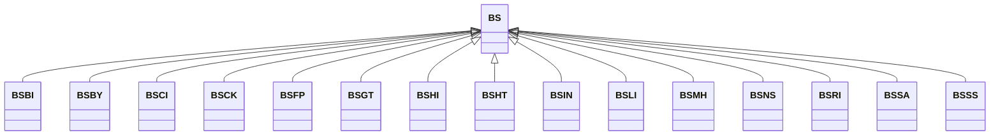

---
search:
  boost: 10.0
---

# Class: BS 


_Concept representing Country of Bahamas_


<div data-search-exclude markdown="1">


URI: [loc:BS](https://w3id.org/lmodel/dpv/loc/BS)





## Inheritance
* **BS**
    * [BSBI](BSBI.md)
    * [BSBY](BSBY.md)
    * [BSCI](BSCI.md)
    * [BSCK](BSCK.md)
    * [BSFP](BSFP.md)
    * [BSGT](BSGT.md)
    * [BSHI](BSHI.md)
    * [BSHT](BSHT.md)
    * [BSIN](BSIN.md)
    * [BSLI](BSLI.md)
    * [BSMH](BSMH.md)
    * [BSNS](BSNS.md)
    * [BSRI](BSRI.md)
    * [BSSA](BSSA.md)
    * [BSSS](BSSS.md)


## Class Properties

| Property | Value |
| --- | --- |
| Class URI | [loc:BS](https://w3id.org/lmodel/dpv/loc/BS) |


## Slots

| Name | Cardinality and Range | Description | Inheritance |
| ---  | --- | --- | --- |


## In Subsets


* [LocSubset](LocSubset.md)


## Aliases


* Bahamas


## Identifier and Mapping Information


### Annotations

| property | value |
| --- | --- |
| upstream_iri | https://w3id.org/dpv/loc/owl#BS |
| dpv_extension_slug | loc |


### Schema Source


* from schema: https://w3id.org/lmodel/dpv/loc


## Mappings

| Mapping Type | Mapped Value |
| ---  | ---  |
| self | loc:BS |
| native | loc:BS |
| exact | dpv_loc:BS, dpv_loc_owl:BS |


## LinkML Source

<!-- TODO: investigate https://stackoverflow.com/questions/37606292/how-to-create-tabbed-code-blocks-in-mkdocs-or-sphinx -->

### Direct

<details>
```yaml
name: BS
annotations:
  upstream_iri:
    tag: upstream_iri
    value: https://w3id.org/dpv/loc/owl#BS
  dpv_extension_slug:
    tag: dpv_extension_slug
    value: loc
description: Concept representing Country of Bahamas
in_subset:
- loc_subset
from_schema: https://w3id.org/lmodel/dpv/loc
aliases:
- Bahamas
exact_mappings:
- dpv_loc:BS
- dpv_loc_owl:BS
class_uri: loc:BS

```
</details>

### Induced

<details>
```yaml
name: BS
annotations:
  upstream_iri:
    tag: upstream_iri
    value: https://w3id.org/dpv/loc/owl#BS
  dpv_extension_slug:
    tag: dpv_extension_slug
    value: loc
description: Concept representing Country of Bahamas
in_subset:
- loc_subset
from_schema: https://w3id.org/lmodel/dpv/loc
aliases:
- Bahamas
exact_mappings:
- dpv_loc:BS
- dpv_loc_owl:BS
class_uri: loc:BS

```
</details></div>