---
search:
  boost: 10.0
---

# Class: BT 


_Concept representing Country of Bhutan_


<div data-search-exclude markdown="1">


URI: [loc:BT](https://w3id.org/lmodel/dpv/loc/BT)

```mermaid
 classDiagram
    class BT
    click BT href "../BT/"
      BT <|-- BT11
        click BT11 href "../BT11/"
      BT <|-- BT12
        click BT12 href "../BT12/"
      BT <|-- BT13
        click BT13 href "../BT13/"
      BT <|-- BT14
        click BT14 href "../BT14/"
      BT <|-- BT15
        click BT15 href "../BT15/"
      BT <|-- BT21
        click BT21 href "../BT21/"
      BT <|-- BT22
        click BT22 href "../BT22/"
      BT <|-- BT23
        click BT23 href "../BT23/"
      BT <|-- BT24
        click BT24 href "../BT24/"
      BT <|-- BT31
        click BT31 href "../BT31/"
      BT <|-- BT32
        click BT32 href "../BT32/"
      BT <|-- BT33
        click BT33 href "../BT33/"
      BT <|-- BT34
        click BT34 href "../BT34/"
      BT <|-- BT41
        click BT41 href "../BT41/"
      BT <|-- BT42
        click BT42 href "../BT42/"
      BT <|-- BT43
        click BT43 href "../BT43/"
      BT <|-- BT44
        click BT44 href "../BT44/"
      BT <|-- BT45
        click BT45 href "../BT45/"
      BT <|-- BTGA
        click BTGA href "../BTGA/"
      BT <|-- BTTY
        click BTTY href "../BTTY/"
      
      
```





## Inheritance
* **BT**
    * [BT11](BT11.md)
    * [BT12](BT12.md)
    * [BT13](BT13.md)
    * [BT14](BT14.md)
    * [BT15](BT15.md)
    * [BT21](BT21.md)
    * [BT22](BT22.md)
    * [BT23](BT23.md)
    * [BT24](BT24.md)
    * [BT31](BT31.md)
    * [BT32](BT32.md)
    * [BT33](BT33.md)
    * [BT34](BT34.md)
    * [BT41](BT41.md)
    * [BT42](BT42.md)
    * [BT43](BT43.md)
    * [BT44](BT44.md)
    * [BT45](BT45.md)
    * [BTGA](BTGA.md)
    * [BTTY](BTTY.md)


## Class Properties

| Property | Value |
| --- | --- |
| Class URI | [loc:BT](https://w3id.org/lmodel/dpv/loc/BT) |


## Slots

| Name | Cardinality and Range | Description | Inheritance |
| ---  | --- | --- | --- |


## In Subsets


* [LocSubset](LocSubset.md)


## Aliases


* Bhutan


## Identifier and Mapping Information


### Annotations

| property | value |
| --- | --- |
| upstream_iri | https://w3id.org/dpv/loc/owl#BT |
| dpv_extension_slug | loc |


### Schema Source


* from schema: https://w3id.org/lmodel/dpv/loc


## Mappings

| Mapping Type | Mapped Value |
| ---  | ---  |
| self | loc:BT |
| native | loc:BT |
| exact | dpv_loc:BT, dpv_loc_owl:BT |


## LinkML Source

<!-- TODO: investigate https://stackoverflow.com/questions/37606292/how-to-create-tabbed-code-blocks-in-mkdocs-or-sphinx -->

### Direct

<details>
```yaml
name: BT
annotations:
  upstream_iri:
    tag: upstream_iri
    value: https://w3id.org/dpv/loc/owl#BT
  dpv_extension_slug:
    tag: dpv_extension_slug
    value: loc
description: Concept representing Country of Bhutan
in_subset:
- loc_subset
from_schema: https://w3id.org/lmodel/dpv/loc
aliases:
- Bhutan
exact_mappings:
- dpv_loc:BT
- dpv_loc_owl:BT
class_uri: loc:BT

```
</details>

### Induced

<details>
```yaml
name: BT
annotations:
  upstream_iri:
    tag: upstream_iri
    value: https://w3id.org/dpv/loc/owl#BT
  dpv_extension_slug:
    tag: dpv_extension_slug
    value: loc
description: Concept representing Country of Bhutan
in_subset:
- loc_subset
from_schema: https://w3id.org/lmodel/dpv/loc
aliases:
- Bhutan
exact_mappings:
- dpv_loc:BT
- dpv_loc_owl:BT
class_uri: loc:BT

```
</details></div>