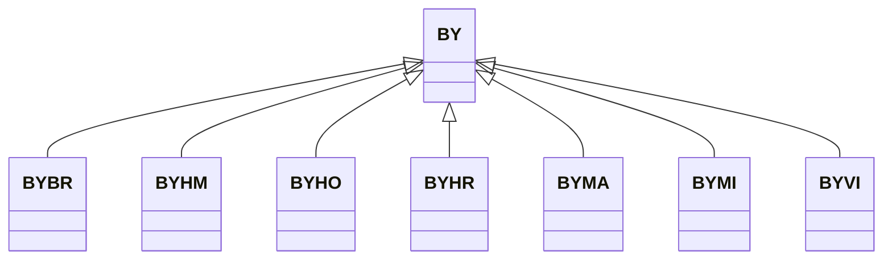

---
search:
  boost: 10.0
---

# Class: BY 


_Concept representing Country of Belarus_


<div data-search-exclude markdown="1">


URI: [loc:BY](https://w3id.org/lmodel/dpv/loc/BY)





## Inheritance
* **BY**
    * [BYBR](BYBR.md)
    * [BYHM](BYHM.md)
    * [BYHO](BYHO.md)
    * [BYHR](BYHR.md)
    * [BYMA](BYMA.md)
    * [BYMI](BYMI.md)
    * [BYVI](BYVI.md)


## Class Properties

| Property | Value |
| --- | --- |
| Class URI | [loc:BY](https://w3id.org/lmodel/dpv/loc/BY) |


## Slots

| Name | Cardinality and Range | Description | Inheritance |
| ---  | --- | --- | --- |


## In Subsets


* [LocSubset](LocSubset.md)


## Aliases


* Belarus


## Identifier and Mapping Information


### Annotations

| property | value |
| --- | --- |
| upstream_iri | https://w3id.org/dpv/loc/owl#BY |
| dpv_extension_slug | loc |


### Schema Source


* from schema: https://w3id.org/lmodel/dpv/loc


## Mappings

| Mapping Type | Mapped Value |
| ---  | ---  |
| self | loc:BY |
| native | loc:BY |
| exact | dpv_loc:BY, dpv_loc_owl:BY |


## LinkML Source

<!-- TODO: investigate https://stackoverflow.com/questions/37606292/how-to-create-tabbed-code-blocks-in-mkdocs-or-sphinx -->

### Direct

<details>
```yaml
name: BY
annotations:
  upstream_iri:
    tag: upstream_iri
    value: https://w3id.org/dpv/loc/owl#BY
  dpv_extension_slug:
    tag: dpv_extension_slug
    value: loc
description: Concept representing Country of Belarus
in_subset:
- loc_subset
from_schema: https://w3id.org/lmodel/dpv/loc
aliases:
- Belarus
exact_mappings:
- dpv_loc:BY
- dpv_loc_owl:BY
class_uri: loc:BY

```
</details>

### Induced

<details>
```yaml
name: BY
annotations:
  upstream_iri:
    tag: upstream_iri
    value: https://w3id.org/dpv/loc/owl#BY
  dpv_extension_slug:
    tag: dpv_extension_slug
    value: loc
description: Concept representing Country of Belarus
in_subset:
- loc_subset
from_schema: https://w3id.org/lmodel/dpv/loc
aliases:
- Belarus
exact_mappings:
- dpv_loc:BY
- dpv_loc_owl:BY
class_uri: loc:BY

```
</details></div>