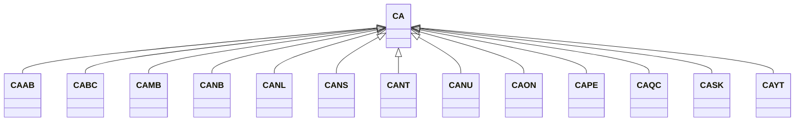

---
search:
  boost: 10.0
---

# Class: CA 


_Concept representing Country of Canada_


<div data-search-exclude markdown="1">


URI: [loc:CA](https://w3id.org/lmodel/dpv/loc/CA)





## Inheritance
* **CA**
    * [CAAB](CAAB.md)
    * [CABC](CABC.md)
    * [CAMB](CAMB.md)
    * [CANB](CANB.md)
    * [CANL](CANL.md)
    * [CANS](CANS.md)
    * [CANT](CANT.md)
    * [CANU](CANU.md)
    * [CAON](CAON.md)
    * [CAPE](CAPE.md)
    * [CAQC](CAQC.md)
    * [CASK](CASK.md)
    * [CAYT](CAYT.md)


## Class Properties

| Property | Value |
| --- | --- |
| Class URI | [loc:CA](https://w3id.org/lmodel/dpv/loc/CA) |


## Slots

| Name | Cardinality and Range | Description | Inheritance |
| ---  | --- | --- | --- |


## In Subsets


* [LocSubset](LocSubset.md)


## Aliases


* Canada


## Identifier and Mapping Information


### Annotations

| property | value |
| --- | --- |
| upstream_iri | https://w3id.org/dpv/loc/owl#CA |
| dpv_extension_slug | loc |


### Schema Source


* from schema: https://w3id.org/lmodel/dpv/loc


## Mappings

| Mapping Type | Mapped Value |
| ---  | ---  |
| self | loc:CA |
| native | loc:CA |
| exact | dpv_loc:CA, dpv_loc_owl:CA, iso3166:CA |


## LinkML Source

<!-- TODO: investigate https://stackoverflow.com/questions/37606292/how-to-create-tabbed-code-blocks-in-mkdocs-or-sphinx -->

### Direct

<details>
```yaml
name: CA
annotations:
  upstream_iri:
    tag: upstream_iri
    value: https://w3id.org/dpv/loc/owl#CA
  dpv_extension_slug:
    tag: dpv_extension_slug
    value: loc
description: Concept representing Country of Canada
in_subset:
- loc_subset
from_schema: https://w3id.org/lmodel/dpv/loc
aliases:
- Canada
exact_mappings:
- dpv_loc:CA
- dpv_loc_owl:CA
- iso3166:CA
class_uri: loc:CA

```
</details>

### Induced

<details>
```yaml
name: CA
annotations:
  upstream_iri:
    tag: upstream_iri
    value: https://w3id.org/dpv/loc/owl#CA
  dpv_extension_slug:
    tag: dpv_extension_slug
    value: loc
description: Concept representing Country of Canada
in_subset:
- loc_subset
from_schema: https://w3id.org/lmodel/dpv/loc
aliases:
- Canada
exact_mappings:
- dpv_loc:CA
- dpv_loc_owl:CA
- iso3166:CA
class_uri: loc:CA

```
</details></div>