---
search:
  boost: 10.0
---

# Class: CD 


_Concept representing Country of Democratic Republic of the Congo_


<div data-search-exclude markdown="1">


URI: [loc:CD](https://w3id.org/lmodel/dpv/loc/CD)

```mermaid
 classDiagram
    class CD
    click CD href "../CD/"
      CD <|-- CDBC
        click CDBC href "../CDBC/"
      CD <|-- CDBN
        click CDBN href "../CDBN/"
      CD <|-- CDEQ
        click CDEQ href "../CDEQ/"
      CD <|-- CDHK
        click CDHK href "../CDHK/"
      CD <|-- CDHL
        click CDHL href "../CDHL/"
      CD <|-- CDHU
        click CDHU href "../CDHU/"
      CD <|-- CDKA
        click CDKA href "../CDKA/"
      CD <|-- CDKC
        click CDKC href "../CDKC/"
      CD <|-- CDKE
        click CDKE href "../CDKE/"
      CD <|-- CDKG
        click CDKG href "../CDKG/"
      CD <|-- CDKL
        click CDKL href "../CDKL/"
      CD <|-- CDKN
        click CDKN href "../CDKN/"
      CD <|-- CDKW
        click CDKW href "../CDKW/"
      CD <|-- CDLO
        click CDLO href "../CDLO/"
      CD <|-- CDLU
        click CDLU href "../CDLU/"
      CD <|-- CDMA
        click CDMA href "../CDMA/"
      CD <|-- CDMN
        click CDMN href "../CDMN/"
      CD <|-- CDMO
        click CDMO href "../CDMO/"
      CD <|-- CDNK
        click CDNK href "../CDNK/"
      CD <|-- CDNU
        click CDNU href "../CDNU/"
      CD <|-- CDSA
        click CDSA href "../CDSA/"
      CD <|-- CDSK
        click CDSK href "../CDSK/"
      CD <|-- CDTA
        click CDTA href "../CDTA/"
      CD <|-- CDTO
        click CDTO href "../CDTO/"
      CD <|-- CDTU
        click CDTU href "../CDTU/"
      
      
```





## Inheritance
* **CD**
    * [CDBC](CDBC.md)
    * [CDBN](CDBN.md)
    * [CDEQ](CDEQ.md)
    * [CDHK](CDHK.md)
    * [CDHL](CDHL.md)
    * [CDHU](CDHU.md)
    * [CDKA](CDKA.md)
    * [CDKC](CDKC.md)
    * [CDKE](CDKE.md)
    * [CDKG](CDKG.md)
    * [CDKL](CDKL.md)
    * [CDKN](CDKN.md)
    * [CDKW](CDKW.md)
    * [CDLO](CDLO.md)
    * [CDLU](CDLU.md)
    * [CDMA](CDMA.md)
    * [CDMN](CDMN.md)
    * [CDMO](CDMO.md)
    * [CDNK](CDNK.md)
    * [CDNU](CDNU.md)
    * [CDSA](CDSA.md)
    * [CDSK](CDSK.md)
    * [CDTA](CDTA.md)
    * [CDTO](CDTO.md)
    * [CDTU](CDTU.md)


## Class Properties

| Property | Value |
| --- | --- |
| Class URI | [loc:CD](https://w3id.org/lmodel/dpv/loc/CD) |


## Slots

| Name | Cardinality and Range | Description | Inheritance |
| ---  | --- | --- | --- |


## In Subsets


* [LocSubset](LocSubset.md)


## Aliases


* Democratic Republic of the Congo


## Identifier and Mapping Information


### Annotations

| property | value |
| --- | --- |
| upstream_iri | https://w3id.org/dpv/loc/owl#CD |
| dpv_extension_slug | loc |


### Schema Source


* from schema: https://w3id.org/lmodel/dpv/loc


## Mappings

| Mapping Type | Mapped Value |
| ---  | ---  |
| self | loc:CD |
| native | loc:CD |
| exact | dpv_loc:CD, dpv_loc_owl:CD |


## LinkML Source

<!-- TODO: investigate https://stackoverflow.com/questions/37606292/how-to-create-tabbed-code-blocks-in-mkdocs-or-sphinx -->

### Direct

<details>
```yaml
name: CD
annotations:
  upstream_iri:
    tag: upstream_iri
    value: https://w3id.org/dpv/loc/owl#CD
  dpv_extension_slug:
    tag: dpv_extension_slug
    value: loc
description: Concept representing Country of Democratic Republic of the Congo
in_subset:
- loc_subset
from_schema: https://w3id.org/lmodel/dpv/loc
aliases:
- Democratic Republic of the Congo
exact_mappings:
- dpv_loc:CD
- dpv_loc_owl:CD
class_uri: loc:CD

```
</details>

### Induced

<details>
```yaml
name: CD
annotations:
  upstream_iri:
    tag: upstream_iri
    value: https://w3id.org/dpv/loc/owl#CD
  dpv_extension_slug:
    tag: dpv_extension_slug
    value: loc
description: Concept representing Country of Democratic Republic of the Congo
in_subset:
- loc_subset
from_schema: https://w3id.org/lmodel/dpv/loc
aliases:
- Democratic Republic of the Congo
exact_mappings:
- dpv_loc:CD
- dpv_loc_owl:CD
class_uri: loc:CD

```
</details></div>