---
search:
  boost: 10.0
---

# Class: CH 


_Concept representing Country of Switzerland_


<div data-search-exclude markdown="1">


URI: [loc:CH](https://w3id.org/lmodel/dpv/loc/CH)

```mermaid
 classDiagram
    class CH
    click CH href "../CH/"
      CH <|-- CHAG
        click CHAG href "../CHAG/"
      CH <|-- CHAI
        click CHAI href "../CHAI/"
      CH <|-- CHAR
        click CHAR href "../CHAR/"
      CH <|-- CHBE
        click CHBE href "../CHBE/"
      CH <|-- CHBL
        click CHBL href "../CHBL/"
      CH <|-- CHBS
        click CHBS href "../CHBS/"
      CH <|-- CHFR
        click CHFR href "../CHFR/"
      CH <|-- CHGE
        click CHGE href "../CHGE/"
      CH <|-- CHGL
        click CHGL href "../CHGL/"
      CH <|-- CHGR
        click CHGR href "../CHGR/"
      CH <|-- CHJU
        click CHJU href "../CHJU/"
      CH <|-- CHLU
        click CHLU href "../CHLU/"
      CH <|-- CHNE
        click CHNE href "../CHNE/"
      CH <|-- CHNW
        click CHNW href "../CHNW/"
      CH <|-- CHOW
        click CHOW href "../CHOW/"
      CH <|-- CHSG
        click CHSG href "../CHSG/"
      CH <|-- CHSH
        click CHSH href "../CHSH/"
      CH <|-- CHSO
        click CHSO href "../CHSO/"
      CH <|-- CHSZ
        click CHSZ href "../CHSZ/"
      CH <|-- CHTG
        click CHTG href "../CHTG/"
      CH <|-- CHTI
        click CHTI href "../CHTI/"
      CH <|-- CHUR
        click CHUR href "../CHUR/"
      CH <|-- CHVD
        click CHVD href "../CHVD/"
      CH <|-- CHVS
        click CHVS href "../CHVS/"
      CH <|-- CHZG
        click CHZG href "../CHZG/"
      CH <|-- CHZH
        click CHZH href "../CHZH/"
      
      
```





## Inheritance
* **CH**
    * [CHAG](CHAG.md)
    * [CHAI](CHAI.md)
    * [CHAR](CHAR.md)
    * [CHBE](CHBE.md)
    * [CHBL](CHBL.md)
    * [CHBS](CHBS.md)
    * [CHFR](CHFR.md)
    * [CHGE](CHGE.md)
    * [CHGL](CHGL.md)
    * [CHGR](CHGR.md)
    * [CHJU](CHJU.md)
    * [CHLU](CHLU.md)
    * [CHNE](CHNE.md)
    * [CHNW](CHNW.md)
    * [CHOW](CHOW.md)
    * [CHSG](CHSG.md)
    * [CHSH](CHSH.md)
    * [CHSO](CHSO.md)
    * [CHSZ](CHSZ.md)
    * [CHTG](CHTG.md)
    * [CHTI](CHTI.md)
    * [CHUR](CHUR.md)
    * [CHVD](CHVD.md)
    * [CHVS](CHVS.md)
    * [CHZG](CHZG.md)
    * [CHZH](CHZH.md)


## Class Properties

| Property | Value |
| --- | --- |
| Class URI | [loc:CH](https://w3id.org/lmodel/dpv/loc/CH) |


## Slots

| Name | Cardinality and Range | Description | Inheritance |
| ---  | --- | --- | --- |


## In Subsets


* [LocSubset](LocSubset.md)


## Aliases


* Switzerland


## Identifier and Mapping Information


### Annotations

| property | value |
| --- | --- |
| upstream_iri | https://w3id.org/dpv/loc/owl#CH |
| dpv_extension_slug | loc |


### Schema Source


* from schema: https://w3id.org/lmodel/dpv/loc


## Mappings

| Mapping Type | Mapped Value |
| ---  | ---  |
| self | loc:CH |
| native | loc:CH |
| exact | dpv_loc:CH, dpv_loc_owl:CH, iso3166:CH |


## LinkML Source

<!-- TODO: investigate https://stackoverflow.com/questions/37606292/how-to-create-tabbed-code-blocks-in-mkdocs-or-sphinx -->

### Direct

<details>
```yaml
name: CH
annotations:
  upstream_iri:
    tag: upstream_iri
    value: https://w3id.org/dpv/loc/owl#CH
  dpv_extension_slug:
    tag: dpv_extension_slug
    value: loc
description: Concept representing Country of Switzerland
in_subset:
- loc_subset
from_schema: https://w3id.org/lmodel/dpv/loc
aliases:
- Switzerland
exact_mappings:
- dpv_loc:CH
- dpv_loc_owl:CH
- iso3166:CH
class_uri: loc:CH

```
</details>

### Induced

<details>
```yaml
name: CH
annotations:
  upstream_iri:
    tag: upstream_iri
    value: https://w3id.org/dpv/loc/owl#CH
  dpv_extension_slug:
    tag: dpv_extension_slug
    value: loc
description: Concept representing Country of Switzerland
in_subset:
- loc_subset
from_schema: https://w3id.org/lmodel/dpv/loc
aliases:
- Switzerland
exact_mappings:
- dpv_loc:CH
- dpv_loc_owl:CH
- iso3166:CH
class_uri: loc:CH

```
</details></div>