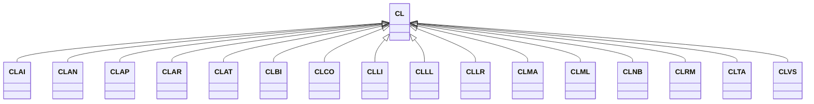

---
search:
  boost: 10.0
---

# Class: CL 


_Concept representing Country of Chile_


<div data-search-exclude markdown="1">


URI: [loc:CL](https://w3id.org/lmodel/dpv/loc/CL)





## Inheritance
* **CL**
    * [CLAI](CLAI.md)
    * [CLAN](CLAN.md)
    * [CLAP](CLAP.md)
    * [CLAR](CLAR.md)
    * [CLAT](CLAT.md)
    * [CLBI](CLBI.md)
    * [CLCO](CLCO.md)
    * [CLLI](CLLI.md)
    * [CLLL](CLLL.md)
    * [CLLR](CLLR.md)
    * [CLMA](CLMA.md)
    * [CLML](CLML.md)
    * [CLNB](CLNB.md)
    * [CLRM](CLRM.md)
    * [CLTA](CLTA.md)
    * [CLVS](CLVS.md)


## Class Properties

| Property | Value |
| --- | --- |
| Class URI | [loc:CL](https://w3id.org/lmodel/dpv/loc/CL) |


## Slots

| Name | Cardinality and Range | Description | Inheritance |
| ---  | --- | --- | --- |


## In Subsets


* [LocSubset](LocSubset.md)


## Aliases


* Chile


## Identifier and Mapping Information


### Annotations

| property | value |
| --- | --- |
| upstream_iri | https://w3id.org/dpv/loc/owl#CL |
| dpv_extension_slug | loc |


### Schema Source


* from schema: https://w3id.org/lmodel/dpv/loc


## Mappings

| Mapping Type | Mapped Value |
| ---  | ---  |
| self | loc:CL |
| native | loc:CL |
| exact | dpv_loc:CL, dpv_loc_owl:CL |


## LinkML Source

<!-- TODO: investigate https://stackoverflow.com/questions/37606292/how-to-create-tabbed-code-blocks-in-mkdocs-or-sphinx -->

### Direct

<details>
```yaml
name: CL
annotations:
  upstream_iri:
    tag: upstream_iri
    value: https://w3id.org/dpv/loc/owl#CL
  dpv_extension_slug:
    tag: dpv_extension_slug
    value: loc
description: Concept representing Country of Chile
in_subset:
- loc_subset
from_schema: https://w3id.org/lmodel/dpv/loc
aliases:
- Chile
exact_mappings:
- dpv_loc:CL
- dpv_loc_owl:CL
class_uri: loc:CL

```
</details>

### Induced

<details>
```yaml
name: CL
annotations:
  upstream_iri:
    tag: upstream_iri
    value: https://w3id.org/dpv/loc/owl#CL
  dpv_extension_slug:
    tag: dpv_extension_slug
    value: loc
description: Concept representing Country of Chile
in_subset:
- loc_subset
from_schema: https://w3id.org/lmodel/dpv/loc
aliases:
- Chile
exact_mappings:
- dpv_loc:CL
- dpv_loc_owl:CL
class_uri: loc:CL

```
</details></div>