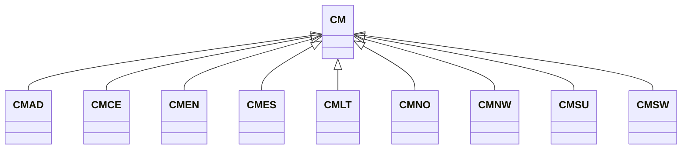

---
search:
  boost: 10.0
---

# Class: CM 


_Concept representing Country of Cameroon_


<div data-search-exclude markdown="1">


URI: [loc:CM](https://w3id.org/lmodel/dpv/loc/CM)





## Inheritance
* **CM**
    * [CMAD](CMAD.md)
    * [CMCE](CMCE.md)
    * [CMEN](CMEN.md)
    * [CMES](CMES.md)
    * [CMLT](CMLT.md)
    * [CMNO](CMNO.md)
    * [CMNW](CMNW.md)
    * [CMSU](CMSU.md)
    * [CMSW](CMSW.md)


## Class Properties

| Property | Value |
| --- | --- |
| Class URI | [loc:CM](https://w3id.org/lmodel/dpv/loc/CM) |


## Slots

| Name | Cardinality and Range | Description | Inheritance |
| ---  | --- | --- | --- |


## In Subsets


* [LocSubset](LocSubset.md)


## Aliases


* Cameroon


## Identifier and Mapping Information


### Annotations

| property | value |
| --- | --- |
| upstream_iri | https://w3id.org/dpv/loc/owl#CM |
| dpv_extension_slug | loc |


### Schema Source


* from schema: https://w3id.org/lmodel/dpv/loc


## Mappings

| Mapping Type | Mapped Value |
| ---  | ---  |
| self | loc:CM |
| native | loc:CM |
| exact | dpv_loc:CM, dpv_loc_owl:CM |


## LinkML Source

<!-- TODO: investigate https://stackoverflow.com/questions/37606292/how-to-create-tabbed-code-blocks-in-mkdocs-or-sphinx -->

### Direct

<details>
```yaml
name: CM
annotations:
  upstream_iri:
    tag: upstream_iri
    value: https://w3id.org/dpv/loc/owl#CM
  dpv_extension_slug:
    tag: dpv_extension_slug
    value: loc
description: Concept representing Country of Cameroon
in_subset:
- loc_subset
from_schema: https://w3id.org/lmodel/dpv/loc
aliases:
- Cameroon
exact_mappings:
- dpv_loc:CM
- dpv_loc_owl:CM
class_uri: loc:CM

```
</details>

### Induced

<details>
```yaml
name: CM
annotations:
  upstream_iri:
    tag: upstream_iri
    value: https://w3id.org/dpv/loc/owl#CM
  dpv_extension_slug:
    tag: dpv_extension_slug
    value: loc
description: Concept representing Country of Cameroon
in_subset:
- loc_subset
from_schema: https://w3id.org/lmodel/dpv/loc
aliases:
- Cameroon
exact_mappings:
- dpv_loc:CM
- dpv_loc_owl:CM
class_uri: loc:CM

```
</details></div>