---
search:
  boost: 10.0
---

# Class: CN 


_Concept representing Country of China_


<div data-search-exclude markdown="1">


URI: [loc:CN](https://w3id.org/lmodel/dpv/loc/CN)

```mermaid
 classDiagram
    class CN
    click CN href "../CN/"
      CN <|-- CNAH
        click CNAH href "../CNAH/"
      CN <|-- CNBJ
        click CNBJ href "../CNBJ/"
      CN <|-- CNCQ
        click CNCQ href "../CNCQ/"
      CN <|-- CNFJ
        click CNFJ href "../CNFJ/"
      CN <|-- CNGD
        click CNGD href "../CNGD/"
      CN <|-- CNGS
        click CNGS href "../CNGS/"
      CN <|-- CNGX
        click CNGX href "../CNGX/"
      CN <|-- CNGZ
        click CNGZ href "../CNGZ/"
      CN <|-- CNHA
        click CNHA href "../CNHA/"
      CN <|-- CNHB
        click CNHB href "../CNHB/"
      CN <|-- CNHE
        click CNHE href "../CNHE/"
      CN <|-- CNHI
        click CNHI href "../CNHI/"
      CN <|-- CNHK
        click CNHK href "../CNHK/"
      CN <|-- CNHL
        click CNHL href "../CNHL/"
      CN <|-- CNHN
        click CNHN href "../CNHN/"
      CN <|-- CNJL
        click CNJL href "../CNJL/"
      CN <|-- CNJS
        click CNJS href "../CNJS/"
      CN <|-- CNJX
        click CNJX href "../CNJX/"
      CN <|-- CNLN
        click CNLN href "../CNLN/"
      CN <|-- CNMO
        click CNMO href "../CNMO/"
      CN <|-- CNNM
        click CNNM href "../CNNM/"
      CN <|-- CNNX
        click CNNX href "../CNNX/"
      CN <|-- CNQH
        click CNQH href "../CNQH/"
      CN <|-- CNSC
        click CNSC href "../CNSC/"
      CN <|-- CNSD
        click CNSD href "../CNSD/"
      CN <|-- CNSH
        click CNSH href "../CNSH/"
      CN <|-- CNSN
        click CNSN href "../CNSN/"
      CN <|-- CNSX
        click CNSX href "../CNSX/"
      CN <|-- CNTJ
        click CNTJ href "../CNTJ/"
      CN <|-- CNTW
        click CNTW href "../CNTW/"
      CN <|-- CNXJ
        click CNXJ href "../CNXJ/"
      CN <|-- CNXZ
        click CNXZ href "../CNXZ/"
      CN <|-- CNYN
        click CNYN href "../CNYN/"
      CN <|-- CNZJ
        click CNZJ href "../CNZJ/"
      CN <|-- HK
        click HK href "../HK/"
      CN <|-- MO
        click MO href "../MO/"
      
      
```





## Inheritance
* **CN**
    * [CNAH](CNAH.md)
    * [CNBJ](CNBJ.md)
    * [CNCQ](CNCQ.md)
    * [CNFJ](CNFJ.md)
    * [CNGD](CNGD.md)
    * [CNGS](CNGS.md)
    * [CNGX](CNGX.md)
    * [CNGZ](CNGZ.md)
    * [CNHA](CNHA.md)
    * [CNHB](CNHB.md)
    * [CNHE](CNHE.md)
    * [CNHI](CNHI.md)
    * [CNHK](CNHK.md)
    * [CNHL](CNHL.md)
    * [CNHN](CNHN.md)
    * [CNJL](CNJL.md)
    * [CNJS](CNJS.md)
    * [CNJX](CNJX.md)
    * [CNLN](CNLN.md)
    * [CNMO](CNMO.md)
    * [CNNM](CNNM.md)
    * [CNNX](CNNX.md)
    * [CNQH](CNQH.md)
    * [CNSC](CNSC.md)
    * [CNSD](CNSD.md)
    * [CNSH](CNSH.md)
    * [CNSN](CNSN.md)
    * [CNSX](CNSX.md)
    * [CNTJ](CNTJ.md)
    * [CNTW](CNTW.md)
    * [CNXJ](CNXJ.md)
    * [CNXZ](CNXZ.md)
    * [CNYN](CNYN.md)
    * [CNZJ](CNZJ.md)
    * [HK](HK.md)
    * [MO](MO.md)


## Class Properties

| Property | Value |
| --- | --- |
| Class URI | [loc:CN](https://w3id.org/lmodel/dpv/loc/CN) |


## Slots

| Name | Cardinality and Range | Description | Inheritance |
| ---  | --- | --- | --- |


## In Subsets


* [LocSubset](LocSubset.md)


## Aliases


* China


## Identifier and Mapping Information


### Annotations

| property | value |
| --- | --- |
| upstream_iri | https://w3id.org/dpv/loc/owl#CN |
| dpv_extension_slug | loc |


### Schema Source


* from schema: https://w3id.org/lmodel/dpv/loc


## Mappings

| Mapping Type | Mapped Value |
| ---  | ---  |
| self | loc:CN |
| native | loc:CN |
| exact | dpv_loc:CN, dpv_loc_owl:CN |


## LinkML Source

<!-- TODO: investigate https://stackoverflow.com/questions/37606292/how-to-create-tabbed-code-blocks-in-mkdocs-or-sphinx -->

### Direct

<details>
```yaml
name: CN
annotations:
  upstream_iri:
    tag: upstream_iri
    value: https://w3id.org/dpv/loc/owl#CN
  dpv_extension_slug:
    tag: dpv_extension_slug
    value: loc
description: Concept representing Country of China
in_subset:
- loc_subset
from_schema: https://w3id.org/lmodel/dpv/loc
aliases:
- China
exact_mappings:
- dpv_loc:CN
- dpv_loc_owl:CN
class_uri: loc:CN

```
</details>

### Induced

<details>
```yaml
name: CN
annotations:
  upstream_iri:
    tag: upstream_iri
    value: https://w3id.org/dpv/loc/owl#CN
  dpv_extension_slug:
    tag: dpv_extension_slug
    value: loc
description: Concept representing Country of China
in_subset:
- loc_subset
from_schema: https://w3id.org/lmodel/dpv/loc
aliases:
- China
exact_mappings:
- dpv_loc:CN
- dpv_loc_owl:CN
class_uri: loc:CN

```
</details></div>