---
search:
  boost: 10.0
---

# Class: CO 


_Concept representing Country of Colombia_


<div data-search-exclude markdown="1">


URI: [loc:CO](https://w3id.org/lmodel/dpv/loc/CO)

```mermaid
 classDiagram
    class CO
    click CO href "../CO/"
      CO <|-- COAMA
        click COAMA href "../COAMA/"
      CO <|-- COANT
        click COANT href "../COANT/"
      CO <|-- COARA
        click COARA href "../COARA/"
      CO <|-- COATL
        click COATL href "../COATL/"
      CO <|-- COBOL
        click COBOL href "../COBOL/"
      CO <|-- COBOY
        click COBOY href "../COBOY/"
      CO <|-- COCAL
        click COCAL href "../COCAL/"
      CO <|-- COCAQ
        click COCAQ href "../COCAQ/"
      CO <|-- COCAS
        click COCAS href "../COCAS/"
      CO <|-- COCAU
        click COCAU href "../COCAU/"
      CO <|-- COCES
        click COCES href "../COCES/"
      CO <|-- COCHO
        click COCHO href "../COCHO/"
      CO <|-- COCOR
        click COCOR href "../COCOR/"
      CO <|-- COCUN
        click COCUN href "../COCUN/"
      CO <|-- CODC
        click CODC href "../CODC/"
      CO <|-- COGUA
        click COGUA href "../COGUA/"
      CO <|-- COGUV
        click COGUV href "../COGUV/"
      CO <|-- COHUI
        click COHUI href "../COHUI/"
      CO <|-- COLAG
        click COLAG href "../COLAG/"
      CO <|-- COMAG
        click COMAG href "../COMAG/"
      CO <|-- COMET
        click COMET href "../COMET/"
      CO <|-- CONAR
        click CONAR href "../CONAR/"
      CO <|-- CONSA
        click CONSA href "../CONSA/"
      CO <|-- COPUT
        click COPUT href "../COPUT/"
      CO <|-- COQUI
        click COQUI href "../COQUI/"
      CO <|-- CORIS
        click CORIS href "../CORIS/"
      CO <|-- COSAN
        click COSAN href "../COSAN/"
      CO <|-- COSAP
        click COSAP href "../COSAP/"
      CO <|-- COSUC
        click COSUC href "../COSUC/"
      CO <|-- COTOL
        click COTOL href "../COTOL/"
      CO <|-- COVAC
        click COVAC href "../COVAC/"
      CO <|-- COVAU
        click COVAU href "../COVAU/"
      CO <|-- COVID
        click COVID href "../COVID/"
      
      
```





## Inheritance
* **CO**
    * [COAMA](COAMA.md)
    * [COANT](COANT.md)
    * [COARA](COARA.md)
    * [COATL](COATL.md)
    * [COBOL](COBOL.md)
    * [COBOY](COBOY.md)
    * [COCAL](COCAL.md)
    * [COCAQ](COCAQ.md)
    * [COCAS](COCAS.md)
    * [COCAU](COCAU.md)
    * [COCES](COCES.md)
    * [COCHO](COCHO.md)
    * [COCOR](COCOR.md)
    * [COCUN](COCUN.md)
    * [CODC](CODC.md)
    * [COGUA](COGUA.md)
    * [COGUV](COGUV.md)
    * [COHUI](COHUI.md)
    * [COLAG](COLAG.md)
    * [COMAG](COMAG.md)
    * [COMET](COMET.md)
    * [CONAR](CONAR.md)
    * [CONSA](CONSA.md)
    * [COPUT](COPUT.md)
    * [COQUI](COQUI.md)
    * [CORIS](CORIS.md)
    * [COSAN](COSAN.md)
    * [COSAP](COSAP.md)
    * [COSUC](COSUC.md)
    * [COTOL](COTOL.md)
    * [COVAC](COVAC.md)
    * [COVAU](COVAU.md)
    * [COVID](COVID.md)


## Class Properties

| Property | Value |
| --- | --- |
| Class URI | [loc:CO](https://w3id.org/lmodel/dpv/loc/CO) |


## Slots

| Name | Cardinality and Range | Description | Inheritance |
| ---  | --- | --- | --- |


## In Subsets


* [LocSubset](LocSubset.md)


## Aliases


* Colombia


## Identifier and Mapping Information


### Annotations

| property | value |
| --- | --- |
| upstream_iri | https://w3id.org/dpv/loc/owl#CO |
| dpv_extension_slug | loc |


### Schema Source


* from schema: https://w3id.org/lmodel/dpv/loc


## Mappings

| Mapping Type | Mapped Value |
| ---  | ---  |
| self | loc:CO |
| native | loc:CO |
| exact | dpv_loc:CO, dpv_loc_owl:CO |


## LinkML Source

<!-- TODO: investigate https://stackoverflow.com/questions/37606292/how-to-create-tabbed-code-blocks-in-mkdocs-or-sphinx -->

### Direct

<details>
```yaml
name: CO
annotations:
  upstream_iri:
    tag: upstream_iri
    value: https://w3id.org/dpv/loc/owl#CO
  dpv_extension_slug:
    tag: dpv_extension_slug
    value: loc
description: Concept representing Country of Colombia
in_subset:
- loc_subset
from_schema: https://w3id.org/lmodel/dpv/loc
aliases:
- Colombia
exact_mappings:
- dpv_loc:CO
- dpv_loc_owl:CO
class_uri: loc:CO

```
</details>

### Induced

<details>
```yaml
name: CO
annotations:
  upstream_iri:
    tag: upstream_iri
    value: https://w3id.org/dpv/loc/owl#CO
  dpv_extension_slug:
    tag: dpv_extension_slug
    value: loc
description: Concept representing Country of Colombia
in_subset:
- loc_subset
from_schema: https://w3id.org/lmodel/dpv/loc
aliases:
- Colombia
exact_mappings:
- dpv_loc:CO
- dpv_loc_owl:CO
class_uri: loc:CO

```
</details></div>