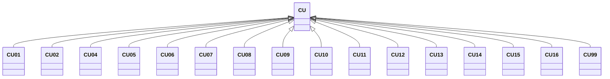

---
search:
  boost: 10.0
---

# Class: CU 


_Concept representing Country of Cuba_


<div data-search-exclude markdown="1">


URI: [loc:CU](https://w3id.org/lmodel/dpv/loc/CU)





## Inheritance
* **CU**
    * [CU01](CU01.md)
    * [CU02](CU02.md)
    * [CU04](CU04.md)
    * [CU05](CU05.md)
    * [CU06](CU06.md)
    * [CU07](CU07.md)
    * [CU08](CU08.md)
    * [CU09](CU09.md)
    * [CU10](CU10.md)
    * [CU11](CU11.md)
    * [CU12](CU12.md)
    * [CU13](CU13.md)
    * [CU14](CU14.md)
    * [CU15](CU15.md)
    * [CU16](CU16.md)
    * [CU99](CU99.md)


## Class Properties

| Property | Value |
| --- | --- |
| Class URI | [loc:CU](https://w3id.org/lmodel/dpv/loc/CU) |


## Slots

| Name | Cardinality and Range | Description | Inheritance |
| ---  | --- | --- | --- |


## In Subsets


* [LocSubset](LocSubset.md)


## Aliases


* Cuba


## Identifier and Mapping Information


### Annotations

| property | value |
| --- | --- |
| upstream_iri | https://w3id.org/dpv/loc/owl#CU |
| dpv_extension_slug | loc |


### Schema Source


* from schema: https://w3id.org/lmodel/dpv/loc


## Mappings

| Mapping Type | Mapped Value |
| ---  | ---  |
| self | loc:CU |
| native | loc:CU |
| exact | dpv_loc:CU, dpv_loc_owl:CU |


## LinkML Source

<!-- TODO: investigate https://stackoverflow.com/questions/37606292/how-to-create-tabbed-code-blocks-in-mkdocs-or-sphinx -->

### Direct

<details>
```yaml
name: CU
annotations:
  upstream_iri:
    tag: upstream_iri
    value: https://w3id.org/dpv/loc/owl#CU
  dpv_extension_slug:
    tag: dpv_extension_slug
    value: loc
description: Concept representing Country of Cuba
in_subset:
- loc_subset
from_schema: https://w3id.org/lmodel/dpv/loc
aliases:
- Cuba
exact_mappings:
- dpv_loc:CU
- dpv_loc_owl:CU
class_uri: loc:CU

```
</details>

### Induced

<details>
```yaml
name: CU
annotations:
  upstream_iri:
    tag: upstream_iri
    value: https://w3id.org/dpv/loc/owl#CU
  dpv_extension_slug:
    tag: dpv_extension_slug
    value: loc
description: Concept representing Country of Cuba
in_subset:
- loc_subset
from_schema: https://w3id.org/lmodel/dpv/loc
aliases:
- Cuba
exact_mappings:
- dpv_loc:CU
- dpv_loc_owl:CU
class_uri: loc:CU

```
</details></div>