---
search:
  boost: 10.0
---

# Class: CV 


_Concept representing Country of Cabo Verde_


<div data-search-exclude markdown="1">


URI: [loc:CV](https://w3id.org/lmodel/dpv/loc/CV)

```mermaid
 classDiagram
    class CV
    click CV href "../CV/"
      CV <|-- CVB
        click CVB href "../CVB/"
      CV <|-- CVBR
        click CVBR href "../CVBR/"
      CV <|-- CVCA
        click CVCA href "../CVCA/"
      CV <|-- CVCF
        click CVCF href "../CVCF/"
      CV <|-- CVMA
        click CVMA href "../CVMA/"
      CV <|-- CVMO
        click CVMO href "../CVMO/"
      CV <|-- CVPA
        click CVPA href "../CVPA/"
      CV <|-- CVPN
        click CVPN href "../CVPN/"
      CV <|-- CVRB
        click CVRB href "../CVRB/"
      CV <|-- CVRG
        click CVRG href "../CVRG/"
      CV <|-- CVRS
        click CVRS href "../CVRS/"
      CV <|-- CVS
        click CVS href "../CVS/"
      CV <|-- CVSD
        click CVSD href "../CVSD/"
      CV <|-- CVSF
        click CVSF href "../CVSF/"
      CV <|-- CVSM
        click CVSM href "../CVSM/"
      CV <|-- CVSO
        click CVSO href "../CVSO/"
      CV <|-- CVSS
        click CVSS href "../CVSS/"
      CV <|-- CVSV
        click CVSV href "../CVSV/"
      CV <|-- CVTA
        click CVTA href "../CVTA/"
      CV <|-- CVTS
        click CVTS href "../CVTS/"
      
      
```





## Inheritance
* **CV**
    * [CVB](CVB.md)
    * [CVBR](CVBR.md)
    * [CVCA](CVCA.md)
    * [CVCF](CVCF.md)
    * [CVMA](CVMA.md)
    * [CVMO](CVMO.md)
    * [CVPA](CVPA.md)
    * [CVPN](CVPN.md)
    * [CVRB](CVRB.md)
    * [CVRG](CVRG.md)
    * [CVRS](CVRS.md)
    * [CVS](CVS.md)
    * [CVSD](CVSD.md)
    * [CVSF](CVSF.md)
    * [CVSM](CVSM.md)
    * [CVSO](CVSO.md)
    * [CVSS](CVSS.md)
    * [CVSV](CVSV.md)
    * [CVTA](CVTA.md)
    * [CVTS](CVTS.md)


## Class Properties

| Property | Value |
| --- | --- |
| Class URI | [loc:CV](https://w3id.org/lmodel/dpv/loc/CV) |


## Slots

| Name | Cardinality and Range | Description | Inheritance |
| ---  | --- | --- | --- |


## In Subsets


* [LocSubset](LocSubset.md)


## Aliases


* Cabo Verde


## Identifier and Mapping Information


### Annotations

| property | value |
| --- | --- |
| upstream_iri | https://w3id.org/dpv/loc/owl#CV |
| dpv_extension_slug | loc |


### Schema Source


* from schema: https://w3id.org/lmodel/dpv/loc


## Mappings

| Mapping Type | Mapped Value |
| ---  | ---  |
| self | loc:CV |
| native | loc:CV |
| exact | dpv_loc:CV, dpv_loc_owl:CV |


## LinkML Source

<!-- TODO: investigate https://stackoverflow.com/questions/37606292/how-to-create-tabbed-code-blocks-in-mkdocs-or-sphinx -->

### Direct

<details>
```yaml
name: CV
annotations:
  upstream_iri:
    tag: upstream_iri
    value: https://w3id.org/dpv/loc/owl#CV
  dpv_extension_slug:
    tag: dpv_extension_slug
    value: loc
description: Concept representing Country of Cabo Verde
in_subset:
- loc_subset
from_schema: https://w3id.org/lmodel/dpv/loc
aliases:
- Cabo Verde
exact_mappings:
- dpv_loc:CV
- dpv_loc_owl:CV
class_uri: loc:CV

```
</details>

### Induced

<details>
```yaml
name: CV
annotations:
  upstream_iri:
    tag: upstream_iri
    value: https://w3id.org/dpv/loc/owl#CV
  dpv_extension_slug:
    tag: dpv_extension_slug
    value: loc
description: Concept representing Country of Cabo Verde
in_subset:
- loc_subset
from_schema: https://w3id.org/lmodel/dpv/loc
aliases:
- Cabo Verde
exact_mappings:
- dpv_loc:CV
- dpv_loc_owl:CV
class_uri: loc:CV

```
</details></div>