---
search:
  boost: 10.0
---

# Class: CZ 


_Concept representing Country of Czechia_


<div data-search-exclude markdown="1">


URI: [loc:CZ](https://w3id.org/lmodel/dpv/loc/CZ)

```mermaid
 classDiagram
    class CZ
    click CZ href "../CZ/"
      EEA30 <|-- CZ
        click EEA30 href "../EEA30/"
      EEA31 <|-- CZ
        click EEA31 href "../EEA31/"
      EU <|-- CZ
        click EU href "../EU/"
      EU27 <|-- CZ
        click EU27 href "../EU27/"
      EU28 <|-- CZ
        click EU28 href "../EU28/"
      EEA <|-- CZ
        click EEA href "../EEA/"
      

      CZ <|-- CZ10
        click CZ10 href "../CZ10/"
      CZ <|-- CZ101
        click CZ101 href "../CZ101/"
      CZ <|-- CZ102
        click CZ102 href "../CZ102/"
      CZ <|-- CZ103
        click CZ103 href "../CZ103/"
      CZ <|-- CZ105
        click CZ105 href "../CZ105/"
      CZ <|-- CZ106
        click CZ106 href "../CZ106/"
      CZ <|-- CZ107
        click CZ107 href "../CZ107/"
      CZ <|-- CZ108
        click CZ108 href "../CZ108/"
      CZ <|-- CZ109
        click CZ109 href "../CZ109/"
      CZ <|-- CZ110
        click CZ110 href "../CZ110/"
      CZ <|-- CZ114
        click CZ114 href "../CZ114/"
      CZ <|-- CZ115
        click CZ115 href "../CZ115/"
      CZ <|-- CZ121
        click CZ121 href "../CZ121/"
      CZ <|-- CZ20
        click CZ20 href "../CZ20/"
      CZ <|-- CZ201
        click CZ201 href "../CZ201/"
      CZ <|-- CZ202
        click CZ202 href "../CZ202/"
      CZ <|-- CZ203
        click CZ203 href "../CZ203/"
      CZ <|-- CZ204
        click CZ204 href "../CZ204/"
      CZ <|-- CZ205
        click CZ205 href "../CZ205/"
      CZ <|-- CZ206
        click CZ206 href "../CZ206/"
      CZ <|-- CZ207
        click CZ207 href "../CZ207/"
      CZ <|-- CZ208
        click CZ208 href "../CZ208/"
      CZ <|-- CZ209
        click CZ209 href "../CZ209/"
      CZ <|-- CZ20A
        click CZ20A href "../CZ20A/"
      CZ <|-- CZ20B
        click CZ20B href "../CZ20B/"
      CZ <|-- CZ20C
        click CZ20C href "../CZ20C/"
      CZ <|-- CZ31
        click CZ31 href "../CZ31/"
      CZ <|-- CZ311
        click CZ311 href "../CZ311/"
      CZ <|-- CZ312
        click CZ312 href "../CZ312/"
      CZ <|-- CZ313
        click CZ313 href "../CZ313/"
      CZ <|-- CZ314
        click CZ314 href "../CZ314/"
      CZ <|-- CZ315
        click CZ315 href "../CZ315/"
      CZ <|-- CZ316
        click CZ316 href "../CZ316/"
      CZ <|-- CZ317
        click CZ317 href "../CZ317/"
      CZ <|-- CZ32
        click CZ32 href "../CZ32/"
      CZ <|-- CZ321
        click CZ321 href "../CZ321/"
      CZ <|-- CZ322
        click CZ322 href "../CZ322/"
      CZ <|-- CZ323
        click CZ323 href "../CZ323/"
      CZ <|-- CZ324
        click CZ324 href "../CZ324/"
      CZ <|-- CZ325
        click CZ325 href "../CZ325/"
      CZ <|-- CZ326
        click CZ326 href "../CZ326/"
      CZ <|-- CZ327
        click CZ327 href "../CZ327/"
      CZ <|-- CZ41
        click CZ41 href "../CZ41/"
      CZ <|-- CZ411
        click CZ411 href "../CZ411/"
      CZ <|-- CZ412
        click CZ412 href "../CZ412/"
      CZ <|-- CZ413
        click CZ413 href "../CZ413/"
      CZ <|-- CZ42
        click CZ42 href "../CZ42/"
      CZ <|-- CZ421
        click CZ421 href "../CZ421/"
      CZ <|-- CZ422
        click CZ422 href "../CZ422/"
      CZ <|-- CZ423
        click CZ423 href "../CZ423/"
      CZ <|-- CZ424
        click CZ424 href "../CZ424/"
      CZ <|-- CZ425
        click CZ425 href "../CZ425/"
      CZ <|-- CZ426
        click CZ426 href "../CZ426/"
      CZ <|-- CZ427
        click CZ427 href "../CZ427/"
      CZ <|-- CZ51
        click CZ51 href "../CZ51/"
      CZ <|-- CZ511
        click CZ511 href "../CZ511/"
      CZ <|-- CZ512
        click CZ512 href "../CZ512/"
      CZ <|-- CZ513
        click CZ513 href "../CZ513/"
      CZ <|-- CZ514
        click CZ514 href "../CZ514/"
      CZ <|-- CZ52
        click CZ52 href "../CZ52/"
      CZ <|-- CZ521
        click CZ521 href "../CZ521/"
      CZ <|-- CZ522
        click CZ522 href "../CZ522/"
      CZ <|-- CZ523
        click CZ523 href "../CZ523/"
      CZ <|-- CZ524
        click CZ524 href "../CZ524/"
      CZ <|-- CZ525
        click CZ525 href "../CZ525/"
      CZ <|-- CZ53
        click CZ53 href "../CZ53/"
      CZ <|-- CZ531
        click CZ531 href "../CZ531/"
      CZ <|-- CZ532
        click CZ532 href "../CZ532/"
      CZ <|-- CZ533
        click CZ533 href "../CZ533/"
      CZ <|-- CZ534
        click CZ534 href "../CZ534/"
      CZ <|-- CZ63
        click CZ63 href "../CZ63/"
      CZ <|-- CZ631
        click CZ631 href "../CZ631/"
      CZ <|-- CZ632
        click CZ632 href "../CZ632/"
      CZ <|-- CZ633
        click CZ633 href "../CZ633/"
      CZ <|-- CZ634
        click CZ634 href "../CZ634/"
      CZ <|-- CZ635
        click CZ635 href "../CZ635/"
      CZ <|-- CZ64
        click CZ64 href "../CZ64/"
      CZ <|-- CZ641
        click CZ641 href "../CZ641/"
      CZ <|-- CZ642
        click CZ642 href "../CZ642/"
      CZ <|-- CZ643
        click CZ643 href "../CZ643/"
      CZ <|-- CZ644
        click CZ644 href "../CZ644/"
      CZ <|-- CZ645
        click CZ645 href "../CZ645/"
      CZ <|-- CZ646
        click CZ646 href "../CZ646/"
      CZ <|-- CZ647
        click CZ647 href "../CZ647/"
      CZ <|-- CZ71
        click CZ71 href "../CZ71/"
      CZ <|-- CZ711
        click CZ711 href "../CZ711/"
      CZ <|-- CZ712
        click CZ712 href "../CZ712/"
      CZ <|-- CZ713
        click CZ713 href "../CZ713/"
      CZ <|-- CZ714
        click CZ714 href "../CZ714/"
      CZ <|-- CZ715
        click CZ715 href "../CZ715/"
      CZ <|-- CZ72
        click CZ72 href "../CZ72/"
      CZ <|-- CZ721
        click CZ721 href "../CZ721/"
      CZ <|-- CZ722
        click CZ722 href "../CZ722/"
      CZ <|-- CZ723
        click CZ723 href "../CZ723/"
      CZ <|-- CZ724
        click CZ724 href "../CZ724/"
      CZ <|-- CZ80
        click CZ80 href "../CZ80/"
      CZ <|-- CZ801
        click CZ801 href "../CZ801/"
      CZ <|-- CZ802
        click CZ802 href "../CZ802/"
      CZ <|-- CZ803
        click CZ803 href "../CZ803/"
      CZ <|-- CZ804
        click CZ804 href "../CZ804/"
      CZ <|-- CZ805
        click CZ805 href "../CZ805/"
      CZ <|-- CZ806
        click CZ806 href "../CZ806/"
      

      
```





## Inheritance
* [EEA](EEA.md)
    * **CZ** [ [EEA30](EEA30.md) [EEA31](EEA31.md) [EU](EU.md) [EU27](EU27.md) [EU28](EU28.md)]
        * [CZ10](CZ10.md)
        * [CZ101](CZ101.md)
        * [CZ102](CZ102.md)
        * [CZ103](CZ103.md)
        * [CZ105](CZ105.md)
        * [CZ106](CZ106.md)
        * [CZ107](CZ107.md)
        * [CZ108](CZ108.md)
        * [CZ109](CZ109.md)
        * [CZ110](CZ110.md)
        * [CZ114](CZ114.md)
        * [CZ115](CZ115.md)
        * [CZ121](CZ121.md)
        * [CZ20](CZ20.md)
        * [CZ201](CZ201.md)
        * [CZ202](CZ202.md)
        * [CZ203](CZ203.md)
        * [CZ204](CZ204.md)
        * [CZ205](CZ205.md)
        * [CZ206](CZ206.md)
        * [CZ207](CZ207.md)
        * [CZ208](CZ208.md)
        * [CZ209](CZ209.md)
        * [CZ20A](CZ20A.md)
        * [CZ20B](CZ20B.md)
        * [CZ20C](CZ20C.md)
        * [CZ31](CZ31.md)
        * [CZ311](CZ311.md)
        * [CZ312](CZ312.md)
        * [CZ313](CZ313.md)
        * [CZ314](CZ314.md)
        * [CZ315](CZ315.md)
        * [CZ316](CZ316.md)
        * [CZ317](CZ317.md)
        * [CZ32](CZ32.md)
        * [CZ321](CZ321.md)
        * [CZ322](CZ322.md)
        * [CZ323](CZ323.md)
        * [CZ324](CZ324.md)
        * [CZ325](CZ325.md)
        * [CZ326](CZ326.md)
        * [CZ327](CZ327.md)
        * [CZ41](CZ41.md)
        * [CZ411](CZ411.md)
        * [CZ412](CZ412.md)
        * [CZ413](CZ413.md)
        * [CZ42](CZ42.md)
        * [CZ421](CZ421.md)
        * [CZ422](CZ422.md)
        * [CZ423](CZ423.md)
        * [CZ424](CZ424.md)
        * [CZ425](CZ425.md)
        * [CZ426](CZ426.md)
        * [CZ427](CZ427.md)
        * [CZ51](CZ51.md)
        * [CZ511](CZ511.md)
        * [CZ512](CZ512.md)
        * [CZ513](CZ513.md)
        * [CZ514](CZ514.md)
        * [CZ52](CZ52.md)
        * [CZ521](CZ521.md)
        * [CZ522](CZ522.md)
        * [CZ523](CZ523.md)
        * [CZ524](CZ524.md)
        * [CZ525](CZ525.md)
        * [CZ53](CZ53.md)
        * [CZ531](CZ531.md)
        * [CZ532](CZ532.md)
        * [CZ533](CZ533.md)
        * [CZ534](CZ534.md)
        * [CZ63](CZ63.md)
        * [CZ631](CZ631.md)
        * [CZ632](CZ632.md)
        * [CZ633](CZ633.md)
        * [CZ634](CZ634.md)
        * [CZ635](CZ635.md)
        * [CZ64](CZ64.md)
        * [CZ641](CZ641.md)
        * [CZ642](CZ642.md)
        * [CZ643](CZ643.md)
        * [CZ644](CZ644.md)
        * [CZ645](CZ645.md)
        * [CZ646](CZ646.md)
        * [CZ647](CZ647.md)
        * [CZ71](CZ71.md)
        * [CZ711](CZ711.md)
        * [CZ712](CZ712.md)
        * [CZ713](CZ713.md)
        * [CZ714](CZ714.md)
        * [CZ715](CZ715.md)
        * [CZ72](CZ72.md)
        * [CZ721](CZ721.md)
        * [CZ722](CZ722.md)
        * [CZ723](CZ723.md)
        * [CZ724](CZ724.md)
        * [CZ80](CZ80.md)
        * [CZ801](CZ801.md)
        * [CZ802](CZ802.md)
        * [CZ803](CZ803.md)
        * [CZ804](CZ804.md)
        * [CZ805](CZ805.md)
        * [CZ806](CZ806.md)


## Class Properties

| Property | Value |
| --- | --- |
| Class URI | [loc:CZ](https://w3id.org/lmodel/dpv/loc/CZ) |


## Slots

| Name | Cardinality and Range | Description | Inheritance |
| ---  | --- | --- | --- |


## In Subsets


* [LocSubset](LocSubset.md)


## Aliases


* Czechia


## Identifier and Mapping Information


### Annotations

| property | value |
| --- | --- |
| upstream_iri | https://w3id.org/dpv/loc/owl#CZ |
| dpv_extension_slug | loc |


### Schema Source


* from schema: https://w3id.org/lmodel/dpv/loc


## Mappings

| Mapping Type | Mapped Value |
| ---  | ---  |
| self | loc:CZ |
| native | loc:CZ |
| exact | dpv_loc:CZ, dpv_loc_owl:CZ |


## LinkML Source

<!-- TODO: investigate https://stackoverflow.com/questions/37606292/how-to-create-tabbed-code-blocks-in-mkdocs-or-sphinx -->

### Direct

<details>
```yaml
name: CZ
annotations:
  upstream_iri:
    tag: upstream_iri
    value: https://w3id.org/dpv/loc/owl#CZ
  dpv_extension_slug:
    tag: dpv_extension_slug
    value: loc
description: Concept representing Country of Czechia
in_subset:
- loc_subset
from_schema: https://w3id.org/lmodel/dpv/loc
aliases:
- Czechia
exact_mappings:
- dpv_loc:CZ
- dpv_loc_owl:CZ
is_a: EEA
mixins:
- EEA30
- EEA31
- EU
- EU27
- EU28
class_uri: loc:CZ

```
</details>

### Induced

<details>
```yaml
name: CZ
annotations:
  upstream_iri:
    tag: upstream_iri
    value: https://w3id.org/dpv/loc/owl#CZ
  dpv_extension_slug:
    tag: dpv_extension_slug
    value: loc
description: Concept representing Country of Czechia
in_subset:
- loc_subset
from_schema: https://w3id.org/lmodel/dpv/loc
aliases:
- Czechia
exact_mappings:
- dpv_loc:CZ
- dpv_loc_owl:CZ
is_a: EEA
mixins:
- EEA30
- EEA31
- EU
- EU27
- EU28
class_uri: loc:CZ

```
</details></div>