---
search:
  boost: 10.0
---

# Class: DO 


_Concept representing Country of Dominican Republic_


<div data-search-exclude markdown="1">


URI: [loc:DO](https://w3id.org/lmodel/dpv/loc/DO)

```mermaid
 classDiagram
    class DO
    click DO href "../DO/"
      DO <|-- DO01
        click DO01 href "../DO01/"
      DO <|-- DO02
        click DO02 href "../DO02/"
      DO <|-- DO03
        click DO03 href "../DO03/"
      DO <|-- DO04
        click DO04 href "../DO04/"
      DO <|-- DO05
        click DO05 href "../DO05/"
      DO <|-- DO06
        click DO06 href "../DO06/"
      DO <|-- DO07
        click DO07 href "../DO07/"
      DO <|-- DO08
        click DO08 href "../DO08/"
      DO <|-- DO09
        click DO09 href "../DO09/"
      DO <|-- DO10
        click DO10 href "../DO10/"
      DO <|-- DO11
        click DO11 href "../DO11/"
      DO <|-- DO12
        click DO12 href "../DO12/"
      DO <|-- DO13
        click DO13 href "../DO13/"
      DO <|-- DO14
        click DO14 href "../DO14/"
      DO <|-- DO15
        click DO15 href "../DO15/"
      DO <|-- DO16
        click DO16 href "../DO16/"
      DO <|-- DO17
        click DO17 href "../DO17/"
      DO <|-- DO18
        click DO18 href "../DO18/"
      DO <|-- DO19
        click DO19 href "../DO19/"
      DO <|-- DO20
        click DO20 href "../DO20/"
      DO <|-- DO21
        click DO21 href "../DO21/"
      DO <|-- DO22
        click DO22 href "../DO22/"
      DO <|-- DO23
        click DO23 href "../DO23/"
      DO <|-- DO24
        click DO24 href "../DO24/"
      DO <|-- DO25
        click DO25 href "../DO25/"
      DO <|-- DO26
        click DO26 href "../DO26/"
      DO <|-- DO27
        click DO27 href "../DO27/"
      DO <|-- DO28
        click DO28 href "../DO28/"
      DO <|-- DO29
        click DO29 href "../DO29/"
      DO <|-- DO30
        click DO30 href "../DO30/"
      DO <|-- DO31
        click DO31 href "../DO31/"
      DO <|-- DO32
        click DO32 href "../DO32/"
      
      
```





## Inheritance
* **DO**
    * [DO01](DO01.md)
    * [DO02](DO02.md)
    * [DO03](DO03.md)
    * [DO04](DO04.md)
    * [DO05](DO05.md)
    * [DO06](DO06.md)
    * [DO07](DO07.md)
    * [DO08](DO08.md)
    * [DO09](DO09.md)
    * [DO10](DO10.md)
    * [DO11](DO11.md)
    * [DO12](DO12.md)
    * [DO13](DO13.md)
    * [DO14](DO14.md)
    * [DO15](DO15.md)
    * [DO16](DO16.md)
    * [DO17](DO17.md)
    * [DO18](DO18.md)
    * [DO19](DO19.md)
    * [DO20](DO20.md)
    * [DO21](DO21.md)
    * [DO22](DO22.md)
    * [DO23](DO23.md)
    * [DO24](DO24.md)
    * [DO25](DO25.md)
    * [DO26](DO26.md)
    * [DO27](DO27.md)
    * [DO28](DO28.md)
    * [DO29](DO29.md)
    * [DO30](DO30.md)
    * [DO31](DO31.md)
    * [DO32](DO32.md)


## Class Properties

| Property | Value |
| --- | --- |
| Class URI | [loc:DO](https://w3id.org/lmodel/dpv/loc/DO) |


## Slots

| Name | Cardinality and Range | Description | Inheritance |
| ---  | --- | --- | --- |


## In Subsets


* [LocSubset](LocSubset.md)


## Aliases


* Dominican Republic


## Identifier and Mapping Information


### Annotations

| property | value |
| --- | --- |
| upstream_iri | https://w3id.org/dpv/loc/owl#DO |
| dpv_extension_slug | loc |


### Schema Source


* from schema: https://w3id.org/lmodel/dpv/loc


## Mappings

| Mapping Type | Mapped Value |
| ---  | ---  |
| self | loc:DO |
| native | loc:DO |
| exact | dpv_loc:DO, dpv_loc_owl:DO |


## LinkML Source

<!-- TODO: investigate https://stackoverflow.com/questions/37606292/how-to-create-tabbed-code-blocks-in-mkdocs-or-sphinx -->

### Direct

<details>
```yaml
name: DO
annotations:
  upstream_iri:
    tag: upstream_iri
    value: https://w3id.org/dpv/loc/owl#DO
  dpv_extension_slug:
    tag: dpv_extension_slug
    value: loc
description: Concept representing Country of Dominican Republic
in_subset:
- loc_subset
from_schema: https://w3id.org/lmodel/dpv/loc
aliases:
- Dominican Republic
exact_mappings:
- dpv_loc:DO
- dpv_loc_owl:DO
class_uri: loc:DO

```
</details>

### Induced

<details>
```yaml
name: DO
annotations:
  upstream_iri:
    tag: upstream_iri
    value: https://w3id.org/dpv/loc/owl#DO
  dpv_extension_slug:
    tag: dpv_extension_slug
    value: loc
description: Concept representing Country of Dominican Republic
in_subset:
- loc_subset
from_schema: https://w3id.org/lmodel/dpv/loc
aliases:
- Dominican Republic
exact_mappings:
- dpv_loc:DO
- dpv_loc_owl:DO
class_uri: loc:DO

```
</details></div>