---
search:
  boost: 10.0
---

# Class: DZ 


_Concept representing Country of Algeria_


<div data-search-exclude markdown="1">


URI: [loc:DZ](https://w3id.org/lmodel/dpv/loc/DZ)

```mermaid
 classDiagram
    class DZ
    click DZ href "../DZ/"
      DZ <|-- DZ01
        click DZ01 href "../DZ01/"
      DZ <|-- DZ02
        click DZ02 href "../DZ02/"
      DZ <|-- DZ03
        click DZ03 href "../DZ03/"
      DZ <|-- DZ04
        click DZ04 href "../DZ04/"
      DZ <|-- DZ05
        click DZ05 href "../DZ05/"
      DZ <|-- DZ06
        click DZ06 href "../DZ06/"
      DZ <|-- DZ07
        click DZ07 href "../DZ07/"
      DZ <|-- DZ08
        click DZ08 href "../DZ08/"
      DZ <|-- DZ09
        click DZ09 href "../DZ09/"
      DZ <|-- DZ10
        click DZ10 href "../DZ10/"
      DZ <|-- DZ11
        click DZ11 href "../DZ11/"
      DZ <|-- DZ12
        click DZ12 href "../DZ12/"
      DZ <|-- DZ13
        click DZ13 href "../DZ13/"
      DZ <|-- DZ14
        click DZ14 href "../DZ14/"
      DZ <|-- DZ15
        click DZ15 href "../DZ15/"
      DZ <|-- DZ16
        click DZ16 href "../DZ16/"
      DZ <|-- DZ17
        click DZ17 href "../DZ17/"
      DZ <|-- DZ18
        click DZ18 href "../DZ18/"
      DZ <|-- DZ19
        click DZ19 href "../DZ19/"
      DZ <|-- DZ20
        click DZ20 href "../DZ20/"
      DZ <|-- DZ21
        click DZ21 href "../DZ21/"
      DZ <|-- DZ22
        click DZ22 href "../DZ22/"
      DZ <|-- DZ23
        click DZ23 href "../DZ23/"
      DZ <|-- DZ24
        click DZ24 href "../DZ24/"
      DZ <|-- DZ25
        click DZ25 href "../DZ25/"
      DZ <|-- DZ26
        click DZ26 href "../DZ26/"
      DZ <|-- DZ27
        click DZ27 href "../DZ27/"
      DZ <|-- DZ28
        click DZ28 href "../DZ28/"
      DZ <|-- DZ29
        click DZ29 href "../DZ29/"
      DZ <|-- DZ30
        click DZ30 href "../DZ30/"
      DZ <|-- DZ31
        click DZ31 href "../DZ31/"
      DZ <|-- DZ32
        click DZ32 href "../DZ32/"
      DZ <|-- DZ33
        click DZ33 href "../DZ33/"
      DZ <|-- DZ34
        click DZ34 href "../DZ34/"
      DZ <|-- DZ35
        click DZ35 href "../DZ35/"
      DZ <|-- DZ36
        click DZ36 href "../DZ36/"
      DZ <|-- DZ37
        click DZ37 href "../DZ37/"
      DZ <|-- DZ38
        click DZ38 href "../DZ38/"
      DZ <|-- DZ39
        click DZ39 href "../DZ39/"
      DZ <|-- DZ40
        click DZ40 href "../DZ40/"
      DZ <|-- DZ41
        click DZ41 href "../DZ41/"
      DZ <|-- DZ42
        click DZ42 href "../DZ42/"
      DZ <|-- DZ43
        click DZ43 href "../DZ43/"
      DZ <|-- DZ44
        click DZ44 href "../DZ44/"
      DZ <|-- DZ45
        click DZ45 href "../DZ45/"
      DZ <|-- DZ46
        click DZ46 href "../DZ46/"
      DZ <|-- DZ47
        click DZ47 href "../DZ47/"
      DZ <|-- DZ48
        click DZ48 href "../DZ48/"
      DZ <|-- DZ49
        click DZ49 href "../DZ49/"
      DZ <|-- DZ50
        click DZ50 href "../DZ50/"
      DZ <|-- DZ51
        click DZ51 href "../DZ51/"
      DZ <|-- DZ52
        click DZ52 href "../DZ52/"
      DZ <|-- DZ53
        click DZ53 href "../DZ53/"
      DZ <|-- DZ55
        click DZ55 href "../DZ55/"
      DZ <|-- DZ56
        click DZ56 href "../DZ56/"
      DZ <|-- DZ58
        click DZ58 href "../DZ58/"
      
      
```





## Inheritance
* **DZ**
    * [DZ01](DZ01.md)
    * [DZ02](DZ02.md)
    * [DZ03](DZ03.md)
    * [DZ04](DZ04.md)
    * [DZ05](DZ05.md)
    * [DZ06](DZ06.md)
    * [DZ07](DZ07.md)
    * [DZ08](DZ08.md)
    * [DZ09](DZ09.md)
    * [DZ10](DZ10.md)
    * [DZ11](DZ11.md)
    * [DZ12](DZ12.md)
    * [DZ13](DZ13.md)
    * [DZ14](DZ14.md)
    * [DZ15](DZ15.md)
    * [DZ16](DZ16.md)
    * [DZ17](DZ17.md)
    * [DZ18](DZ18.md)
    * [DZ19](DZ19.md)
    * [DZ20](DZ20.md)
    * [DZ21](DZ21.md)
    * [DZ22](DZ22.md)
    * [DZ23](DZ23.md)
    * [DZ24](DZ24.md)
    * [DZ25](DZ25.md)
    * [DZ26](DZ26.md)
    * [DZ27](DZ27.md)
    * [DZ28](DZ28.md)
    * [DZ29](DZ29.md)
    * [DZ30](DZ30.md)
    * [DZ31](DZ31.md)
    * [DZ32](DZ32.md)
    * [DZ33](DZ33.md)
    * [DZ34](DZ34.md)
    * [DZ35](DZ35.md)
    * [DZ36](DZ36.md)
    * [DZ37](DZ37.md)
    * [DZ38](DZ38.md)
    * [DZ39](DZ39.md)
    * [DZ40](DZ40.md)
    * [DZ41](DZ41.md)
    * [DZ42](DZ42.md)
    * [DZ43](DZ43.md)
    * [DZ44](DZ44.md)
    * [DZ45](DZ45.md)
    * [DZ46](DZ46.md)
    * [DZ47](DZ47.md)
    * [DZ48](DZ48.md)
    * [DZ49](DZ49.md)
    * [DZ50](DZ50.md)
    * [DZ51](DZ51.md)
    * [DZ52](DZ52.md)
    * [DZ53](DZ53.md)
    * [DZ55](DZ55.md)
    * [DZ56](DZ56.md)
    * [DZ58](DZ58.md)


## Class Properties

| Property | Value |
| --- | --- |
| Class URI | [loc:DZ](https://w3id.org/lmodel/dpv/loc/DZ) |


## Slots

| Name | Cardinality and Range | Description | Inheritance |
| ---  | --- | --- | --- |


## In Subsets


* [LocSubset](LocSubset.md)


## Aliases


* Algeria


## Identifier and Mapping Information


### Annotations

| property | value |
| --- | --- |
| upstream_iri | https://w3id.org/dpv/loc/owl#DZ |
| dpv_extension_slug | loc |


### Schema Source


* from schema: https://w3id.org/lmodel/dpv/loc


## Mappings

| Mapping Type | Mapped Value |
| ---  | ---  |
| self | loc:DZ |
| native | loc:DZ |
| exact | dpv_loc:DZ, dpv_loc_owl:DZ |


## LinkML Source

<!-- TODO: investigate https://stackoverflow.com/questions/37606292/how-to-create-tabbed-code-blocks-in-mkdocs-or-sphinx -->

### Direct

<details>
```yaml
name: DZ
annotations:
  upstream_iri:
    tag: upstream_iri
    value: https://w3id.org/dpv/loc/owl#DZ
  dpv_extension_slug:
    tag: dpv_extension_slug
    value: loc
description: Concept representing Country of Algeria
in_subset:
- loc_subset
from_schema: https://w3id.org/lmodel/dpv/loc
aliases:
- Algeria
exact_mappings:
- dpv_loc:DZ
- dpv_loc_owl:DZ
class_uri: loc:DZ

```
</details>

### Induced

<details>
```yaml
name: DZ
annotations:
  upstream_iri:
    tag: upstream_iri
    value: https://w3id.org/dpv/loc/owl#DZ
  dpv_extension_slug:
    tag: dpv_extension_slug
    value: loc
description: Concept representing Country of Algeria
in_subset:
- loc_subset
from_schema: https://w3id.org/lmodel/dpv/loc
aliases:
- Algeria
exact_mappings:
- dpv_loc:DZ
- dpv_loc_owl:DZ
class_uri: loc:DZ

```
</details></div>