---
search:
  boost: 10.0
---

# Class: EC 


_Concept representing Country of Ecuador_


<div data-search-exclude markdown="1">


URI: [loc:EC](https://w3id.org/lmodel/dpv/loc/EC)

```mermaid
 classDiagram
    class EC
    click EC href "../EC/"
      EC <|-- ECA
        click ECA href "../ECA/"
      EC <|-- ECB
        click ECB href "../ECB/"
      EC <|-- ECC
        click ECC href "../ECC/"
      EC <|-- ECD
        click ECD href "../ECD/"
      EC <|-- ECE
        click ECE href "../ECE/"
      EC <|-- ECF
        click ECF href "../ECF/"
      EC <|-- ECG
        click ECG href "../ECG/"
      EC <|-- ECH
        click ECH href "../ECH/"
      EC <|-- ECI
        click ECI href "../ECI/"
      EC <|-- ECL
        click ECL href "../ECL/"
      EC <|-- ECM
        click ECM href "../ECM/"
      EC <|-- ECN
        click ECN href "../ECN/"
      EC <|-- ECO
        click ECO href "../ECO/"
      EC <|-- ECP
        click ECP href "../ECP/"
      EC <|-- ECR
        click ECR href "../ECR/"
      EC <|-- ECS
        click ECS href "../ECS/"
      EC <|-- ECSD
        click ECSD href "../ECSD/"
      EC <|-- ECSE
        click ECSE href "../ECSE/"
      EC <|-- ECT
        click ECT href "../ECT/"
      EC <|-- ECU
        click ECU href "../ECU/"
      EC <|-- ECW
        click ECW href "../ECW/"
      EC <|-- ECX
        click ECX href "../ECX/"
      EC <|-- ECY
        click ECY href "../ECY/"
      EC <|-- ECZ
        click ECZ href "../ECZ/"
      
      
```





## Inheritance
* **EC**
    * [ECA](ECA.md)
    * [ECB](ECB.md)
    * [ECC](ECC.md)
    * [ECD](ECD.md)
    * [ECE](ECE.md)
    * [ECF](ECF.md)
    * [ECG](ECG.md)
    * [ECH](ECH.md)
    * [ECI](ECI.md)
    * [ECL](ECL.md)
    * [ECM](ECM.md)
    * [ECN](ECN.md)
    * [ECO](ECO.md)
    * [ECP](ECP.md)
    * [ECR](ECR.md)
    * [ECS](ECS.md)
    * [ECSD](ECSD.md)
    * [ECSE](ECSE.md)
    * [ECT](ECT.md)
    * [ECU](ECU.md)
    * [ECW](ECW.md)
    * [ECX](ECX.md)
    * [ECY](ECY.md)
    * [ECZ](ECZ.md)


## Class Properties

| Property | Value |
| --- | --- |
| Class URI | [loc:EC](https://w3id.org/lmodel/dpv/loc/EC) |


## Slots

| Name | Cardinality and Range | Description | Inheritance |
| ---  | --- | --- | --- |


## In Subsets


* [LocSubset](LocSubset.md)


## Aliases


* Ecuador


## Identifier and Mapping Information


### Annotations

| property | value |
| --- | --- |
| upstream_iri | https://w3id.org/dpv/loc/owl#EC |
| dpv_extension_slug | loc |


### Schema Source


* from schema: https://w3id.org/lmodel/dpv/loc


## Mappings

| Mapping Type | Mapped Value |
| ---  | ---  |
| self | loc:EC |
| native | loc:EC |
| exact | dpv_loc:EC, dpv_loc_owl:EC |


## LinkML Source

<!-- TODO: investigate https://stackoverflow.com/questions/37606292/how-to-create-tabbed-code-blocks-in-mkdocs-or-sphinx -->

### Direct

<details>
```yaml
name: EC
annotations:
  upstream_iri:
    tag: upstream_iri
    value: https://w3id.org/dpv/loc/owl#EC
  dpv_extension_slug:
    tag: dpv_extension_slug
    value: loc
description: Concept representing Country of Ecuador
in_subset:
- loc_subset
from_schema: https://w3id.org/lmodel/dpv/loc
aliases:
- Ecuador
exact_mappings:
- dpv_loc:EC
- dpv_loc_owl:EC
class_uri: loc:EC

```
</details>

### Induced

<details>
```yaml
name: EC
annotations:
  upstream_iri:
    tag: upstream_iri
    value: https://w3id.org/dpv/loc/owl#EC
  dpv_extension_slug:
    tag: dpv_extension_slug
    value: loc
description: Concept representing Country of Ecuador
in_subset:
- loc_subset
from_schema: https://w3id.org/lmodel/dpv/loc
aliases:
- Ecuador
exact_mappings:
- dpv_loc:EC
- dpv_loc_owl:EC
class_uri: loc:EC

```
</details></div>