---
search:
  boost: 10.0
---

# Class: EE 


_Concept representing Country of Estonia_


<div data-search-exclude markdown="1">


URI: [loc:EE](https://w3id.org/lmodel/dpv/loc/EE)

```mermaid
 classDiagram
    class EE
    click EE href "../EE/"
      EEA30 <|-- EE
        click EEA30 href "../EEA30/"
      EEA31 <|-- EE
        click EEA31 href "../EEA31/"
      EU <|-- EE
        click EU href "../EU/"
      EU27 <|-- EE
        click EU27 href "../EU27/"
      EU28 <|-- EE
        click EU28 href "../EU28/"
      EEA <|-- EE
        click EEA href "../EEA/"
      

      EE <|-- EE130
        click EE130 href "../EE130/"
      EE <|-- EE141
        click EE141 href "../EE141/"
      EE <|-- EE142
        click EE142 href "../EE142/"
      EE <|-- EE171
        click EE171 href "../EE171/"
      EE <|-- EE205
        click EE205 href "../EE205/"
      EE <|-- EE214
        click EE214 href "../EE214/"
      EE <|-- EE245
        click EE245 href "../EE245/"
      EE <|-- EE247
        click EE247 href "../EE247/"
      EE <|-- EE251
        click EE251 href "../EE251/"
      EE <|-- EE255
        click EE255 href "../EE255/"
      EE <|-- EE321
        click EE321 href "../EE321/"
      EE <|-- EE37
        click EE37 href "../EE37/"
      EE <|-- EE39
        click EE39 href "../EE39/"
      EE <|-- EE430
        click EE430 href "../EE430/"
      EE <|-- EE431
        click EE431 href "../EE431/"
      EE <|-- EE441
        click EE441 href "../EE441/"
      EE <|-- EE442
        click EE442 href "../EE442/"
      EE <|-- EE45
        click EE45 href "../EE45/"
      EE <|-- EE50
        click EE50 href "../EE50/"
      EE <|-- EE514
        click EE514 href "../EE514/"
      EE <|-- EE52
        click EE52 href "../EE52/"
      EE <|-- EE557
        click EE557 href "../EE557/"
      EE <|-- EE56
        click EE56 href "../EE56/"
      EE <|-- EE586
        click EE586 href "../EE586/"
      EE <|-- EE60
        click EE60 href "../EE60/"
      EE <|-- EE615
        click EE615 href "../EE615/"
      EE <|-- EE618
        click EE618 href "../EE618/"
      EE <|-- EE638
        click EE638 href "../EE638/"
      EE <|-- EE64
        click EE64 href "../EE64/"
      EE <|-- EE68
        click EE68 href "../EE68/"
      EE <|-- EE698
        click EE698 href "../EE698/"
      EE <|-- EE71
        click EE71 href "../EE71/"
      EE <|-- EE735
        click EE735 href "../EE735/"
      EE <|-- EE74
        click EE74 href "../EE74/"
      EE <|-- EE79
        click EE79 href "../EE79/"
      EE <|-- EE809
        click EE809 href "../EE809/"
      EE <|-- EE81
        click EE81 href "../EE81/"
      EE <|-- EE834
        click EE834 href "../EE834/"
      EE <|-- EE84
        click EE84 href "../EE84/"
      EE <|-- EE87
        click EE87 href "../EE87/"
      EE <|-- EE928
        click EE928 href "../EE928/"
      

      
```





## Inheritance
* [EEA](EEA.md)
    * **EE** [ [EEA30](EEA30.md) [EEA31](EEA31.md) [EU](EU.md) [EU27](EU27.md) [EU28](EU28.md)]
        * [EE130](EE130.md)
        * [EE141](EE141.md)
        * [EE142](EE142.md)
        * [EE171](EE171.md)
        * [EE205](EE205.md)
        * [EE214](EE214.md)
        * [EE245](EE245.md)
        * [EE247](EE247.md)
        * [EE251](EE251.md)
        * [EE255](EE255.md)
        * [EE321](EE321.md)
        * [EE37](EE37.md)
        * [EE39](EE39.md)
        * [EE430](EE430.md)
        * [EE431](EE431.md)
        * [EE441](EE441.md)
        * [EE442](EE442.md)
        * [EE45](EE45.md)
        * [EE50](EE50.md)
        * [EE514](EE514.md)
        * [EE52](EE52.md)
        * [EE557](EE557.md)
        * [EE56](EE56.md)
        * [EE586](EE586.md)
        * [EE60](EE60.md)
        * [EE615](EE615.md)
        * [EE618](EE618.md)
        * [EE638](EE638.md)
        * [EE64](EE64.md)
        * [EE68](EE68.md)
        * [EE698](EE698.md)
        * [EE71](EE71.md)
        * [EE735](EE735.md)
        * [EE74](EE74.md)
        * [EE79](EE79.md)
        * [EE809](EE809.md)
        * [EE81](EE81.md)
        * [EE834](EE834.md)
        * [EE84](EE84.md)
        * [EE87](EE87.md)
        * [EE928](EE928.md)


## Class Properties

| Property | Value |
| --- | --- |
| Class URI | [loc:EE](https://w3id.org/lmodel/dpv/loc/EE) |


## Slots

| Name | Cardinality and Range | Description | Inheritance |
| ---  | --- | --- | --- |


## In Subsets


* [LocSubset](LocSubset.md)


## Aliases


* Estonia


## Identifier and Mapping Information


### Annotations

| property | value |
| --- | --- |
| upstream_iri | https://w3id.org/dpv/loc/owl#EE |
| dpv_extension_slug | loc |


### Schema Source


* from schema: https://w3id.org/lmodel/dpv/loc


## Mappings

| Mapping Type | Mapped Value |
| ---  | ---  |
| self | loc:EE |
| native | loc:EE |
| exact | dpv_loc:EE, dpv_loc_owl:EE |


## LinkML Source

<!-- TODO: investigate https://stackoverflow.com/questions/37606292/how-to-create-tabbed-code-blocks-in-mkdocs-or-sphinx -->

### Direct

<details>
```yaml
name: EE
annotations:
  upstream_iri:
    tag: upstream_iri
    value: https://w3id.org/dpv/loc/owl#EE
  dpv_extension_slug:
    tag: dpv_extension_slug
    value: loc
description: Concept representing Country of Estonia
in_subset:
- loc_subset
from_schema: https://w3id.org/lmodel/dpv/loc
aliases:
- Estonia
exact_mappings:
- dpv_loc:EE
- dpv_loc_owl:EE
is_a: EEA
mixins:
- EEA30
- EEA31
- EU
- EU27
- EU28
class_uri: loc:EE

```
</details>

### Induced

<details>
```yaml
name: EE
annotations:
  upstream_iri:
    tag: upstream_iri
    value: https://w3id.org/dpv/loc/owl#EE
  dpv_extension_slug:
    tag: dpv_extension_slug
    value: loc
description: Concept representing Country of Estonia
in_subset:
- loc_subset
from_schema: https://w3id.org/lmodel/dpv/loc
aliases:
- Estonia
exact_mappings:
- dpv_loc:EE
- dpv_loc_owl:EE
is_a: EEA
mixins:
- EEA30
- EEA31
- EU
- EU27
- EU28
class_uri: loc:EE

```
</details></div>