---
search:
  boost: 10.0
---

# Class: EEA 


_Concept representing the latest membership of European Economic Area_

_(EEA)_


<div data-search-exclude markdown="1">


URI: [loc:EEA](https://w3id.org/lmodel/dpv/loc/EEA)

```mermaid
 classDiagram
    class EEA
    click EEA href "../EEA/"
      EEA <|-- AT
        click AT href "../AT/"
      EEA <|-- BE
        click BE href "../BE/"
      EEA <|-- BG
        click BG href "../BG/"
      EEA <|-- CY
        click CY href "../CY/"
      EEA <|-- CZ
        click CZ href "../CZ/"
      EEA <|-- DE
        click DE href "../DE/"
      EEA <|-- DK
        click DK href "../DK/"
      EEA <|-- EE
        click EE href "../EE/"
      EEA <|-- EEA30
        click EEA30 href "../EEA30/"
      EEA <|-- EEA31
        click EEA31 href "../EEA31/"
      EEA <|-- ES
        click ES href "../ES/"
      EEA <|-- FI
        click FI href "../FI/"
      EEA <|-- FR
        click FR href "../FR/"
      EEA <|-- GR
        click GR href "../GR/"
      EEA <|-- HR
        click HR href "../HR/"
      EEA <|-- HU
        click HU href "../HU/"
      EEA <|-- IE
        click IE href "../IE/"
      EEA <|-- IS
        click IS href "../IS/"
      EEA <|-- IT
        click IT href "../IT/"
      EEA <|-- LI
        click LI href "../LI/"
      EEA <|-- LT
        click LT href "../LT/"
      EEA <|-- LU
        click LU href "../LU/"
      EEA <|-- LV
        click LV href "../LV/"
      EEA <|-- MT
        click MT href "../MT/"
      EEA <|-- NL
        click NL href "../NL/"
      EEA <|-- NO
        click NO href "../NO/"
      EEA <|-- PL
        click PL href "../PL/"
      EEA <|-- PT
        click PT href "../PT/"
      EEA <|-- RO
        click RO href "../RO/"
      EEA <|-- SE
        click SE href "../SE/"
      EEA <|-- SI
        click SI href "../SI/"
      EEA <|-- SK
        click SK href "../SK/"
      
      
```





## Inheritance
* **EEA**
    * [AT](AT.md) [ [EEA30](EEA30.md) [EEA31](EEA31.md) [EU](EU.md) [EU27](EU27.md) [EU28](EU28.md)]
    * [BE](BE.md) [ [EEA30](EEA30.md) [EEA31](EEA31.md) [EU](EU.md) [EU27](EU27.md) [EU28](EU28.md)]
    * [BG](BG.md) [ [EEA30](EEA30.md) [EEA31](EEA31.md) [EU](EU.md) [EU27](EU27.md) [EU28](EU28.md)]
    * [CY](CY.md) [ [EEA30](EEA30.md) [EEA31](EEA31.md) [EU](EU.md) [EU27](EU27.md) [EU28](EU28.md)]
    * [CZ](CZ.md) [ [EEA30](EEA30.md) [EEA31](EEA31.md) [EU](EU.md) [EU27](EU27.md) [EU28](EU28.md)]
    * [DE](DE.md) [ [EEA30](EEA30.md) [EEA31](EEA31.md) [EU](EU.md) [EU27](EU27.md) [EU28](EU28.md)]
    * [DK](DK.md) [ [EEA30](EEA30.md) [EEA31](EEA31.md) [EU](EU.md) [EU27](EU27.md) [EU28](EU28.md)]
    * [EE](EE.md) [ [EEA30](EEA30.md) [EEA31](EEA31.md) [EU](EU.md) [EU27](EU27.md) [EU28](EU28.md)]
    * [EEA30](EEA30.md)
    * [EEA31](EEA31.md)
    * [ES](ES.md) [ [EEA30](EEA30.md) [EEA31](EEA31.md) [EU](EU.md) [EU27](EU27.md) [EU28](EU28.md)]
    * [FI](FI.md) [ [EEA30](EEA30.md) [EEA31](EEA31.md) [EU](EU.md) [EU27](EU27.md) [EU28](EU28.md)]
    * [FR](FR.md) [ [EEA30](EEA30.md) [EEA31](EEA31.md) [EU](EU.md) [EU27](EU27.md) [EU28](EU28.md)]
    * [GR](GR.md) [ [EEA30](EEA30.md) [EEA31](EEA31.md) [EU](EU.md) [EU27](EU27.md) [EU28](EU28.md)]
    * [HR](HR.md) [ [EEA30](EEA30.md) [EEA31](EEA31.md) [EU](EU.md) [EU27](EU27.md) [EU28](EU28.md)]
    * [HU](HU.md) [ [EEA30](EEA30.md) [EEA31](EEA31.md) [EU](EU.md) [EU27](EU27.md) [EU28](EU28.md)]
    * [IE](IE.md) [ [EEA30](EEA30.md) [EEA31](EEA31.md) [EU](EU.md) [EU27](EU27.md) [EU28](EU28.md)]
    * [IS](IS.md) [ [EEA30](EEA30.md) [EEA31](EEA31.md)]
    * [IT](IT.md) [ [EEA30](EEA30.md) [EEA31](EEA31.md) [EU](EU.md) [EU27](EU27.md) [EU28](EU28.md)]
    * [LI](LI.md) [ [EEA30](EEA30.md) [EEA31](EEA31.md)]
    * [LT](LT.md) [ [EEA30](EEA30.md) [EEA31](EEA31.md) [EU](EU.md) [EU27](EU27.md) [EU28](EU28.md)]
    * [LU](LU.md) [ [EEA30](EEA30.md) [EEA31](EEA31.md) [EU](EU.md) [EU27](EU27.md) [EU28](EU28.md)]
    * [LV](LV.md) [ [EEA30](EEA30.md) [EEA31](EEA31.md) [EU](EU.md) [EU27](EU27.md) [EU28](EU28.md)]
    * [MT](MT.md) [ [EEA30](EEA30.md) [EEA31](EEA31.md) [EU](EU.md) [EU27](EU27.md) [EU28](EU28.md)]
    * [NL](NL.md) [ [EEA30](EEA30.md) [EEA31](EEA31.md) [EU](EU.md) [EU27](EU27.md) [EU28](EU28.md)]
    * [NO](NO.md) [ [EEA30](EEA30.md) [EEA31](EEA31.md)]
    * [PL](PL.md) [ [EEA30](EEA30.md) [EEA31](EEA31.md) [EU](EU.md) [EU27](EU27.md) [EU28](EU28.md)]
    * [PT](PT.md) [ [EEA30](EEA30.md) [EEA31](EEA31.md) [EU](EU.md) [EU27](EU27.md) [EU28](EU28.md)]
    * [RO](RO.md) [ [EEA30](EEA30.md) [EEA31](EEA31.md) [EU](EU.md) [EU27](EU27.md) [EU28](EU28.md)]
    * [SE](SE.md) [ [EEA30](EEA30.md) [EEA31](EEA31.md) [EU](EU.md) [EU27](EU27.md) [EU28](EU28.md)]
    * [SI](SI.md) [ [EEA30](EEA30.md) [EEA31](EEA31.md) [EU](EU.md) [EU27](EU27.md) [EU28](EU28.md)]
    * [SK](SK.md) [ [EEA30](EEA30.md) [EEA31](EEA31.md) [EU](EU.md) [EU27](EU27.md) [EU28](EU28.md)]


## Class Properties

| Property | Value |
| --- | --- |
| Class URI | [loc:EEA](https://w3id.org/lmodel/dpv/loc/EEA) |


## Slots

| Name | Cardinality and Range | Description | Inheritance |
| ---  | --- | --- | --- |


## In Subsets


* [LocSubset](LocSubset.md)


## Aliases


* European Economic Area (EEA)


## Identifier and Mapping Information


### Annotations

| property | value |
| --- | --- |
| upstream_iri | https://w3id.org/dpv/loc/owl#EEA |
| dpv_extension_slug | loc |


### Schema Source


* from schema: https://w3id.org/lmodel/dpv/loc


## Mappings

| Mapping Type | Mapped Value |
| ---  | ---  |
| self | loc:EEA |
| native | loc:EEA |
| exact | dpv_loc:EEA, dpv_loc_owl:EEA |


## LinkML Source

<!-- TODO: investigate https://stackoverflow.com/questions/37606292/how-to-create-tabbed-code-blocks-in-mkdocs-or-sphinx -->

### Direct

<details>
```yaml
name: EEA
annotations:
  upstream_iri:
    tag: upstream_iri
    value: https://w3id.org/dpv/loc/owl#EEA
  dpv_extension_slug:
    tag: dpv_extension_slug
    value: loc
description: 'Concept representing the latest membership of European Economic Area

  (EEA)'
in_subset:
- loc_subset
from_schema: https://w3id.org/lmodel/dpv/loc
aliases:
- European Economic Area (EEA)
exact_mappings:
- dpv_loc:EEA
- dpv_loc_owl:EEA
class_uri: loc:EEA

```
</details>

### Induced

<details>
```yaml
name: EEA
annotations:
  upstream_iri:
    tag: upstream_iri
    value: https://w3id.org/dpv/loc/owl#EEA
  dpv_extension_slug:
    tag: dpv_extension_slug
    value: loc
description: 'Concept representing the latest membership of European Economic Area

  (EEA)'
in_subset:
- loc_subset
from_schema: https://w3id.org/lmodel/dpv/loc
aliases:
- European Economic Area (EEA)
exact_mappings:
- dpv_loc:EEA
- dpv_loc_owl:EEA
class_uri: loc:EEA

```
</details></div>