---
search:
  boost: 10.0
---

# Class: EEA30 


_Concept representing current EEA with 30 Member States that became_

_active from 2020 with exit of UK from EEA31 after Brexit_


<div data-search-exclude markdown="1">


URI: [loc:EEA30](https://w3id.org/lmodel/dpv/loc/EEA30)

```mermaid
 classDiagram
    class EEA30
    click EEA30 href "../EEA30/"
      EEA <|-- EEA30
        click EEA href "../EEA/"
      

      EEA30 <|-- AT
        click AT href "../AT/"
      EEA30 <|-- BE
        click BE href "../BE/"
      EEA30 <|-- BG
        click BG href "../BG/"
      EEA30 <|-- CY
        click CY href "../CY/"
      EEA30 <|-- CZ
        click CZ href "../CZ/"
      EEA30 <|-- DE
        click DE href "../DE/"
      EEA30 <|-- DK
        click DK href "../DK/"
      EEA30 <|-- EE
        click EE href "../EE/"
      EEA30 <|-- ES
        click ES href "../ES/"
      EEA30 <|-- FI
        click FI href "../FI/"
      EEA30 <|-- FR
        click FR href "../FR/"
      EEA30 <|-- GR
        click GR href "../GR/"
      EEA30 <|-- HR
        click HR href "../HR/"
      EEA30 <|-- HU
        click HU href "../HU/"
      EEA30 <|-- IE
        click IE href "../IE/"
      EEA30 <|-- IS
        click IS href "../IS/"
      EEA30 <|-- IT
        click IT href "../IT/"
      EEA30 <|-- LI
        click LI href "../LI/"
      EEA30 <|-- LT
        click LT href "../LT/"
      EEA30 <|-- LU
        click LU href "../LU/"
      EEA30 <|-- LV
        click LV href "../LV/"
      EEA30 <|-- MT
        click MT href "../MT/"
      EEA30 <|-- NL
        click NL href "../NL/"
      EEA30 <|-- NO
        click NO href "../NO/"
      EEA30 <|-- PL
        click PL href "../PL/"
      EEA30 <|-- PT
        click PT href "../PT/"
      EEA30 <|-- RO
        click RO href "../RO/"
      EEA30 <|-- SE
        click SE href "../SE/"
      EEA30 <|-- SI
        click SI href "../SI/"
      EEA30 <|-- SK
        click SK href "../SK/"
      

      
```





## Inheritance
* [EEA](EEA.md)
    * **EEA30**


## Class Properties

| Property | Value |
| --- | --- |
| Class URI | [loc:EEA30](https://w3id.org/lmodel/dpv/loc/EEA30) |


## Slots

| Name | Cardinality and Range | Description | Inheritance |
| ---  | --- | --- | --- |


## In Subsets


* [LocSubset](LocSubset.md)


## Aliases


* EEA 30 Member States


## Comments

* European Economic Area (EEA-31) with 30 Member States post Brexit


## Identifier and Mapping Information


### Annotations

| property | value |
| --- | --- |
| upstream_iri | https://w3id.org/dpv/loc/owl#EEA30 |
| dpv_extension_slug | loc |


### Schema Source


* from schema: https://w3id.org/lmodel/dpv/loc


## Mappings

| Mapping Type | Mapped Value |
| ---  | ---  |
| self | loc:EEA30 |
| native | loc:EEA30 |
| exact | dpv_loc:EEA30, dpv_loc_owl:EEA30 |


## LinkML Source

<!-- TODO: investigate https://stackoverflow.com/questions/37606292/how-to-create-tabbed-code-blocks-in-mkdocs-or-sphinx -->

### Direct

<details>
```yaml
name: EEA30
annotations:
  upstream_iri:
    tag: upstream_iri
    value: https://w3id.org/dpv/loc/owl#EEA30
  dpv_extension_slug:
    tag: dpv_extension_slug
    value: loc
description: 'Concept representing current EEA with 30 Member States that became

  active from 2020 with exit of UK from EEA31 after Brexit'
comments:
- European Economic Area (EEA-31) with 30 Member States post Brexit
in_subset:
- loc_subset
from_schema: https://w3id.org/lmodel/dpv/loc
aliases:
- EEA 30 Member States
exact_mappings:
- dpv_loc:EEA30
- dpv_loc_owl:EEA30
is_a: EEA
class_uri: loc:EEA30

```
</details>

### Induced

<details>
```yaml
name: EEA30
annotations:
  upstream_iri:
    tag: upstream_iri
    value: https://w3id.org/dpv/loc/owl#EEA30
  dpv_extension_slug:
    tag: dpv_extension_slug
    value: loc
description: 'Concept representing current EEA with 30 Member States that became

  active from 2020 with exit of UK from EEA31 after Brexit'
comments:
- European Economic Area (EEA-31) with 30 Member States post Brexit
in_subset:
- loc_subset
from_schema: https://w3id.org/lmodel/dpv/loc
aliases:
- EEA 30 Member States
exact_mappings:
- dpv_loc:EEA30
- dpv_loc_owl:EEA30
is_a: EEA
class_uri: loc:EEA30

```
</details></div>