---
search:
  boost: 10.0
---

# Class: EG 


_Concept representing Country of Egypt_


<div data-search-exclude markdown="1">


URI: [loc:EG](https://w3id.org/lmodel/dpv/loc/EG)

```mermaid
 classDiagram
    class EG
    click EG href "../EG/"
      EG <|-- EGALX
        click EGALX href "../EGALX/"
      EG <|-- EGASN
        click EGASN href "../EGASN/"
      EG <|-- EGAST
        click EGAST href "../EGAST/"
      EG <|-- EGBA
        click EGBA href "../EGBA/"
      EG <|-- EGBH
        click EGBH href "../EGBH/"
      EG <|-- EGBNS
        click EGBNS href "../EGBNS/"
      EG <|-- EGC
        click EGC href "../EGC/"
      EG <|-- EGDK
        click EGDK href "../EGDK/"
      EG <|-- EGDT
        click EGDT href "../EGDT/"
      EG <|-- EGFYM
        click EGFYM href "../EGFYM/"
      EG <|-- EGGH
        click EGGH href "../EGGH/"
      EG <|-- EGGZ
        click EGGZ href "../EGGZ/"
      EG <|-- EGHU
        click EGHU href "../EGHU/"
      EG <|-- EGIS
        click EGIS href "../EGIS/"
      EG <|-- EGJS
        click EGJS href "../EGJS/"
      EG <|-- EGKB
        click EGKB href "../EGKB/"
      EG <|-- EGKFS
        click EGKFS href "../EGKFS/"
      EG <|-- EGKN
        click EGKN href "../EGKN/"
      EG <|-- EGLX
        click EGLX href "../EGLX/"
      EG <|-- EGMN
        click EGMN href "../EGMN/"
      EG <|-- EGMNF
        click EGMNF href "../EGMNF/"
      EG <|-- EGMT
        click EGMT href "../EGMT/"
      EG <|-- EGPTS
        click EGPTS href "../EGPTS/"
      EG <|-- EGSHG
        click EGSHG href "../EGSHG/"
      EG <|-- EGSHR
        click EGSHR href "../EGSHR/"
      EG <|-- EGSIN
        click EGSIN href "../EGSIN/"
      EG <|-- EGSU
        click EGSU href "../EGSU/"
      EG <|-- EGSUZ
        click EGSUZ href "../EGSUZ/"
      EG <|-- EGWAD
        click EGWAD href "../EGWAD/"
      
      
```





## Inheritance
* **EG**
    * [EGALX](EGALX.md)
    * [EGASN](EGASN.md)
    * [EGAST](EGAST.md)
    * [EGBA](EGBA.md)
    * [EGBH](EGBH.md)
    * [EGBNS](EGBNS.md)
    * [EGC](EGC.md)
    * [EGDK](EGDK.md)
    * [EGDT](EGDT.md)
    * [EGFYM](EGFYM.md)
    * [EGGH](EGGH.md)
    * [EGGZ](EGGZ.md)
    * [EGHU](EGHU.md)
    * [EGIS](EGIS.md)
    * [EGJS](EGJS.md)
    * [EGKB](EGKB.md)
    * [EGKFS](EGKFS.md)
    * [EGKN](EGKN.md)
    * [EGLX](EGLX.md)
    * [EGMN](EGMN.md)
    * [EGMNF](EGMNF.md)
    * [EGMT](EGMT.md)
    * [EGPTS](EGPTS.md)
    * [EGSHG](EGSHG.md)
    * [EGSHR](EGSHR.md)
    * [EGSIN](EGSIN.md)
    * [EGSU](EGSU.md)
    * [EGSUZ](EGSUZ.md)
    * [EGWAD](EGWAD.md)


## Class Properties

| Property | Value |
| --- | --- |
| Class URI | [loc:EG](https://w3id.org/lmodel/dpv/loc/EG) |


## Slots

| Name | Cardinality and Range | Description | Inheritance |
| ---  | --- | --- | --- |


## In Subsets


* [LocSubset](LocSubset.md)


## Aliases


* Egypt


## Identifier and Mapping Information


### Annotations

| property | value |
| --- | --- |
| upstream_iri | https://w3id.org/dpv/loc/owl#EG |
| dpv_extension_slug | loc |


### Schema Source


* from schema: https://w3id.org/lmodel/dpv/loc


## Mappings

| Mapping Type | Mapped Value |
| ---  | ---  |
| self | loc:EG |
| native | loc:EG |
| exact | dpv_loc:EG, dpv_loc_owl:EG |


## LinkML Source

<!-- TODO: investigate https://stackoverflow.com/questions/37606292/how-to-create-tabbed-code-blocks-in-mkdocs-or-sphinx -->

### Direct

<details>
```yaml
name: EG
annotations:
  upstream_iri:
    tag: upstream_iri
    value: https://w3id.org/dpv/loc/owl#EG
  dpv_extension_slug:
    tag: dpv_extension_slug
    value: loc
description: Concept representing Country of Egypt
in_subset:
- loc_subset
from_schema: https://w3id.org/lmodel/dpv/loc
aliases:
- Egypt
exact_mappings:
- dpv_loc:EG
- dpv_loc_owl:EG
class_uri: loc:EG

```
</details>

### Induced

<details>
```yaml
name: EG
annotations:
  upstream_iri:
    tag: upstream_iri
    value: https://w3id.org/dpv/loc/owl#EG
  dpv_extension_slug:
    tag: dpv_extension_slug
    value: loc
description: Concept representing Country of Egypt
in_subset:
- loc_subset
from_schema: https://w3id.org/lmodel/dpv/loc
aliases:
- Egypt
exact_mappings:
- dpv_loc:EG
- dpv_loc_owl:EG
class_uri: loc:EG

```
</details></div>