---
search:
  boost: 10.0
---

# Class: ES 


_Concept representing Country of Spain_


<div data-search-exclude markdown="1">


URI: [loc:ES](https://w3id.org/lmodel/dpv/loc/ES)

```mermaid
 classDiagram
    class ES
    click ES href "../ES/"
      EEA30 <|-- ES
        click EEA30 href "../EEA30/"
      EEA31 <|-- ES
        click EEA31 href "../EEA31/"
      EU <|-- ES
        click EU href "../EU/"
      EU27 <|-- ES
        click EU27 href "../EU27/"
      EU28 <|-- ES
        click EU28 href "../EU28/"
      EEA <|-- ES
        click EEA href "../EEA/"
      

      ES <|-- ESA
        click ESA href "../ESA/"
      ES <|-- ESAB
        click ESAB href "../ESAB/"
      ES <|-- ESAL
        click ESAL href "../ESAL/"
      ES <|-- ESAN
        click ESAN href "../ESAN/"
      ES <|-- ESAR
        click ESAR href "../ESAR/"
      ES <|-- ESAS
        click ESAS href "../ESAS/"
      ES <|-- ESAV
        click ESAV href "../ESAV/"
      ES <|-- ESB
        click ESB href "../ESB/"
      ES <|-- ESBA
        click ESBA href "../ESBA/"
      ES <|-- ESBI
        click ESBI href "../ESBI/"
      ES <|-- ESBU
        click ESBU href "../ESBU/"
      ES <|-- ESC
        click ESC href "../ESC/"
      ES <|-- ESCA
        click ESCA href "../ESCA/"
      ES <|-- ESCB
        click ESCB href "../ESCB/"
      ES <|-- ESCC
        click ESCC href "../ESCC/"
      ES <|-- ESCE
        click ESCE href "../ESCE/"
      ES <|-- ESCL
        click ESCL href "../ESCL/"
      ES <|-- ESCM
        click ESCM href "../ESCM/"
      ES <|-- ESCN
        click ESCN href "../ESCN/"
      ES <|-- ESCO
        click ESCO href "../ESCO/"
      ES <|-- ESCR
        click ESCR href "../ESCR/"
      ES <|-- ESCS
        click ESCS href "../ESCS/"
      ES <|-- ESCT
        click ESCT href "../ESCT/"
      ES <|-- ESCU
        click ESCU href "../ESCU/"
      ES <|-- ESEX
        click ESEX href "../ESEX/"
      ES <|-- ESGA
        click ESGA href "../ESGA/"
      ES <|-- ESGC
        click ESGC href "../ESGC/"
      ES <|-- ESGI
        click ESGI href "../ESGI/"
      ES <|-- ESGR
        click ESGR href "../ESGR/"
      ES <|-- ESGU
        click ESGU href "../ESGU/"
      ES <|-- ESH
        click ESH href "../ESH/"
      ES <|-- ESHU
        click ESHU href "../ESHU/"
      ES <|-- ESIB
        click ESIB href "../ESIB/"
      ES <|-- ESJ
        click ESJ href "../ESJ/"
      ES <|-- ESL
        click ESL href "../ESL/"
      ES <|-- ESLE
        click ESLE href "../ESLE/"
      ES <|-- ESLU
        click ESLU href "../ESLU/"
      ES <|-- ESM
        click ESM href "../ESM/"
      ES <|-- ESMA
        click ESMA href "../ESMA/"
      ES <|-- ESMC
        click ESMC href "../ESMC/"
      ES <|-- ESMD
        click ESMD href "../ESMD/"
      ES <|-- ESML
        click ESML href "../ESML/"
      ES <|-- ESNC
        click ESNC href "../ESNC/"
      ES <|-- ESOR
        click ESOR href "../ESOR/"
      ES <|-- ESP
        click ESP href "../ESP/"
      ES <|-- ESPO
        click ESPO href "../ESPO/"
      ES <|-- ESPV
        click ESPV href "../ESPV/"
      ES <|-- ESRI
        click ESRI href "../ESRI/"
      ES <|-- ESSA
        click ESSA href "../ESSA/"
      ES <|-- ESSE
        click ESSE href "../ESSE/"
      ES <|-- ESSG
        click ESSG href "../ESSG/"
      ES <|-- ESSO
        click ESSO href "../ESSO/"
      ES <|-- ESSS
        click ESSS href "../ESSS/"
      ES <|-- EST
        click EST href "../EST/"
      ES <|-- ESTE
        click ESTE href "../ESTE/"
      ES <|-- ESTF
        click ESTF href "../ESTF/"
      ES <|-- ESTO
        click ESTO href "../ESTO/"
      ES <|-- ESV
        click ESV href "../ESV/"
      ES <|-- ESVA
        click ESVA href "../ESVA/"
      ES <|-- ESVC
        click ESVC href "../ESVC/"
      ES <|-- ESVI
        click ESVI href "../ESVI/"
      ES <|-- ESZ
        click ESZ href "../ESZ/"
      ES <|-- ESZA
        click ESZA href "../ESZA/"
      

      
```





## Inheritance
* [EEA](EEA.md)
    * **ES** [ [EEA30](EEA30.md) [EEA31](EEA31.md) [EU](EU.md) [EU27](EU27.md) [EU28](EU28.md)]
        * [ESA](ESA.md)
        * [ESAB](ESAB.md)
        * [ESAL](ESAL.md)
        * [ESAN](ESAN.md)
        * [ESAR](ESAR.md)
        * [ESAS](ESAS.md)
        * [ESAV](ESAV.md)
        * [ESB](ESB.md)
        * [ESBA](ESBA.md)
        * [ESBI](ESBI.md)
        * [ESBU](ESBU.md)
        * [ESC](ESC.md)
        * [ESCA](ESCA.md)
        * [ESCB](ESCB.md)
        * [ESCC](ESCC.md)
        * [ESCE](ESCE.md)
        * [ESCL](ESCL.md)
        * [ESCM](ESCM.md)
        * [ESCN](ESCN.md)
        * [ESCO](ESCO.md)
        * [ESCR](ESCR.md)
        * [ESCS](ESCS.md)
        * [ESCT](ESCT.md)
        * [ESCU](ESCU.md)
        * [ESEX](ESEX.md)
        * [ESGA](ESGA.md)
        * [ESGC](ESGC.md)
        * [ESGI](ESGI.md)
        * [ESGR](ESGR.md)
        * [ESGU](ESGU.md)
        * [ESH](ESH.md)
        * [ESHU](ESHU.md)
        * [ESIB](ESIB.md)
        * [ESJ](ESJ.md)
        * [ESL](ESL.md)
        * [ESLE](ESLE.md)
        * [ESLU](ESLU.md)
        * [ESM](ESM.md)
        * [ESMA](ESMA.md)
        * [ESMC](ESMC.md)
        * [ESMD](ESMD.md)
        * [ESML](ESML.md)
        * [ESNC](ESNC.md)
        * [ESOR](ESOR.md)
        * [ESP](ESP.md)
        * [ESPO](ESPO.md)
        * [ESPV](ESPV.md)
        * [ESRI](ESRI.md)
        * [ESSA](ESSA.md)
        * [ESSE](ESSE.md)
        * [ESSG](ESSG.md)
        * [ESSO](ESSO.md)
        * [ESSS](ESSS.md)
        * [EST](EST.md)
        * [ESTE](ESTE.md)
        * [ESTF](ESTF.md)
        * [ESTO](ESTO.md)
        * [ESV](ESV.md)
        * [ESVA](ESVA.md)
        * [ESVC](ESVC.md)
        * [ESVI](ESVI.md)
        * [ESZ](ESZ.md)
        * [ESZA](ESZA.md)


## Class Properties

| Property | Value |
| --- | --- |
| Class URI | [loc:ES](https://w3id.org/lmodel/dpv/loc/ES) |


## Slots

| Name | Cardinality and Range | Description | Inheritance |
| ---  | --- | --- | --- |


## In Subsets


* [LocSubset](LocSubset.md)


## Aliases


* Spain


## Identifier and Mapping Information


### Annotations

| property | value |
| --- | --- |
| upstream_iri | https://w3id.org/dpv/loc/owl#ES |
| dpv_extension_slug | loc |


### Schema Source


* from schema: https://w3id.org/lmodel/dpv/loc


## Mappings

| Mapping Type | Mapped Value |
| ---  | ---  |
| self | loc:ES |
| native | loc:ES |
| exact | dpv_loc:ES, dpv_loc_owl:ES, iso3166:ES |


## LinkML Source

<!-- TODO: investigate https://stackoverflow.com/questions/37606292/how-to-create-tabbed-code-blocks-in-mkdocs-or-sphinx -->

### Direct

<details>
```yaml
name: ES
annotations:
  upstream_iri:
    tag: upstream_iri
    value: https://w3id.org/dpv/loc/owl#ES
  dpv_extension_slug:
    tag: dpv_extension_slug
    value: loc
description: Concept representing Country of Spain
in_subset:
- loc_subset
from_schema: https://w3id.org/lmodel/dpv/loc
aliases:
- Spain
exact_mappings:
- dpv_loc:ES
- dpv_loc_owl:ES
- iso3166:ES
is_a: EEA
mixins:
- EEA30
- EEA31
- EU
- EU27
- EU28
class_uri: loc:ES

```
</details>

### Induced

<details>
```yaml
name: ES
annotations:
  upstream_iri:
    tag: upstream_iri
    value: https://w3id.org/dpv/loc/owl#ES
  dpv_extension_slug:
    tag: dpv_extension_slug
    value: loc
description: Concept representing Country of Spain
in_subset:
- loc_subset
from_schema: https://w3id.org/lmodel/dpv/loc
aliases:
- Spain
exact_mappings:
- dpv_loc:ES
- dpv_loc_owl:ES
- iso3166:ES
is_a: EEA
mixins:
- EEA30
- EEA31
- EU
- EU27
- EU28
class_uri: loc:ES

```
</details></div>