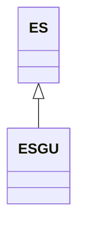

---
search:
  boost: 10.0
---

# Class: ESGU 


_Concept representing region Province of Guadalajara in country Spain_


<div data-search-exclude markdown="1">


URI: [loc:ES-GU](https://w3id.org/lmodel/dpv/loc/ES-GU)





## Inheritance
* [EEA](EEA.md)
    * [ES](ES.md) [ [EEA30](EEA30.md) [EEA31](EEA31.md) [EU](EU.md) [EU27](EU27.md) [EU28](EU28.md)]
        * **ESGU**


## Class Properties

| Property | Value |
| --- | --- |
| Class URI | [loc:ES-GU](https://w3id.org/lmodel/dpv/loc/ES-GU) |


## Slots

| Name | Cardinality and Range | Description | Inheritance |
| ---  | --- | --- | --- |


## In Subsets


* [LocSubset](LocSubset.md)


## Aliases


* ES-GU
* Province of Guadalajara


## Identifier and Mapping Information


### Annotations

| property | value |
| --- | --- |
| upstream_iri | https://w3id.org/dpv/loc/owl#ES-GU |
| dpv_extension_slug | loc |


### Schema Source


* from schema: https://w3id.org/lmodel/dpv/loc


## Mappings

| Mapping Type | Mapped Value |
| ---  | ---  |
| self | loc:ES-GU |
| native | loc:ESGU |
| exact | dpv_loc:ES-GU, dpv_loc_owl:ES-GU |


## LinkML Source

<!-- TODO: investigate https://stackoverflow.com/questions/37606292/how-to-create-tabbed-code-blocks-in-mkdocs-or-sphinx -->

### Direct

<details>
```yaml
name: ESGU
annotations:
  upstream_iri:
    tag: upstream_iri
    value: https://w3id.org/dpv/loc/owl#ES-GU
  dpv_extension_slug:
    tag: dpv_extension_slug
    value: loc
description: Concept representing region Province of Guadalajara in country Spain
in_subset:
- loc_subset
from_schema: https://w3id.org/lmodel/dpv/loc
aliases:
- ES-GU
- Province of Guadalajara
exact_mappings:
- dpv_loc:ES-GU
- dpv_loc_owl:ES-GU
is_a: ES
class_uri: loc:ES-GU

```
</details>

### Induced

<details>
```yaml
name: ESGU
annotations:
  upstream_iri:
    tag: upstream_iri
    value: https://w3id.org/dpv/loc/owl#ES-GU
  dpv_extension_slug:
    tag: dpv_extension_slug
    value: loc
description: Concept representing region Province of Guadalajara in country Spain
in_subset:
- loc_subset
from_schema: https://w3id.org/lmodel/dpv/loc
aliases:
- ES-GU
- Province of Guadalajara
exact_mappings:
- dpv_loc:ES-GU
- dpv_loc_owl:ES-GU
is_a: ES
class_uri: loc:ES-GU

```
</details></div>