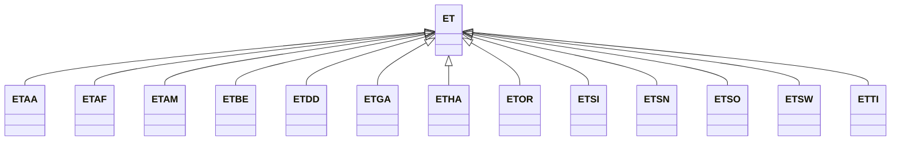

---
search:
  boost: 10.0
---

# Class: ET 


_Concept representing Country of Ethiopia_


<div data-search-exclude markdown="1">


URI: [loc:ET](https://w3id.org/lmodel/dpv/loc/ET)





## Inheritance
* **ET**
    * [ETAA](ETAA.md)
    * [ETAF](ETAF.md)
    * [ETAM](ETAM.md)
    * [ETBE](ETBE.md)
    * [ETDD](ETDD.md)
    * [ETGA](ETGA.md)
    * [ETHA](ETHA.md)
    * [ETOR](ETOR.md)
    * [ETSI](ETSI.md)
    * [ETSN](ETSN.md)
    * [ETSO](ETSO.md)
    * [ETSW](ETSW.md)
    * [ETTI](ETTI.md)


## Class Properties

| Property | Value |
| --- | --- |
| Class URI | [loc:ET](https://w3id.org/lmodel/dpv/loc/ET) |


## Slots

| Name | Cardinality and Range | Description | Inheritance |
| ---  | --- | --- | --- |


## In Subsets


* [LocSubset](LocSubset.md)


## Aliases


* Ethiopia


## Identifier and Mapping Information


### Annotations

| property | value |
| --- | --- |
| upstream_iri | https://w3id.org/dpv/loc/owl#ET |
| dpv_extension_slug | loc |


### Schema Source


* from schema: https://w3id.org/lmodel/dpv/loc


## Mappings

| Mapping Type | Mapped Value |
| ---  | ---  |
| self | loc:ET |
| native | loc:ET |
| exact | dpv_loc:ET, dpv_loc_owl:ET |


## LinkML Source

<!-- TODO: investigate https://stackoverflow.com/questions/37606292/how-to-create-tabbed-code-blocks-in-mkdocs-or-sphinx -->

### Direct

<details>
```yaml
name: ET
annotations:
  upstream_iri:
    tag: upstream_iri
    value: https://w3id.org/dpv/loc/owl#ET
  dpv_extension_slug:
    tag: dpv_extension_slug
    value: loc
description: Concept representing Country of Ethiopia
in_subset:
- loc_subset
from_schema: https://w3id.org/lmodel/dpv/loc
aliases:
- Ethiopia
exact_mappings:
- dpv_loc:ET
- dpv_loc_owl:ET
class_uri: loc:ET

```
</details>

### Induced

<details>
```yaml
name: ET
annotations:
  upstream_iri:
    tag: upstream_iri
    value: https://w3id.org/dpv/loc/owl#ET
  dpv_extension_slug:
    tag: dpv_extension_slug
    value: loc
description: Concept representing Country of Ethiopia
in_subset:
- loc_subset
from_schema: https://w3id.org/lmodel/dpv/loc
aliases:
- Ethiopia
exact_mappings:
- dpv_loc:ET
- dpv_loc_owl:ET
class_uri: loc:ET

```
</details></div>