---
search:
  boost: 10.0
---

# Class: EU27 


_Concept representing current EU with 27 Member States that became active_

_from 2020 with exit of UK from EU28 after Brexit_


<div data-search-exclude markdown="1">


URI: [loc:EU27](https://w3id.org/lmodel/dpv/loc/EU27)

```mermaid
 classDiagram
    class EU27
    click EU27 href "../EU27/"
      EU <|-- EU27
        click EU href "../EU/"
      

      EU27 <|-- AT
        click AT href "../AT/"
      EU27 <|-- BE
        click BE href "../BE/"
      EU27 <|-- BG
        click BG href "../BG/"
      EU27 <|-- CY
        click CY href "../CY/"
      EU27 <|-- CZ
        click CZ href "../CZ/"
      EU27 <|-- DE
        click DE href "../DE/"
      EU27 <|-- DK
        click DK href "../DK/"
      EU27 <|-- EE
        click EE href "../EE/"
      EU27 <|-- ES
        click ES href "../ES/"
      EU27 <|-- FI
        click FI href "../FI/"
      EU27 <|-- FR
        click FR href "../FR/"
      EU27 <|-- GR
        click GR href "../GR/"
      EU27 <|-- HR
        click HR href "../HR/"
      EU27 <|-- HU
        click HU href "../HU/"
      EU27 <|-- IE
        click IE href "../IE/"
      EU27 <|-- IT
        click IT href "../IT/"
      EU27 <|-- LT
        click LT href "../LT/"
      EU27 <|-- LU
        click LU href "../LU/"
      EU27 <|-- LV
        click LV href "../LV/"
      EU27 <|-- MT
        click MT href "../MT/"
      EU27 <|-- NL
        click NL href "../NL/"
      EU27 <|-- PL
        click PL href "../PL/"
      EU27 <|-- PT
        click PT href "../PT/"
      EU27 <|-- RO
        click RO href "../RO/"
      EU27 <|-- SE
        click SE href "../SE/"
      EU27 <|-- SI
        click SI href "../SI/"
      EU27 <|-- SK
        click SK href "../SK/"
      

      
```





## Inheritance
* [EU](EU.md)
    * **EU27**


## Class Properties

| Property | Value |
| --- | --- |
| Class URI | [loc:EU27](https://w3id.org/lmodel/dpv/loc/EU27) |


## Slots

| Name | Cardinality and Range | Description | Inheritance |
| ---  | --- | --- | --- |


## In Subsets


* [LocSubset](LocSubset.md)


## Aliases


* EU 27 Member States


## Comments

* European Union (EU-27) with 27 Member States post Brexit. Note that EU27
is also applicable to the 27 Member States in the EU from 2007 to 2013,
which is not represented in the LOC extension. If this concept should
exist, please submit an issue or proposal


## Identifier and Mapping Information


### Annotations

| property | value |
| --- | --- |
| upstream_iri | https://w3id.org/dpv/loc/owl#EU27 |
| dpv_extension_slug | loc |


### Schema Source


* from schema: https://w3id.org/lmodel/dpv/loc


## Mappings

| Mapping Type | Mapped Value |
| ---  | ---  |
| self | loc:EU27 |
| native | loc:EU27 |
| exact | dpv_loc:EU27, dpv_loc_owl:EU27 |


## LinkML Source

<!-- TODO: investigate https://stackoverflow.com/questions/37606292/how-to-create-tabbed-code-blocks-in-mkdocs-or-sphinx -->

### Direct

<details>
```yaml
name: EU27
annotations:
  upstream_iri:
    tag: upstream_iri
    value: https://w3id.org/dpv/loc/owl#EU27
  dpv_extension_slug:
    tag: dpv_extension_slug
    value: loc
description: 'Concept representing current EU with 27 Member States that became active

  from 2020 with exit of UK from EU28 after Brexit'
comments:
- 'European Union (EU-27) with 27 Member States post Brexit. Note that EU27

  is also applicable to the 27 Member States in the EU from 2007 to 2013,

  which is not represented in the LOC extension. If this concept should

  exist, please submit an issue or proposal'
in_subset:
- loc_subset
from_schema: https://w3id.org/lmodel/dpv/loc
aliases:
- EU 27 Member States
exact_mappings:
- dpv_loc:EU27
- dpv_loc_owl:EU27
is_a: EU
class_uri: loc:EU27

```
</details>

### Induced

<details>
```yaml
name: EU27
annotations:
  upstream_iri:
    tag: upstream_iri
    value: https://w3id.org/dpv/loc/owl#EU27
  dpv_extension_slug:
    tag: dpv_extension_slug
    value: loc
description: 'Concept representing current EU with 27 Member States that became active

  from 2020 with exit of UK from EU28 after Brexit'
comments:
- 'European Union (EU-27) with 27 Member States post Brexit. Note that EU27

  is also applicable to the 27 Member States in the EU from 2007 to 2013,

  which is not represented in the LOC extension. If this concept should

  exist, please submit an issue or proposal'
in_subset:
- loc_subset
from_schema: https://w3id.org/lmodel/dpv/loc
aliases:
- EU 27 Member States
exact_mappings:
- dpv_loc:EU27
- dpv_loc_owl:EU27
is_a: EU
class_uri: loc:EU27

```
</details></div>