---
search:
  boost: 10.0
---

# Class: EU28 


_Concept representing previous EU with 28 Member States that was active_

_from 2014 and concluded with the exit of UK in 2022 after Brexit_


<div data-search-exclude markdown="1">


URI: [loc:EU28](https://w3id.org/lmodel/dpv/loc/EU28)

```mermaid
 classDiagram
    class EU28
    click EU28 href "../EU28/"
      EU <|-- EU28
        click EU href "../EU/"
      

      EU28 <|-- AT
        click AT href "../AT/"
      EU28 <|-- BE
        click BE href "../BE/"
      EU28 <|-- BG
        click BG href "../BG/"
      EU28 <|-- CY
        click CY href "../CY/"
      EU28 <|-- CZ
        click CZ href "../CZ/"
      EU28 <|-- DE
        click DE href "../DE/"
      EU28 <|-- DK
        click DK href "../DK/"
      EU28 <|-- EE
        click EE href "../EE/"
      EU28 <|-- ES
        click ES href "../ES/"
      EU28 <|-- FI
        click FI href "../FI/"
      EU28 <|-- FR
        click FR href "../FR/"
      EU28 <|-- GB
        click GB href "../GB/"
      EU28 <|-- GR
        click GR href "../GR/"
      EU28 <|-- HR
        click HR href "../HR/"
      EU28 <|-- HU
        click HU href "../HU/"
      EU28 <|-- IE
        click IE href "../IE/"
      EU28 <|-- IT
        click IT href "../IT/"
      EU28 <|-- LT
        click LT href "../LT/"
      EU28 <|-- LU
        click LU href "../LU/"
      EU28 <|-- LV
        click LV href "../LV/"
      EU28 <|-- MT
        click MT href "../MT/"
      EU28 <|-- NL
        click NL href "../NL/"
      EU28 <|-- PL
        click PL href "../PL/"
      EU28 <|-- PT
        click PT href "../PT/"
      EU28 <|-- RO
        click RO href "../RO/"
      EU28 <|-- SE
        click SE href "../SE/"
      EU28 <|-- SI
        click SI href "../SI/"
      EU28 <|-- SK
        click SK href "../SK/"
      

      
```





## Inheritance
* [EU](EU.md)
    * **EU28**


## Class Properties

| Property | Value |
| --- | --- |
| Class URI | [loc:EU28](https://w3id.org/lmodel/dpv/loc/EU28) |


## Slots

| Name | Cardinality and Range | Description | Inheritance |
| ---  | --- | --- | --- |


## In Subsets


* [LocSubset](LocSubset.md)


## Aliases


* EU 28 Member States


## Comments

* European Union (EU-28) with 28 Member States pre Brexit


## Identifier and Mapping Information


### Annotations

| property | value |
| --- | --- |
| upstream_iri | https://w3id.org/dpv/loc/owl#EU28 |
| dpv_extension_slug | loc |


### Schema Source


* from schema: https://w3id.org/lmodel/dpv/loc


## Mappings

| Mapping Type | Mapped Value |
| ---  | ---  |
| self | loc:EU28 |
| native | loc:EU28 |
| exact | dpv_loc:EU28, dpv_loc_owl:EU28 |


## LinkML Source

<!-- TODO: investigate https://stackoverflow.com/questions/37606292/how-to-create-tabbed-code-blocks-in-mkdocs-or-sphinx -->

### Direct

<details>
```yaml
name: EU28
annotations:
  upstream_iri:
    tag: upstream_iri
    value: https://w3id.org/dpv/loc/owl#EU28
  dpv_extension_slug:
    tag: dpv_extension_slug
    value: loc
description: 'Concept representing previous EU with 28 Member States that was active

  from 2014 and concluded with the exit of UK in 2022 after Brexit'
comments:
- European Union (EU-28) with 28 Member States pre Brexit
in_subset:
- loc_subset
from_schema: https://w3id.org/lmodel/dpv/loc
aliases:
- EU 28 Member States
exact_mappings:
- dpv_loc:EU28
- dpv_loc_owl:EU28
is_a: EU
class_uri: loc:EU28

```
</details>

### Induced

<details>
```yaml
name: EU28
annotations:
  upstream_iri:
    tag: upstream_iri
    value: https://w3id.org/dpv/loc/owl#EU28
  dpv_extension_slug:
    tag: dpv_extension_slug
    value: loc
description: 'Concept representing previous EU with 28 Member States that was active

  from 2014 and concluded with the exit of UK in 2022 after Brexit'
comments:
- European Union (EU-28) with 28 Member States pre Brexit
in_subset:
- loc_subset
from_schema: https://w3id.org/lmodel/dpv/loc
aliases:
- EU 28 Member States
exact_mappings:
- dpv_loc:EU28
- dpv_loc_owl:EU28
is_a: EU
class_uri: loc:EU28

```
</details></div>