---
search:
  boost: 10.0
---

# Class: FI 


_Concept representing Country of Finland_


<div data-search-exclude markdown="1">


URI: [loc:FI](https://w3id.org/lmodel/dpv/loc/FI)

```mermaid
 classDiagram
    class FI
    click FI href "../FI/"
      EEA30 <|-- FI
        click EEA30 href "../EEA30/"
      EEA31 <|-- FI
        click EEA31 href "../EEA31/"
      EU <|-- FI
        click EU href "../EU/"
      EU27 <|-- FI
        click EU27 href "../EU27/"
      EU28 <|-- FI
        click EU28 href "../EU28/"
      EEA <|-- FI
        click EEA href "../EEA/"
      

      FI <|-- AX
        click AX href "../AX/"
      FI <|-- FI01
        click FI01 href "../FI01/"
      FI <|-- FI02
        click FI02 href "../FI02/"
      FI <|-- FI03
        click FI03 href "../FI03/"
      FI <|-- FI04
        click FI04 href "../FI04/"
      FI <|-- FI05
        click FI05 href "../FI05/"
      FI <|-- FI06
        click FI06 href "../FI06/"
      FI <|-- FI07
        click FI07 href "../FI07/"
      FI <|-- FI08
        click FI08 href "../FI08/"
      FI <|-- FI09
        click FI09 href "../FI09/"
      FI <|-- FI10
        click FI10 href "../FI10/"
      FI <|-- FI11
        click FI11 href "../FI11/"
      FI <|-- FI12
        click FI12 href "../FI12/"
      FI <|-- FI13
        click FI13 href "../FI13/"
      FI <|-- FI14
        click FI14 href "../FI14/"
      FI <|-- FI15
        click FI15 href "../FI15/"
      FI <|-- FI16
        click FI16 href "../FI16/"
      FI <|-- FI17
        click FI17 href "../FI17/"
      FI <|-- FI18
        click FI18 href "../FI18/"
      FI <|-- FI19
        click FI19 href "../FI19/"
      FI <|-- FIIS
        click FIIS href "../FIIS/"
      FI <|-- FILL
        click FILL href "../FILL/"
      FI <|-- FILS
        click FILS href "../FILS/"
      FI <|-- FIOL
        click FIOL href "../FIOL/"
      

      
```





## Inheritance
* [EEA](EEA.md)
    * **FI** [ [EEA30](EEA30.md) [EEA31](EEA31.md) [EU](EU.md) [EU27](EU27.md) [EU28](EU28.md)]
        * [AX](AX.md)
        * [FI01](FI01.md)
        * [FI02](FI02.md)
        * [FI03](FI03.md)
        * [FI04](FI04.md)
        * [FI05](FI05.md)
        * [FI06](FI06.md)
        * [FI07](FI07.md)
        * [FI08](FI08.md)
        * [FI09](FI09.md)
        * [FI10](FI10.md)
        * [FI11](FI11.md)
        * [FI12](FI12.md)
        * [FI13](FI13.md)
        * [FI14](FI14.md)
        * [FI15](FI15.md)
        * [FI16](FI16.md)
        * [FI17](FI17.md)
        * [FI18](FI18.md)
        * [FI19](FI19.md)
        * [FIIS](FIIS.md)
        * [FILL](FILL.md)
        * [FILS](FILS.md)
        * [FIOL](FIOL.md)


## Class Properties

| Property | Value |
| --- | --- |
| Class URI | [loc:FI](https://w3id.org/lmodel/dpv/loc/FI) |


## Slots

| Name | Cardinality and Range | Description | Inheritance |
| ---  | --- | --- | --- |


## In Subsets


* [LocSubset](LocSubset.md)


## Aliases


* Finland


## Identifier and Mapping Information


### Annotations

| property | value |
| --- | --- |
| upstream_iri | https://w3id.org/dpv/loc/owl#FI |
| dpv_extension_slug | loc |


### Schema Source


* from schema: https://w3id.org/lmodel/dpv/loc


## Mappings

| Mapping Type | Mapped Value |
| ---  | ---  |
| self | loc:FI |
| native | loc:FI |
| exact | dpv_loc:FI, dpv_loc_owl:FI |


## LinkML Source

<!-- TODO: investigate https://stackoverflow.com/questions/37606292/how-to-create-tabbed-code-blocks-in-mkdocs-or-sphinx -->

### Direct

<details>
```yaml
name: FI
annotations:
  upstream_iri:
    tag: upstream_iri
    value: https://w3id.org/dpv/loc/owl#FI
  dpv_extension_slug:
    tag: dpv_extension_slug
    value: loc
description: Concept representing Country of Finland
in_subset:
- loc_subset
from_schema: https://w3id.org/lmodel/dpv/loc
aliases:
- Finland
exact_mappings:
- dpv_loc:FI
- dpv_loc_owl:FI
is_a: EEA
mixins:
- EEA30
- EEA31
- EU
- EU27
- EU28
class_uri: loc:FI

```
</details>

### Induced

<details>
```yaml
name: FI
annotations:
  upstream_iri:
    tag: upstream_iri
    value: https://w3id.org/dpv/loc/owl#FI
  dpv_extension_slug:
    tag: dpv_extension_slug
    value: loc
description: Concept representing Country of Finland
in_subset:
- loc_subset
from_schema: https://w3id.org/lmodel/dpv/loc
aliases:
- Finland
exact_mappings:
- dpv_loc:FI
- dpv_loc_owl:FI
is_a: EEA
mixins:
- EEA30
- EEA31
- EU
- EU27
- EU28
class_uri: loc:FI

```
</details></div>