---
search:
  boost: 10.0
---

# Class: FR 


_Concept representing Country of France_


<div data-search-exclude markdown="1">


URI: [loc:FR](https://w3id.org/lmodel/dpv/loc/FR)

```mermaid
 classDiagram
    class FR
    click FR href "../FR/"
      EEA30 <|-- FR
        click EEA30 href "../EEA30/"
      EEA31 <|-- FR
        click EEA31 href "../EEA31/"
      EU <|-- FR
        click EU href "../EU/"
      EU27 <|-- FR
        click EU27 href "../EU27/"
      EU28 <|-- FR
        click EU28 href "../EU28/"
      EEA <|-- FR
        click EEA href "../EEA/"
      

      FR <|-- BL
        click BL href "../BL/"
      FR <|-- FR01
        click FR01 href "../FR01/"
      FR <|-- FR02
        click FR02 href "../FR02/"
      FR <|-- FR03
        click FR03 href "../FR03/"
      FR <|-- FR04
        click FR04 href "../FR04/"
      FR <|-- FR05
        click FR05 href "../FR05/"
      FR <|-- FR06
        click FR06 href "../FR06/"
      FR <|-- FR07
        click FR07 href "../FR07/"
      FR <|-- FR08
        click FR08 href "../FR08/"
      FR <|-- FR09
        click FR09 href "../FR09/"
      FR <|-- FR10
        click FR10 href "../FR10/"
      FR <|-- FR11
        click FR11 href "../FR11/"
      FR <|-- FR12
        click FR12 href "../FR12/"
      FR <|-- FR13
        click FR13 href "../FR13/"
      FR <|-- FR14
        click FR14 href "../FR14/"
      FR <|-- FR15
        click FR15 href "../FR15/"
      FR <|-- FR16
        click FR16 href "../FR16/"
      FR <|-- FR17
        click FR17 href "../FR17/"
      FR <|-- FR18
        click FR18 href "../FR18/"
      FR <|-- FR19
        click FR19 href "../FR19/"
      FR <|-- FR20R
        click FR20R href "../FR20R/"
      FR <|-- FR21
        click FR21 href "../FR21/"
      FR <|-- FR22
        click FR22 href "../FR22/"
      FR <|-- FR23
        click FR23 href "../FR23/"
      FR <|-- FR24
        click FR24 href "../FR24/"
      FR <|-- FR25
        click FR25 href "../FR25/"
      FR <|-- FR26
        click FR26 href "../FR26/"
      FR <|-- FR27
        click FR27 href "../FR27/"
      FR <|-- FR28
        click FR28 href "../FR28/"
      FR <|-- FR29
        click FR29 href "../FR29/"
      FR <|-- FR2A
        click FR2A href "../FR2A/"
      FR <|-- FR2B
        click FR2B href "../FR2B/"
      FR <|-- FR30
        click FR30 href "../FR30/"
      FR <|-- FR31
        click FR31 href "../FR31/"
      FR <|-- FR32
        click FR32 href "../FR32/"
      FR <|-- FR33
        click FR33 href "../FR33/"
      FR <|-- FR34
        click FR34 href "../FR34/"
      FR <|-- FR35
        click FR35 href "../FR35/"
      FR <|-- FR36
        click FR36 href "../FR36/"
      FR <|-- FR37
        click FR37 href "../FR37/"
      FR <|-- FR38
        click FR38 href "../FR38/"
      FR <|-- FR39
        click FR39 href "../FR39/"
      FR <|-- FR40
        click FR40 href "../FR40/"
      FR <|-- FR41
        click FR41 href "../FR41/"
      FR <|-- FR42
        click FR42 href "../FR42/"
      FR <|-- FR43
        click FR43 href "../FR43/"
      FR <|-- FR44
        click FR44 href "../FR44/"
      FR <|-- FR45
        click FR45 href "../FR45/"
      FR <|-- FR46
        click FR46 href "../FR46/"
      FR <|-- FR47
        click FR47 href "../FR47/"
      FR <|-- FR48
        click FR48 href "../FR48/"
      FR <|-- FR49
        click FR49 href "../FR49/"
      FR <|-- FR50
        click FR50 href "../FR50/"
      FR <|-- FR51
        click FR51 href "../FR51/"
      FR <|-- FR52
        click FR52 href "../FR52/"
      FR <|-- FR53
        click FR53 href "../FR53/"
      FR <|-- FR54
        click FR54 href "../FR54/"
      FR <|-- FR55
        click FR55 href "../FR55/"
      FR <|-- FR56
        click FR56 href "../FR56/"
      FR <|-- FR57
        click FR57 href "../FR57/"
      FR <|-- FR58
        click FR58 href "../FR58/"
      FR <|-- FR59
        click FR59 href "../FR59/"
      FR <|-- FR60
        click FR60 href "../FR60/"
      FR <|-- FR61
        click FR61 href "../FR61/"
      FR <|-- FR62
        click FR62 href "../FR62/"
      FR <|-- FR63
        click FR63 href "../FR63/"
      FR <|-- FR64
        click FR64 href "../FR64/"
      FR <|-- FR65
        click FR65 href "../FR65/"
      FR <|-- FR66
        click FR66 href "../FR66/"
      FR <|-- FR67
        click FR67 href "../FR67/"
      FR <|-- FR68
        click FR68 href "../FR68/"
      FR <|-- FR69
        click FR69 href "../FR69/"
      FR <|-- FR6AE
        click FR6AE href "../FR6AE/"
      FR <|-- FR70
        click FR70 href "../FR70/"
      FR <|-- FR71
        click FR71 href "../FR71/"
      FR <|-- FR72
        click FR72 href "../FR72/"
      FR <|-- FR73
        click FR73 href "../FR73/"
      FR <|-- FR74
        click FR74 href "../FR74/"
      FR <|-- FR75C
        click FR75C href "../FR75C/"
      FR <|-- FR76
        click FR76 href "../FR76/"
      FR <|-- FR77
        click FR77 href "../FR77/"
      FR <|-- FR78
        click FR78 href "../FR78/"
      FR <|-- FR79
        click FR79 href "../FR79/"
      FR <|-- FR80
        click FR80 href "../FR80/"
      FR <|-- FR81
        click FR81 href "../FR81/"
      FR <|-- FR82
        click FR82 href "../FR82/"
      FR <|-- FR83
        click FR83 href "../FR83/"
      FR <|-- FR84
        click FR84 href "../FR84/"
      FR <|-- FR85
        click FR85 href "../FR85/"
      FR <|-- FR86
        click FR86 href "../FR86/"
      FR <|-- FR87
        click FR87 href "../FR87/"
      FR <|-- FR88
        click FR88 href "../FR88/"
      FR <|-- FR89
        click FR89 href "../FR89/"
      FR <|-- FR90
        click FR90 href "../FR90/"
      FR <|-- FR91
        click FR91 href "../FR91/"
      FR <|-- FR92
        click FR92 href "../FR92/"
      FR <|-- FR93
        click FR93 href "../FR93/"
      FR <|-- FR94
        click FR94 href "../FR94/"
      FR <|-- FR95
        click FR95 href "../FR95/"
      FR <|-- FR971
        click FR971 href "../FR971/"
      FR <|-- FR972
        click FR972 href "../FR972/"
      FR <|-- FR973
        click FR973 href "../FR973/"
      FR <|-- FR974
        click FR974 href "../FR974/"
      FR <|-- FR976
        click FR976 href "../FR976/"
      FR <|-- FRARA
        click FRARA href "../FRARA/"
      FR <|-- FRB
        click FRB href "../FRB/"
      FR <|-- FRBFC
        click FRBFC href "../FRBFC/"
      FR <|-- FRBL
        click FRBL href "../FRBL/"
      FR <|-- FRBRE
        click FRBRE href "../FRBRE/"
      FR <|-- FRC
        click FRC href "../FRC/"
      FR <|-- FRCP
        click FRCP href "../FRCP/"
      FR <|-- FRCVL
        click FRCVL href "../FRCVL/"
      FR <|-- FRD
        click FRD href "../FRD/"
      FR <|-- FRG
        click FRG href "../FRG/"
      FR <|-- FRGES
        click FRGES href "../FRGES/"
      FR <|-- FRHDF
        click FRHDF href "../FRHDF/"
      FR <|-- FRIDF
        click FRIDF href "../FRIDF/"
      FR <|-- FRK
        click FRK href "../FRK/"
      FR <|-- FRL
        click FRL href "../FRL/"
      FR <|-- FRM
        click FRM href "../FRM/"
      FR <|-- FRMF
        click FRMF href "../FRMF/"
      FR <|-- FRN
        click FRN href "../FRN/"
      FR <|-- FRNAQ
        click FRNAQ href "../FRNAQ/"
      FR <|-- FRNC
        click FRNC href "../FRNC/"
      FR <|-- FRNOR
        click FRNOR href "../FRNOR/"
      FR <|-- FRO
        click FRO href "../FRO/"
      FR <|-- FROCC
        click FROCC href "../FROCC/"
      FR <|-- FRP
        click FRP href "../FRP/"
      FR <|-- FRPAC
        click FRPAC href "../FRPAC/"
      FR <|-- FRPDL
        click FRPDL href "../FRPDL/"
      FR <|-- FRPF
        click FRPF href "../FRPF/"
      FR <|-- FRPM
        click FRPM href "../FRPM/"
      FR <|-- FRQ
        click FRQ href "../FRQ/"
      FR <|-- FRS
        click FRS href "../FRS/"
      FR <|-- FRT
        click FRT href "../FRT/"
      FR <|-- FRTF
        click FRTF href "../FRTF/"
      FR <|-- FRV
        click FRV href "../FRV/"
      FR <|-- FRWF
        click FRWF href "../FRWF/"
      FR <|-- GF
        click GF href "../GF/"
      FR <|-- GP
        click GP href "../GP/"
      FR <|-- MF
        click MF href "../MF/"
      FR <|-- MQ
        click MQ href "../MQ/"
      FR <|-- NC
        click NC href "../NC/"
      FR <|-- PF
        click PF href "../PF/"
      FR <|-- PM
        click PM href "../PM/"
      FR <|-- RE
        click RE href "../RE/"
      FR <|-- TF
        click TF href "../TF/"
      FR <|-- WF
        click WF href "../WF/"
      FR <|-- YT
        click YT href "../YT/"
      

      
```





## Inheritance
* [EEA](EEA.md)
    * **FR** [ [EEA30](EEA30.md) [EEA31](EEA31.md) [EU](EU.md) [EU27](EU27.md) [EU28](EU28.md)]
        * [BL](BL.md)
        * [FR01](FR01.md)
        * [FR02](FR02.md)
        * [FR03](FR03.md)
        * [FR04](FR04.md)
        * [FR05](FR05.md)
        * [FR06](FR06.md)
        * [FR07](FR07.md)
        * [FR08](FR08.md)
        * [FR09](FR09.md)
        * [FR10](FR10.md)
        * [FR11](FR11.md)
        * [FR12](FR12.md)
        * [FR13](FR13.md)
        * [FR14](FR14.md)
        * [FR15](FR15.md)
        * [FR16](FR16.md)
        * [FR17](FR17.md)
        * [FR18](FR18.md)
        * [FR19](FR19.md)
        * [FR20R](FR20R.md)
        * [FR21](FR21.md)
        * [FR22](FR22.md)
        * [FR23](FR23.md)
        * [FR24](FR24.md)
        * [FR25](FR25.md)
        * [FR26](FR26.md)
        * [FR27](FR27.md)
        * [FR28](FR28.md)
        * [FR29](FR29.md)
        * [FR2A](FR2A.md)
        * [FR2B](FR2B.md)
        * [FR30](FR30.md)
        * [FR31](FR31.md)
        * [FR32](FR32.md)
        * [FR33](FR33.md)
        * [FR34](FR34.md)
        * [FR35](FR35.md)
        * [FR36](FR36.md)
        * [FR37](FR37.md)
        * [FR38](FR38.md)
        * [FR39](FR39.md)
        * [FR40](FR40.md)
        * [FR41](FR41.md)
        * [FR42](FR42.md)
        * [FR43](FR43.md)
        * [FR44](FR44.md)
        * [FR45](FR45.md)
        * [FR46](FR46.md)
        * [FR47](FR47.md)
        * [FR48](FR48.md)
        * [FR49](FR49.md)
        * [FR50](FR50.md)
        * [FR51](FR51.md)
        * [FR52](FR52.md)
        * [FR53](FR53.md)
        * [FR54](FR54.md)
        * [FR55](FR55.md)
        * [FR56](FR56.md)
        * [FR57](FR57.md)
        * [FR58](FR58.md)
        * [FR59](FR59.md)
        * [FR60](FR60.md)
        * [FR61](FR61.md)
        * [FR62](FR62.md)
        * [FR63](FR63.md)
        * [FR64](FR64.md)
        * [FR65](FR65.md)
        * [FR66](FR66.md)
        * [FR67](FR67.md)
        * [FR68](FR68.md)
        * [FR69](FR69.md)
        * [FR6AE](FR6AE.md)
        * [FR70](FR70.md)
        * [FR71](FR71.md)
        * [FR72](FR72.md)
        * [FR73](FR73.md)
        * [FR74](FR74.md)
        * [FR75C](FR75C.md)
        * [FR76](FR76.md)
        * [FR77](FR77.md)
        * [FR78](FR78.md)
        * [FR79](FR79.md)
        * [FR80](FR80.md)
        * [FR81](FR81.md)
        * [FR82](FR82.md)
        * [FR83](FR83.md)
        * [FR84](FR84.md)
        * [FR85](FR85.md)
        * [FR86](FR86.md)
        * [FR87](FR87.md)
        * [FR88](FR88.md)
        * [FR89](FR89.md)
        * [FR90](FR90.md)
        * [FR91](FR91.md)
        * [FR92](FR92.md)
        * [FR93](FR93.md)
        * [FR94](FR94.md)
        * [FR95](FR95.md)
        * [FR971](FR971.md)
        * [FR972](FR972.md)
        * [FR973](FR973.md)
        * [FR974](FR974.md)
        * [FR976](FR976.md)
        * [FRARA](FRARA.md)
        * [FRB](FRB.md)
        * [FRBFC](FRBFC.md)
        * [FRBL](FRBL.md)
        * [FRBRE](FRBRE.md)
        * [FRC](FRC.md)
        * [FRCP](FRCP.md)
        * [FRCVL](FRCVL.md)
        * [FRD](FRD.md)
        * [FRG](FRG.md)
        * [FRGES](FRGES.md)
        * [FRHDF](FRHDF.md)
        * [FRIDF](FRIDF.md)
        * [FRK](FRK.md)
        * [FRL](FRL.md)
        * [FRM](FRM.md)
        * [FRMF](FRMF.md)
        * [FRN](FRN.md)
        * [FRNAQ](FRNAQ.md)
        * [FRNC](FRNC.md)
        * [FRNOR](FRNOR.md)
        * [FRO](FRO.md)
        * [FROCC](FROCC.md)
        * [FRP](FRP.md)
        * [FRPAC](FRPAC.md)
        * [FRPDL](FRPDL.md)
        * [FRPF](FRPF.md)
        * [FRPM](FRPM.md)
        * [FRQ](FRQ.md)
        * [FRS](FRS.md)
        * [FRT](FRT.md)
        * [FRTF](FRTF.md)
        * [FRV](FRV.md)
        * [FRWF](FRWF.md)
        * [GF](GF.md)
        * [GP](GP.md)
        * [MF](MF.md)
        * [MQ](MQ.md)
        * [NC](NC.md)
        * [PF](PF.md)
        * [PM](PM.md)
        * [RE](RE.md)
        * [TF](TF.md)
        * [WF](WF.md)
        * [YT](YT.md)


## Class Properties

| Property | Value |
| --- | --- |
| Class URI | [loc:FR](https://w3id.org/lmodel/dpv/loc/FR) |


## Slots

| Name | Cardinality and Range | Description | Inheritance |
| ---  | --- | --- | --- |


## In Subsets


* [LocSubset](LocSubset.md)


## Aliases


* France


## Identifier and Mapping Information


### Annotations

| property | value |
| --- | --- |
| upstream_iri | https://w3id.org/dpv/loc/owl#FR |
| dpv_extension_slug | loc |


### Schema Source


* from schema: https://w3id.org/lmodel/dpv/loc


## Mappings

| Mapping Type | Mapped Value |
| ---  | ---  |
| self | loc:FR |
| native | loc:FR |
| exact | dpv_loc:FR, dpv_loc_owl:FR, iso3166:FR |


## LinkML Source

<!-- TODO: investigate https://stackoverflow.com/questions/37606292/how-to-create-tabbed-code-blocks-in-mkdocs-or-sphinx -->

### Direct

<details>
```yaml
name: FR
annotations:
  upstream_iri:
    tag: upstream_iri
    value: https://w3id.org/dpv/loc/owl#FR
  dpv_extension_slug:
    tag: dpv_extension_slug
    value: loc
description: Concept representing Country of France
in_subset:
- loc_subset
from_schema: https://w3id.org/lmodel/dpv/loc
aliases:
- France
exact_mappings:
- dpv_loc:FR
- dpv_loc_owl:FR
- iso3166:FR
is_a: EEA
mixins:
- EEA30
- EEA31
- EU
- EU27
- EU28
class_uri: loc:FR

```
</details>

### Induced

<details>
```yaml
name: FR
annotations:
  upstream_iri:
    tag: upstream_iri
    value: https://w3id.org/dpv/loc/owl#FR
  dpv_extension_slug:
    tag: dpv_extension_slug
    value: loc
description: Concept representing Country of France
in_subset:
- loc_subset
from_schema: https://w3id.org/lmodel/dpv/loc
aliases:
- France
exact_mappings:
- dpv_loc:FR
- dpv_loc_owl:FR
- iso3166:FR
is_a: EEA
mixins:
- EEA30
- EEA31
- EU
- EU27
- EU28
class_uri: loc:FR

```
</details></div>