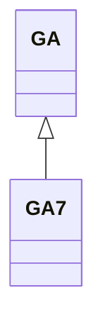

---
search:
  boost: 10.0
---

# Class: GA7 


_Concept representing region Ogooué-Lolo Province in country Gabon_


<div data-search-exclude markdown="1">


URI: [loc:GA-7](https://w3id.org/lmodel/dpv/loc/GA-7)





## Inheritance
* [GA](GA.md)
    * **GA7**


## Class Properties

| Property | Value |
| --- | --- |
| Class URI | [loc:GA-7](https://w3id.org/lmodel/dpv/loc/GA-7) |


## Slots

| Name | Cardinality and Range | Description | Inheritance |
| ---  | --- | --- | --- |


## In Subsets


* [LocSubset](LocSubset.md)


## Aliases


* GA-7
* Ogooué-Lolo Province


## Identifier and Mapping Information


### Annotations

| property | value |
| --- | --- |
| upstream_iri | https://w3id.org/dpv/loc/owl#GA-7 |
| dpv_extension_slug | loc |


### Schema Source


* from schema: https://w3id.org/lmodel/dpv/loc


## Mappings

| Mapping Type | Mapped Value |
| ---  | ---  |
| self | loc:GA-7 |
| native | loc:GA7 |
| exact | dpv_loc:GA-7, dpv_loc_owl:GA-7 |


## LinkML Source

<!-- TODO: investigate https://stackoverflow.com/questions/37606292/how-to-create-tabbed-code-blocks-in-mkdocs-or-sphinx -->

### Direct

<details>
```yaml
name: GA7
annotations:
  upstream_iri:
    tag: upstream_iri
    value: https://w3id.org/dpv/loc/owl#GA-7
  dpv_extension_slug:
    tag: dpv_extension_slug
    value: loc
description: Concept representing region Ogooué-Lolo Province in country Gabon
in_subset:
- loc_subset
from_schema: https://w3id.org/lmodel/dpv/loc
aliases:
- GA-7
- Ogooué-Lolo Province
exact_mappings:
- dpv_loc:GA-7
- dpv_loc_owl:GA-7
is_a: GA
class_uri: loc:GA-7

```
</details>

### Induced

<details>
```yaml
name: GA7
annotations:
  upstream_iri:
    tag: upstream_iri
    value: https://w3id.org/dpv/loc/owl#GA-7
  dpv_extension_slug:
    tag: dpv_extension_slug
    value: loc
description: Concept representing region Ogooué-Lolo Province in country Gabon
in_subset:
- loc_subset
from_schema: https://w3id.org/lmodel/dpv/loc
aliases:
- GA-7
- Ogooué-Lolo Province
exact_mappings:
- dpv_loc:GA-7
- dpv_loc_owl:GA-7
is_a: GA
class_uri: loc:GA-7

```
</details></div>