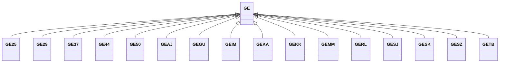

---
search:
  boost: 10.0
---

# Class: GE 


_Concept representing Country of Georgia_


<div data-search-exclude markdown="1">


URI: [loc:GE](https://w3id.org/lmodel/dpv/loc/GE)





## Inheritance
* **GE**
    * [GE25](GE25.md)
    * [GE29](GE29.md)
    * [GE37](GE37.md)
    * [GE44](GE44.md)
    * [GE50](GE50.md)
    * [GEAJ](GEAJ.md)
    * [GEGU](GEGU.md)
    * [GEIM](GEIM.md)
    * [GEKA](GEKA.md)
    * [GEKK](GEKK.md)
    * [GEMM](GEMM.md)
    * [GERL](GERL.md)
    * [GESJ](GESJ.md)
    * [GESK](GESK.md)
    * [GESZ](GESZ.md)
    * [GETB](GETB.md)


## Class Properties

| Property | Value |
| --- | --- |
| Class URI | [loc:GE](https://w3id.org/lmodel/dpv/loc/GE) |


## Slots

| Name | Cardinality and Range | Description | Inheritance |
| ---  | --- | --- | --- |


## In Subsets


* [LocSubset](LocSubset.md)


## Aliases


* Georgia


## Identifier and Mapping Information


### Annotations

| property | value |
| --- | --- |
| upstream_iri | https://w3id.org/dpv/loc/owl#GE |
| dpv_extension_slug | loc |


### Schema Source


* from schema: https://w3id.org/lmodel/dpv/loc


## Mappings

| Mapping Type | Mapped Value |
| ---  | ---  |
| self | loc:GE |
| native | loc:GE |
| exact | dpv_loc:GE, dpv_loc_owl:GE |


## LinkML Source

<!-- TODO: investigate https://stackoverflow.com/questions/37606292/how-to-create-tabbed-code-blocks-in-mkdocs-or-sphinx -->

### Direct

<details>
```yaml
name: GE
annotations:
  upstream_iri:
    tag: upstream_iri
    value: https://w3id.org/dpv/loc/owl#GE
  dpv_extension_slug:
    tag: dpv_extension_slug
    value: loc
description: Concept representing Country of Georgia
in_subset:
- loc_subset
from_schema: https://w3id.org/lmodel/dpv/loc
aliases:
- Georgia
exact_mappings:
- dpv_loc:GE
- dpv_loc_owl:GE
class_uri: loc:GE

```
</details>

### Induced

<details>
```yaml
name: GE
annotations:
  upstream_iri:
    tag: upstream_iri
    value: https://w3id.org/dpv/loc/owl#GE
  dpv_extension_slug:
    tag: dpv_extension_slug
    value: loc
description: Concept representing Country of Georgia
in_subset:
- loc_subset
from_schema: https://w3id.org/lmodel/dpv/loc
aliases:
- Georgia
exact_mappings:
- dpv_loc:GE
- dpv_loc_owl:GE
class_uri: loc:GE

```
</details></div>