---
search:
  boost: 10.0
---

# Class: GR 


_Concept representing Country of Greece_


<div data-search-exclude markdown="1">


URI: [loc:GR](https://w3id.org/lmodel/dpv/loc/GR)

```mermaid
 classDiagram
    class GR
    click GR href "../GR/"
      EEA30 <|-- GR
        click EEA30 href "../EEA30/"
      EEA31 <|-- GR
        click EEA31 href "../EEA31/"
      EU <|-- GR
        click EU href "../EU/"
      EU27 <|-- GR
        click EU27 href "../EU27/"
      EU28 <|-- GR
        click EU28 href "../EU28/"
      EEA <|-- GR
        click EEA href "../EEA/"
      

      GR <|-- GR01
        click GR01 href "../GR01/"
      GR <|-- GR03
        click GR03 href "../GR03/"
      GR <|-- GR04
        click GR04 href "../GR04/"
      GR <|-- GR05
        click GR05 href "../GR05/"
      GR <|-- GR06
        click GR06 href "../GR06/"
      GR <|-- GR07
        click GR07 href "../GR07/"
      GR <|-- GR11
        click GR11 href "../GR11/"
      GR <|-- GR12
        click GR12 href "../GR12/"
      GR <|-- GR13
        click GR13 href "../GR13/"
      GR <|-- GR14
        click GR14 href "../GR14/"
      GR <|-- GR15
        click GR15 href "../GR15/"
      GR <|-- GR16
        click GR16 href "../GR16/"
      GR <|-- GR17
        click GR17 href "../GR17/"
      GR <|-- GR21
        click GR21 href "../GR21/"
      GR <|-- GR22
        click GR22 href "../GR22/"
      GR <|-- GR24
        click GR24 href "../GR24/"
      GR <|-- GR31
        click GR31 href "../GR31/"
      GR <|-- GR32
        click GR32 href "../GR32/"
      GR <|-- GR33
        click GR33 href "../GR33/"
      GR <|-- GR34
        click GR34 href "../GR34/"
      GR <|-- GR41
        click GR41 href "../GR41/"
      GR <|-- GR42
        click GR42 href "../GR42/"
      GR <|-- GR43
        click GR43 href "../GR43/"
      GR <|-- GR44
        click GR44 href "../GR44/"
      GR <|-- GR51
        click GR51 href "../GR51/"
      GR <|-- GR52
        click GR52 href "../GR52/"
      GR <|-- GR53
        click GR53 href "../GR53/"
      GR <|-- GR54
        click GR54 href "../GR54/"
      GR <|-- GR55
        click GR55 href "../GR55/"
      GR <|-- GR56
        click GR56 href "../GR56/"
      GR <|-- GR57
        click GR57 href "../GR57/"
      GR <|-- GR58
        click GR58 href "../GR58/"
      GR <|-- GR59
        click GR59 href "../GR59/"
      GR <|-- GR61
        click GR61 href "../GR61/"
      GR <|-- GR62
        click GR62 href "../GR62/"
      GR <|-- GR63
        click GR63 href "../GR63/"
      GR <|-- GR64
        click GR64 href "../GR64/"
      GR <|-- GR71
        click GR71 href "../GR71/"
      GR <|-- GR72
        click GR72 href "../GR72/"
      GR <|-- GR73
        click GR73 href "../GR73/"
      GR <|-- GR82
        click GR82 href "../GR82/"
      GR <|-- GR83
        click GR83 href "../GR83/"
      GR <|-- GR84
        click GR84 href "../GR84/"
      GR <|-- GR85
        click GR85 href "../GR85/"
      GR <|-- GR91
        click GR91 href "../GR91/"
      GR <|-- GR92
        click GR92 href "../GR92/"
      GR <|-- GR93
        click GR93 href "../GR93/"
      GR <|-- GR94
        click GR94 href "../GR94/"
      GR <|-- GRA
        click GRA href "../GRA/"
      GR <|-- GRA2
        click GRA2 href "../GRA2/"
      GR <|-- GRB
        click GRB href "../GRB/"
      GR <|-- GRC
        click GRC href "../GRC/"
      GR <|-- GRD
        click GRD href "../GRD/"
      GR <|-- GRE
        click GRE href "../GRE/"
      GR <|-- GRF
        click GRF href "../GRF/"
      GR <|-- GRG
        click GRG href "../GRG/"
      GR <|-- GRH
        click GRH href "../GRH/"
      GR <|-- GRI
        click GRI href "../GRI/"
      GR <|-- GRJ
        click GRJ href "../GRJ/"
      GR <|-- GRK
        click GRK href "../GRK/"
      GR <|-- GRL
        click GRL href "../GRL/"
      

      
```





## Inheritance
* [EEA](EEA.md)
    * **GR** [ [EEA30](EEA30.md) [EEA31](EEA31.md) [EU](EU.md) [EU27](EU27.md) [EU28](EU28.md)]
        * [GR01](GR01.md)
        * [GR03](GR03.md)
        * [GR04](GR04.md)
        * [GR05](GR05.md)
        * [GR06](GR06.md)
        * [GR07](GR07.md)
        * [GR11](GR11.md)
        * [GR12](GR12.md)
        * [GR13](GR13.md)
        * [GR14](GR14.md)
        * [GR15](GR15.md)
        * [GR16](GR16.md)
        * [GR17](GR17.md)
        * [GR21](GR21.md)
        * [GR22](GR22.md)
        * [GR24](GR24.md)
        * [GR31](GR31.md)
        * [GR32](GR32.md)
        * [GR33](GR33.md)
        * [GR34](GR34.md)
        * [GR41](GR41.md)
        * [GR42](GR42.md)
        * [GR43](GR43.md)
        * [GR44](GR44.md)
        * [GR51](GR51.md)
        * [GR52](GR52.md)
        * [GR53](GR53.md)
        * [GR54](GR54.md)
        * [GR55](GR55.md)
        * [GR56](GR56.md)
        * [GR57](GR57.md)
        * [GR58](GR58.md)
        * [GR59](GR59.md)
        * [GR61](GR61.md)
        * [GR62](GR62.md)
        * [GR63](GR63.md)
        * [GR64](GR64.md)
        * [GR71](GR71.md)
        * [GR72](GR72.md)
        * [GR73](GR73.md)
        * [GR82](GR82.md)
        * [GR83](GR83.md)
        * [GR84](GR84.md)
        * [GR85](GR85.md)
        * [GR91](GR91.md)
        * [GR92](GR92.md)
        * [GR93](GR93.md)
        * [GR94](GR94.md)
        * [GRA](GRA.md)
        * [GRA2](GRA2.md)
        * [GRB](GRB.md)
        * [GRC](GRC.md)
        * [GRD](GRD.md)
        * [GRE](GRE.md)
        * [GRF](GRF.md)
        * [GRG](GRG.md)
        * [GRH](GRH.md)
        * [GRI](GRI.md)
        * [GRJ](GRJ.md)
        * [GRK](GRK.md)
        * [GRL](GRL.md)


## Class Properties

| Property | Value |
| --- | --- |
| Class URI | [loc:GR](https://w3id.org/lmodel/dpv/loc/GR) |


## Slots

| Name | Cardinality and Range | Description | Inheritance |
| ---  | --- | --- | --- |


## In Subsets


* [LocSubset](LocSubset.md)


## Aliases


* Greece


## Identifier and Mapping Information


### Annotations

| property | value |
| --- | --- |
| upstream_iri | https://w3id.org/dpv/loc/owl#GR |
| dpv_extension_slug | loc |


### Schema Source


* from schema: https://w3id.org/lmodel/dpv/loc


## Mappings

| Mapping Type | Mapped Value |
| ---  | ---  |
| self | loc:GR |
| native | loc:GR |
| exact | dpv_loc:GR, dpv_loc_owl:GR |


## LinkML Source

<!-- TODO: investigate https://stackoverflow.com/questions/37606292/how-to-create-tabbed-code-blocks-in-mkdocs-or-sphinx -->

### Direct

<details>
```yaml
name: GR
annotations:
  upstream_iri:
    tag: upstream_iri
    value: https://w3id.org/dpv/loc/owl#GR
  dpv_extension_slug:
    tag: dpv_extension_slug
    value: loc
description: Concept representing Country of Greece
in_subset:
- loc_subset
from_schema: https://w3id.org/lmodel/dpv/loc
aliases:
- Greece
exact_mappings:
- dpv_loc:GR
- dpv_loc_owl:GR
is_a: EEA
mixins:
- EEA30
- EEA31
- EU
- EU27
- EU28
class_uri: loc:GR

```
</details>

### Induced

<details>
```yaml
name: GR
annotations:
  upstream_iri:
    tag: upstream_iri
    value: https://w3id.org/dpv/loc/owl#GR
  dpv_extension_slug:
    tag: dpv_extension_slug
    value: loc
description: Concept representing Country of Greece
in_subset:
- loc_subset
from_schema: https://w3id.org/lmodel/dpv/loc
aliases:
- Greece
exact_mappings:
- dpv_loc:GR
- dpv_loc_owl:GR
is_a: EEA
mixins:
- EEA30
- EEA31
- EU
- EU27
- EU28
class_uri: loc:GR

```
</details></div>