---
search:
  boost: 10.0
---

# Class: GT 


_Concept representing Country of Guatemala_


<div data-search-exclude markdown="1">


URI: [loc:GT](https://w3id.org/lmodel/dpv/loc/GT)

```mermaid
 classDiagram
    class GT
    click GT href "../GT/"
      GT <|-- GT01
        click GT01 href "../GT01/"
      GT <|-- GT02
        click GT02 href "../GT02/"
      GT <|-- GT03
        click GT03 href "../GT03/"
      GT <|-- GT04
        click GT04 href "../GT04/"
      GT <|-- GT05
        click GT05 href "../GT05/"
      GT <|-- GT06
        click GT06 href "../GT06/"
      GT <|-- GT07
        click GT07 href "../GT07/"
      GT <|-- GT08
        click GT08 href "../GT08/"
      GT <|-- GT09
        click GT09 href "../GT09/"
      GT <|-- GT10
        click GT10 href "../GT10/"
      GT <|-- GT11
        click GT11 href "../GT11/"
      GT <|-- GT12
        click GT12 href "../GT12/"
      GT <|-- GT13
        click GT13 href "../GT13/"
      GT <|-- GT14
        click GT14 href "../GT14/"
      GT <|-- GT15
        click GT15 href "../GT15/"
      GT <|-- GT16
        click GT16 href "../GT16/"
      GT <|-- GT17
        click GT17 href "../GT17/"
      GT <|-- GT18
        click GT18 href "../GT18/"
      GT <|-- GT19
        click GT19 href "../GT19/"
      GT <|-- GT20
        click GT20 href "../GT20/"
      GT <|-- GT21
        click GT21 href "../GT21/"
      GT <|-- GT22
        click GT22 href "../GT22/"
      
      
```





## Inheritance
* **GT**
    * [GT01](GT01.md)
    * [GT02](GT02.md)
    * [GT03](GT03.md)
    * [GT04](GT04.md)
    * [GT05](GT05.md)
    * [GT06](GT06.md)
    * [GT07](GT07.md)
    * [GT08](GT08.md)
    * [GT09](GT09.md)
    * [GT10](GT10.md)
    * [GT11](GT11.md)
    * [GT12](GT12.md)
    * [GT13](GT13.md)
    * [GT14](GT14.md)
    * [GT15](GT15.md)
    * [GT16](GT16.md)
    * [GT17](GT17.md)
    * [GT18](GT18.md)
    * [GT19](GT19.md)
    * [GT20](GT20.md)
    * [GT21](GT21.md)
    * [GT22](GT22.md)


## Class Properties

| Property | Value |
| --- | --- |
| Class URI | [loc:GT](https://w3id.org/lmodel/dpv/loc/GT) |


## Slots

| Name | Cardinality and Range | Description | Inheritance |
| ---  | --- | --- | --- |


## In Subsets


* [LocSubset](LocSubset.md)


## Aliases


* Guatemala


## Identifier and Mapping Information


### Annotations

| property | value |
| --- | --- |
| upstream_iri | https://w3id.org/dpv/loc/owl#GT |
| dpv_extension_slug | loc |


### Schema Source


* from schema: https://w3id.org/lmodel/dpv/loc


## Mappings

| Mapping Type | Mapped Value |
| ---  | ---  |
| self | loc:GT |
| native | loc:GT |
| exact | dpv_loc:GT, dpv_loc_owl:GT |


## LinkML Source

<!-- TODO: investigate https://stackoverflow.com/questions/37606292/how-to-create-tabbed-code-blocks-in-mkdocs-or-sphinx -->

### Direct

<details>
```yaml
name: GT
annotations:
  upstream_iri:
    tag: upstream_iri
    value: https://w3id.org/dpv/loc/owl#GT
  dpv_extension_slug:
    tag: dpv_extension_slug
    value: loc
description: Concept representing Country of Guatemala
in_subset:
- loc_subset
from_schema: https://w3id.org/lmodel/dpv/loc
aliases:
- Guatemala
exact_mappings:
- dpv_loc:GT
- dpv_loc_owl:GT
class_uri: loc:GT

```
</details>

### Induced

<details>
```yaml
name: GT
annotations:
  upstream_iri:
    tag: upstream_iri
    value: https://w3id.org/dpv/loc/owl#GT
  dpv_extension_slug:
    tag: dpv_extension_slug
    value: loc
description: Concept representing Country of Guatemala
in_subset:
- loc_subset
from_schema: https://w3id.org/lmodel/dpv/loc
aliases:
- Guatemala
exact_mappings:
- dpv_loc:GT
- dpv_loc_owl:GT
class_uri: loc:GT

```
</details></div>